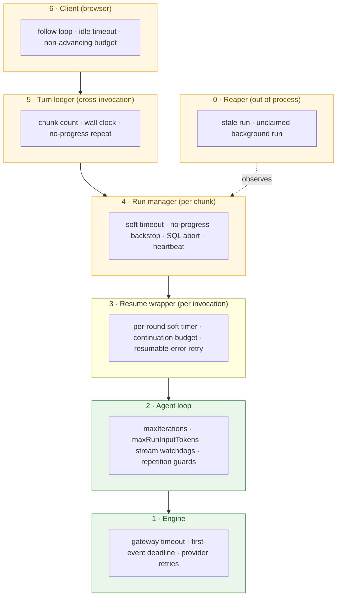
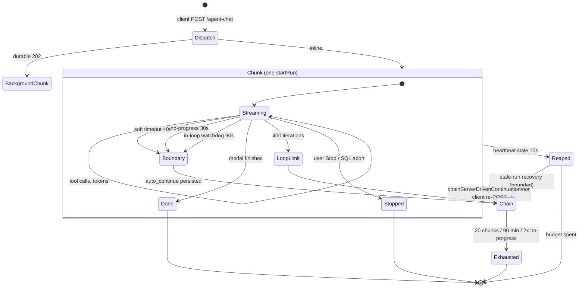
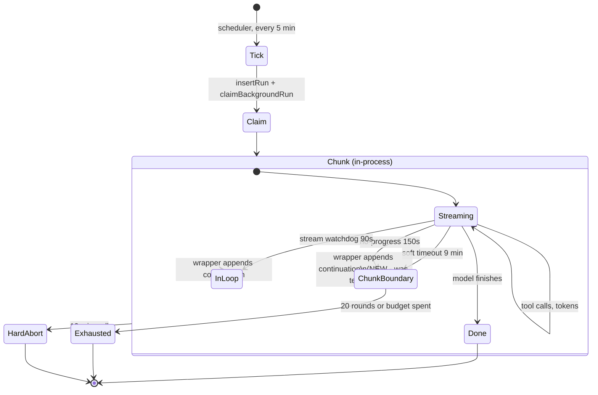

# Agent run stop conditions: map, archaeology, and cleanup plan

**Scope:** every condition that can end an agent turn in `@agent-native/core`,
across the four entry points (main chat, A2A/MCP, agent teams, background
automations).
**Written:** 2026-08-21, against `packages/core@0.168.5`.
**Why:** the same class of bug — a healthy run killed by a watchdog — has been
patched at least six times in four months. This maps the machine so we can
argue about it as a whole instead of one constant at a time.

---

## 1. The question, answered up front

> In theory this is a loop of LLM calls calling tools. None of these checks
> should be needed. Why are they?

**In theory, three stop conditions are enough**, and all three are inside
`runAgentLoop` (`agent/production-agent.ts:4881`):

| Stop                            | Meaning                                      |
| ------------------------------- | -------------------------------------------- |
| The model returns no tool calls | The turn is done.                            |
| `maxIterations` (400)           | Budget: this turn has taken too many rounds. |
| `maxRunInputTokens` (20M)       | Budget: this turn has cost too much.         |

Everything else — and there are **~40 more** — exists because of four facts
about the world the loop runs in. None of them is about the loop:

1. **The process gets killed.** A hosted foreground invocation dies at ~57-60s;
   a background function at 15 min. The turn is longer than the process, so the
   turn must be _chunked_ and _resumed_. This is the single largest source of
   machinery: soft timeouts, `auto_continue`, continuation budgets, the run
   ledger, the client's follow loop.
2. **The transport lies.** A gateway can hold a socket open and stream nothing,
   or drop mid-stream after a partial tool-call. "Still connected" is not
   "still working", so liveness needs its own watchers.
3. **The model loops.** Twenty-seven identical `run-code` calls is not deep
   work. Repetition, not volume, has to be bounded.
4. **A dead process writes no outcome.** If the isolate is killed, nobody
   records the failure — so a _separate_ observer (heartbeat + reaper) has to
   decide the run is dead from outside.

So: the checks are needed. **What is badly architected is not that they exist —
it is that they were each added at a different layer, watching a different
clock, with their ordering written in prose and enforced by nothing.** Section 6
is the evidence; section 7 is what to do about it.

---

## 2. Layer map

Every stop lives at one of six layers. The layer determines who, if anyone, can
recover it.



The green layers are the ones whose stops are _about the work_. The amber ones
are all about the host. That ratio is the architecture problem in one picture.

---

## 3. Complete stop inventory

Columns: **Fires when** · **Effect** · **Who recovers it** · **Verdict**.

### Layer 2 — the agent loop (`production-agent.ts`)

| Stop                                                        | Fires when                                          | Effect                               | Recovered by         | Verdict                         |
| ----------------------------------------------------------- | --------------------------------------------------- | ------------------------------------ | -------------------- | ------------------------------- |
| Normal finish                                               | Model returns no tool calls                         | `done`                               | —                    | **Keep.** The real one.         |
| `maxIterations` (400)                                       | 400 rounds in one chunk                             | `loop_limit`                         | Turn ledger / client | **Keep.**                       |
| `maxRunInputTokens` (20M)                                   | Turn input tokens exceeded                          | tripwire, terminal                   | nobody (by design)   | **Keep.**                       |
| `MODEL_STREAM_NO_PROGRESS_TIMEOUT_MS` (90s)                 | 90s between engine frames                           | `auto_continue{no_progress}` + break | resume wrapper       | **Keep.** Recoverable, in-loop. |
| `ACTION_PREPARATION_NO_PROGRESS_TIMEOUT_MS` (90s)           | 90s of a tool's args not growing                    | same                                 | resume wrapper       | **Keep.**                       |
| `FOREGROUND_FIRST_MODEL_EVENT_TIMEOUT_MS` (25s)             | No first frame, hosted foreground only              | same                                 | resume wrapper       | **Keep**, but see §6.2.         |
| `ACTION_PREPARATION_ZERO_BYTE_RESTART_LIMIT` (2)            | Args stream restarts twice at 0 bytes               | same                                 | resume wrapper       | **Keep.**                       |
| `stream_ended`                                              | Stream closes with partial tool input or no content | `auto_continue{stream_ended}`        | resume wrapper       | **Keep.**                       |
| `MAX_IDENTICAL_TOOL_CALLS` (8)                              | Same (tool,args) 8×                                 | terminal stop                        | nobody               | **Keep.**                       |
| `MAX_IDENTICAL_TOOL_ERRORS` (3)                             | Same (tool,args,error) 3×                           | error injected                       | model                | **Keep.**                       |
| `MAX_SAME_ERROR_ACROSS_ARGUMENTS` (6)                       | Same (tool,error), any args, 6×                     | terminal stop                        | nobody               | **Keep.**                       |
| `MAX_WRITE_TOOL_INTERRUPTIONS` (2)                          | Write tool re-interrupted twice                     | terminal stop                        | nobody               | **Keep.**                       |
| `MAX_RETRIES` (3) / `BUILDER_GATEWAY_ERROR_MAX_RETRIES` (1) | Engine error                                        | in-loop retry                        | itself               | **Keep.**                       |

### Layer 3 — resume wrapper (`run-loop-with-resume.ts`)

| Stop                                                      | Fires when                             | Effect                       | Recovered by        | Verdict   |
| --------------------------------------------------------- | -------------------------------------- | ---------------------------- | ------------------- | --------- |
| Per-round soft timer                                      | `roundTimeoutMs` elapsed               | abort round                  | itself → next round | **Keep.** |
| `MAX_RUN_LOOP_CONTINUATIONS` (6) / background (20)        | Rounds exhausted                       | `RUN_BUDGET_EXHAUSTED` error | nobody              | **Keep.** |
| `SELF_CHAIN_MIN_CONTINUATION_BUDGET_MS` (8s)              | <8s of budget left                     | stop before starting a round | nobody              | **Keep.** |
| Resumable engine error                                    | gateway timeout / socket hang up / 5xx | append continuation, retry   | itself              | **Keep.** |
| `MAX_BACKGROUND_RATE_LIMIT_CONTINUATIONS` (1) + 20s delay | transient 429/529, background only     | one cooled retry             | itself              | **Keep.** |

### Layer 4 — run manager (`run-manager.ts`)

| Stop                                                 | Fires when                                             | Effect                                            | Recovered by                       | Verdict                                         |
| ---------------------------------------------------- | ------------------------------------------------------ | ------------------------------------------------- | ---------------------------------- | ----------------------------------------------- |
| Soft timeout (40s fg / 13 min bg / 9 min automation) | chunk budget elapsed                                   | `auto_continue{run_timeout}` + checkpoint + abort | HTTP chain, or in-invocation (new) | **Keep.**                                       |
| No-progress backstop (150s, 30s effective fg)        | 150s no _forwarded_ progress **and** nothing in flight | same, reason `no_progress`                        | as above                           | **Keep — but this is the problem child.** §6.1. |
| SQL abort check (3s poll)                            | row no longer `running`, or Stop pressed               | abort turn                                        | nobody (intended)                  | **Keep.**                                       |
| Heartbeat (1.5s)                                     | —                                                      | writes liveness                                   | —                                  | **Keep.**                                       |
| Per-tool ceiling = soft timeout − 5s                 | tool exceeds it                                        | tool error                                        | model                              | **Keep.**                                       |

### Layer 5 — turn ledger (`production-agent.ts`, cross-invocation)

| Stop                                            | Fires when                                              | Effect          | Verdict                                                |
| ----------------------------------------------- | ------------------------------------------------------- | --------------- | ------------------------------------------------------ |
| `MAX_BACKGROUND_RUN_CONTINUATIONS` (20)         | 20 chunks in one turn                                   | refuse to chain | **Keep.** Cost ceiling.                                |
| `turnRunCount > 20 + 5`                         | ledger says 25 runs                                     | terminal        | **Merge** with the above — two bounds on one quantity. |
| `MAX_TURN_WALL_CLOCK_MS` (90 min)               | turn older than 90 min                                  | terminal        | **Keep.**                                              |
| `MAX_CONSECUTIVE_NO_PROGRESS_CONTINUATIONS` (2) | 2 chunks ending on the same error with nothing produced | stop chaining   | **Keep.**                                              |
| `MAX_NESTED_SELF_DISPATCH_DEPTH` (6)            | dispatch recursion                                      | terminal        | **Keep.**                                              |

### Layer 0 — reaper (`run-store.ts`, another isolate)

| Stop                                                      | Fires when                      | Effect                            | Verdict   |
| --------------------------------------------------------- | ------------------------------- | --------------------------------- | --------- |
| `RUN_STALE_MS` (15s) fg / `BACKGROUND_RUN_STALE_MS` (90s) | heartbeat older than window     | `error:stale_run`                 | **Keep.** |
| `BACKGROUND_PROCESSING_RUN_STALE_MS` (45s)                | claimed worker went quiet       | same                              | **Keep.** |
| `UNCLAIMED_BACKGROUND_RUN_GRACE_MS` (25s)                 | 202 returned, nobody claimed    | `background_worker_never_started` | **Keep.** |
| `IN_FLIGHT_RUN_STALE_GRACE_MS` (14.5 min)                 | grace while a tool is in flight | suspends reap                     | **Keep.** |
| `STALE_RUN_RECOVERY_*` (25 runs / 3 no-progress / 20s)    | recovery budget                 | stop recovering                   | **Keep.** |

### Layer 6 — client (`client/agent-chat-adapter.ts`)

| Stop                                                                                | Fires when                          | Effect            | Verdict                                                                                                               |
| ----------------------------------------------------------------------------------- | ----------------------------------- | ----------------- | --------------------------------------------------------------------------------------------------------------------- |
| `BACKGROUND_FOLLOW_IDLE_TIMEOUT_MS` (210s)                                          | no active run for the turn          | give up following | **Keep.**                                                                                                             |
| `BACKGROUND_FOLLOW_ATTACH_WATCHDOG_MS` (90s)                                        | reattach never lands                | re-poll           | **Keep.**                                                                                                             |
| `MAX_NON_ADVANCING_CONTINUATIONS` (3)                                               | 3 rounds that produced nothing new  | end turn          | **Keep.** Best-designed bound in the stack — it reads _progress_, not a clock, and it replaced five separate budgets. |
| `MAX_TOTAL_TRANSIENT_CONTINUATIONS` (12)                                            | 12 failure-driven rounds            | end turn          | **Keep.**                                                                                                             |
| `MAX_LOOP_LIMIT_CONTINUATIONS` (25)                                                 | 25 work-boundary rounds             | end turn          | **Keep.**                                                                                                             |
| `MAX_FOLLOWED_BACKGROUND_RUNS` (24) / `MAX_BACKGROUND_FOLLOW_WALL_TIME_MS` (95 min) | client backstop above server bounds | end turn          | **Keep.**                                                                                                             |
| `MAX_REPEATED_BACKGROUND_TERMINAL_REASONS` (3)                                      | same terminal reason 3×             | end turn          | **Keep.**                                                                                                             |

### Layer 1 — engine

| Stop                                         | Fires when       | Effect          | Verdict                                                                                                    |
| -------------------------------------------- | ---------------- | --------------- | ---------------------------------------------------------------------------------------------------------- |
| Builder gateway timeout (45s fg / 14 min bg) | request deadline | resumable error | **Keep.**                                                                                                  |
| `FIRST_STREAM_EVENT_TIMEOUT_MS` (120s)       | no first frame   | abort           | **Keep.** Shadowed inside the loop; the only first-event bound for direct `engine.stream()` callers, §6.2. |

---

## 4. Foreground turn state machine



The important shape: **`Boundary` is not a failure.** It is the normal way a
turn crosses a process wall. Everything in the amber layers exists to get from
`Boundary` back to `Chunk`.

## 5. Background automation state machine



Before the current branch, the `ChunkBoundary --> Chunk` edge did not exist:
the checkpoint aborted the turn-level controller, which is the same signal the
wrapper's `while (!signal.aborted)` is gated on. Every one of the recovery
mechanisms below it was unreachable. That is the whole of Finding 1 in the
Marisco brief, and it accounted for **37% of that deployment's analyst runs**.

---

## 6. Findings

### 6.1 The no-progress backstop is a special-case stack, and it is still growing

`RUN_NO_PROGRESS_HARD_TIMEOUT_MS` was introduced on **2026-07-02**
(`b68e4f72a`, "Make durable background chat recovery server-owned"). Since then
it has been patched at least five times, every time by **adding an exclusion**:

| Date       | Commit      | What was excluded                                              |
| ---------- | ----------- | -------------------------------------------------------------- |
| 2026-07-02 | `c213eb81b` | Window extended for durable background                         |
| 2026-07-02 | `b4c0b9d71` | `clear` events stopped counting as progress                    |
| 2026-07-26 | `52cce19f6` | Checkpoint made durable (`checkpointRunBoundary`)              |
| 2026-07-30 | `c0e7d64b7` | Foreground value derived from soft timeout instead of flat     |
| 2026-08-20 | `483f03d22` | **`inFlightWorkDelta`** — suspend while a model stream is open |

`483f03d22` landed the day before this document. Its own comment explains why
the previous four were not enough:

> _this clock and the loop's `lastModelStreamProgressAt` measure DIFFERENT
> events. An extended-thinking phase bumps the inner clock on every engine frame
> while forwarding nothing… runs whose worst gap crossed 150s died while still
> streaming, some by a single second._

That is the diagnosis, and it generalises past the fix that was applied to it.
**The backstop watches the wrong signal.** It counts events the loop _forwards
to the client_, which is a rendering concern, and infers liveness from it. Every
patch has been a new exclusion for a case where forwarding and working diverge:
keepalives, `clear`, zero-byte prep, and now the model stream. There will be
more, because the list of ways to work without forwarding is open-ended.

**The client already solved this exact problem, better.**
`MAX_NON_ADVANCING_CONTINUATIONS` (client, 3) reads _advance_ — did this round
produce something new? — instead of a clock, and its comment records that it
"replaced five separate budgets… each of which existed because the rung above it
had a hole the next one patched." The server backstop is at exactly the stage
those five were at.

**But the obvious fix — delete the exclusions, keep only bracketed liveness — is
wrong, and this is the sharper finding.**

`shouldBumpProgressForEvent` is one predicate wired to **two consumers with
different jobs** (`run-manager.ts`, in `emitRunEvent`):

```ts
trackInFlightWork(runEvent.event);
if (shouldBumpProgressForEvent(runEvent.event)) {
  lastRealProgressAt = Date.now(); // consumer 1: the backstop's own clock
  bumpProgressIfDue(); // consumer 2: agent_runs.last_progress_at
}
```

Consumer 2 is not about the backstop at all. `last_progress_at` feeds
`livenessBasisSql()` — which every stale reaper takes the max of against
`heartbeat_at`, _granting a run more life_ — plus `hasNoForwardProgress` (the
stale-run recovery circuit breaker) and the client's stuck detector.

The two want the same answer for keepalives today, for opposite reasons: the
backstop must not let a wedged transport emitting keepalives be immortal, and
the reaper does not need keepalives because `heartbeat_at` already covers
process liveness. Delete the exclusion and a keepalive starts counting as
_durable progress_, which makes a wedged run look alive to the reaper and to
the client. That is a regression, not a cleanup.

**So the real defect is not the exclusion list — it is that one predicate
answers two questions.** Every future exclusion has to be right for both
consumers simultaneously, and nothing says so; the coupling is invisible at both
call sites. There are now **five** liveness signals for one run — `heartbeat_at`,
`last_progress_at`, `in_flight_since`, in-memory `lastRealProgressAt`, in-memory
`inFlightWorkCount` — and the exclusion list is shared between two of them by
accident of implementation.

**Proposal, revised.** Do not restructure the backstop yet. Split the predicate
first — `countsAsBackstopProgress` and `countsAsDurableProgress`, identical
today, each documented with its consumer — _only when the next divergence
actually arrives_, so the seam is added by a change that needs it rather than
speculatively. Until then, the highest-value action is measurement: the
`agent_run_boundary` counter from layer 1 tells us whether the backstop still
kills healthy runs after `inFlightWorkDelta`. **If the terminal-boundary rate is
near zero, #3224 already fixed this and no restructuring is warranted at all.**

### 6.2 `FIRST_STREAM_EVENT_TIMEOUT_MS` (120s) is shadowed on the loop path — and load-bearing off it

_(Corrected after verification. The first draft of this section called the
constant dead code and proposed deleting it. That was wrong, and the way it was
wrong is the point of the whole document, so it stays on the record.)_

On the agent-loop path it never fires. `nextEngineEventWithNoProgressTimeout`
races `iterator.next()` against a real timer (`production-agent.ts:5150`), so
the loop's 90s `MODEL_STREAM_NO_PROGRESS_TIMEOUT_MS` fires with zero frames
received, cancels the iterator, and clears the engine's timer — 90 < 120, on
every runtime, because the loop watchdog is ungated. On hosted foreground the
25s first-model-event cap and the 45s gateway timeout fire earlier still.

**But `runAgentLoop` is not the only caller of `engine.stream()`.** Six others
exist — `completeText`, `transcribe-voice`, `sentiment`, `evals`,
`eval/agent-runner`, `observational-memory/internal-run` — and for them the
engine's 120s deadline is the _only_ thing bounding a gateway that accepts a
connection and streams nothing. Five of the six happen to set a tighter total
timeout (5s, 30s, 45s, 60s, 120s). `completeText` takes `timeoutMs` as
**optional**: a caller that omits it has no total deadline at all, and this
constant is the only backstop between it and an unbounded hang.

**Verdict: keep it, unchanged.** It is a floor for callers that set no bound of
their own, and it is doing that job for at least one live caller shape today.

**The real finding is what the first draft got wrong.** Reading the constant
list, "120s is above 90s so it can never fire" looked obvious and was obviously
wrong — because the ordering only holds for one of seven callers, and nothing in
the code says which callers a bound is for. That is the same defect as §6.4 in a
different key: a bound whose _audience_ is undocumented reads as redundant to
the next person, and the next person deletes it.

**Action:** no code change. Document the audience — one line on the constant
saying it is the floor for direct `engine.stream()` callers and is expected to
be shadowed inside the agent loop.

### 6.3 Three spellings of one quantity: run rows per turn — FIXED

`MAX_BACKGROUND_RUN_CONTINUATIONS` (20) gated chaining; a different line checked
`turnRunCount > MAX_BACKGROUND_RUN_CONTINUATIONS + 5`; and
`STALE_RUN_RECOVERY_MAX_TURN_RUNS = 25` in `run-store.ts` was a hand-maintained
third copy whose own comment said so:

> _Duplicated as a literal rather than imported: production-agent.ts already
> imports run-manager.ts, which imports this file, so a runtime import back from
> here would be circular. Keep this numerically in sync if that constant ever
> changes._

The cycle was real, and it is gone: the base value is configuration now, and
`app-config` imports no agent code. Both sites read
`resolveTurnRunLedgerBudget()` (`run-store.ts`), with the slack named
`TURN_RUN_LEDGER_SLACK` and its reason written down — the two bounds count
different things (handoffs vs. run rows), which is why the slack exists and why
the ledger must sit strictly above the chain bound. A spec pins the
relationship, so drift is a failing test rather than a surprise.

### 6.4 The ordering invariants were prose until this branch

The source is full of ordering arguments — `FOREGROUND_FIRST_MODEL_EVENT <
HOSTED_SOFT_TIMEOUT < MODEL_STREAM_NO_PROGRESS < RUN_NO_PROGRESS`, the
three-site invariant in `agent-chat-adapter.ts`, the client-above-server
invariant — and until this branch none was checked. One was already violated in
the shipped build: the automation path took a 13-minute chunk budget under its
own 10-minute hard abort, making its recoverable boundary dead code.

`app-config/run-lifecycle-invariants.ts` (this branch) asserts eight of them at
configuration resolve time. **Gap: the client-side chain is still unasserted in
the same place** — it lives in a comment plus one spec. Those numbers should
come from the same resolver the server uses, projected into the bundle.

### 6.5 Gaps — things nothing bounds

| Gap                                           | Why it matters                                                                                                                                                                                                                                                                                                                                  |
| --------------------------------------------- | ----------------------------------------------------------------------------------------------------------------------------------------------------------------------------------------------------------------------------------------------------------------------------------------------------------------------------------------------- |
| **Time spent inside the loop between frames** | The model-stream bound covers _waiting for the engine_, not a hang while the loop processes a frame it already has. `inFlightWorkDelta`'s own comment admits this. Only the chunk soft timeout covers it.                                                                                                                                       |
| ~~**Wall clock for a non-chat turn**~~        | **Withdrawn on verification.** An automation never spans invocations, so its 10-minute hard abort _is_ its per-turn wall clock, and the wrapper's cumulative round budget sits inside it. `MAX_TURN_WALL_CLOCK_MS` exists because a chat turn spans many invocations and no single one can see the total; an automation has no such blind spot. |
| **Cost, as opposed to tokens**                | `maxRunInputTokens` bounds one turn's input. Nothing bounds spend across a chained turn in currency, which is the unit a deployment actually budgets.                                                                                                                                                                                           |
| **Boundary rate**                             | Until this branch, nothing counted boundaries. A 37% terminal-boundary rate was invisible for two releases. Now emitted as `agent_run_boundary`; **it still needs a dashboard and an alert**, or it is invisible in a second way.                                                                                                               |

### 6.6 Deletion candidates, ranked

1. ~~`FIRST_STREAM_EVENT_TIMEOUT_MS`~~ — **withdrawn**, it is live off the loop
   path (§6.2).
2. ~~The `+ 5` ledger bound and its two duplicate spellings~~ — **done**, one
   `resolveTurnRunLedgerBudget()` (§6.3).
3. ~~`DEFAULT_BACKGROUND_RUN_SOFT_TIMEOUT_MS`~~ — **done**, it was an alias for
   `BACKGROUND_SOFT_TIMEOUT_CEILING_MS`; two names, one number, no source caller.
4. ~~`BACKGROUND_RUN_STUCK_MS`~~ — **done**, a third copy of the 10-minute
   automation abort, folded into `resolveBackgroundRunHardTimeoutMs()`.
5. ~~The five exclusion branches in `shouldBumpProgressForEvent`~~ —
   **withdrawn**. They also define the durable `last_progress_at` signal, whose
   consumers are the reapers and the client, not the backstop. Deleting them
   would make a keepalive-emitting wedged run read as alive to both (§6.1).

---

## 6.7 Measured: the baseline, and why nobody could see it

Run against the reporting deployment's PostHog on 2026-08-21, 21-day window,
`agent_run_terminal` grouped by run-id prefix:

| path                  | prefix     | done | `no_progress` | `run_timeout` | total | **% no_progress** |
| --------------------- | ---------- | ---- | ------------- | ------------- | ----- | ----------------- |
| interactive chat      | `run-*`    | 169  | 2             | 17            | 190   | **1.1%**          |
| scheduled automations | `job-*`    | 8    | 0             | 0             | 9     | **0%**            |
| manual analyst runs   | `manual-*` | 1    | **6**         | 0             | 7     | **85.7%**         |

Two things fall out.

**The asymmetry the brief predicted is real, and larger than reported.** The
brief measured 37% on `automation_runs`; the live rate on the in-process
manual-dispatch path is 6 of 7. Interactive chat, which has a continuation owner,
sits at 1.1% on 190 runs. That is the whole thesis in one table: the same
backstop, the same 150s, and a 78× difference in outcome depending on whether
anything downstream was going to recover the checkpoint.

**And it was invisible, because every one of those runs reported itself as
`foreground`.** `emitRunTerminalTrackingEvent` defaulted `dispatch_mode` to
`"foreground"` when the caller passed none — and the interactive handler is the
_only_ caller that passes it. Five others (automations, agent teams, webhooks,
harness runs, the docs poller) passed nothing, so the default was wrong 100% of
the times it applied. An 85.7% failure rate on the automation path was sitting
in the same bucket as healthy chat, labelled as chat.

That is the flagship rule in `CLAUDE.md` — _"a default that returns a value
callers cannot distinguish from success is a bug, not a guard"_ — inside the
telemetry that exists to find such bugs. `dispatch_mode` is now absent when
unknown rather than confidently wrong, and the automation runner passes the
`"background"` it already writes to its own row.

**Caveat on `#3224`.** These runs are on `0.164.26`, which predates the
`inFlightWorkDelta` fix (merged 2026-08-20, four minor versions later). So this
is a clean _pre-fix_ baseline: it confirms the defect is live and quantifies it,
but it says nothing about whether `#3224` helped. Step 4 below is answered for
the "is it real" half and still open for the "did the last fix already handle
it" half — which now needs a post-upgrade re-read.

---

## 7. Plan

Ordered so each step makes the next one measurable.

| #   | Step                                                                                                               | Why now                                                                                                                                                                                                                                             |
| --- | ------------------------------------------------------------------------------------------------------------------ | --------------------------------------------------------------------------------------------------------------------------------------------------------------------------------------------------------------------------------------------------- |
| 1   | **Ship the current branch** (chunk-scoped checkpoints, automation tracing, boundary counters, config + invariants) | Stops the bleeding and, critically, makes boundaries countable. Nothing below is verifiable without that.                                                                                                                                           |
| 2   | **Put `agent_run_boundary` on a dashboard**, split by `recovered` **and `dispatch_mode`**                          | One number — recovered vs terminal — answers "is any of this working?" The mode split is not optional: without it the automation path hides inside chat's volume, which is exactly what happened (§6.7).                                            |
| 3   | ~~**Delete §6.2 and §6.3**~~ → **§6.3 done; §6.2 withdrawn on verification**                                       | Pure removal, no behaviour change, shrinks the surface before restructuring it.                                                                                                                                                                     |
| 4   | ~~**Read the boundary rate**~~ → **baseline measured (§6.7); re-read after upgrade**                               | 85.7% `no_progress` on the in-process path vs 1.1% on chat — the defect is real and larger than the brief reported. But that deployment predates `#3224`, so whether the last fix already helped is still unanswered and needs a post-upgrade read. |
| 5   | _Conditional:_ **split `shouldBumpProgressForEvent` by consumer (§6.1)**                                           | Only when a divergence actually arrives. One predicate answering two questions is the coupling; adding the seam speculatively is not better.                                                                                                        |
| 6   | **Project the client bounds from the server resolver (§6.4)**                                                      | Closes the last unasserted invariant chain.                                                                                                                                                                                                         |
| 7   | **Bound spend in currency, not tokens (§6.5)**                                                                     | The one genuine missing bound left.                                                                                                                                                                                                                 |

### A note on what survived

Four of this document's findings were withdrawn while implementing it: the
"dead" 120s engine bound (§6.2), the missing automation wall clock (§6.5), and
both halves of the backstop-exclusion deletion (§6.1, §6.6.5). Each looked
obvious from the constant list and dissolved on contact with the callers.

That result is worth stating plainly, because it changes the diagnosis: **this
system is not over-guarded. Almost every bound is load-bearing and well
argued.** The defects were never redundancy — they were (a) ordering
relationships written in prose and enforced by nothing, (b) one number spelled
three times, and (c) outcomes nobody counted. Layer 1 fixed (a) and (c); layer 2
fixed (b). What is left is to look at the numbers (a) and (c) now produce before
changing anything else.

**Non-goal:** reducing the number of constants for its own sake. Most of them
are load-bearing and well-argued. The win is not fewer numbers — it is fewer
_clocks_: today six layers each measure liveness their own way, and every bug in
this class has come from two of them disagreeing about whether the same run was
alive.
