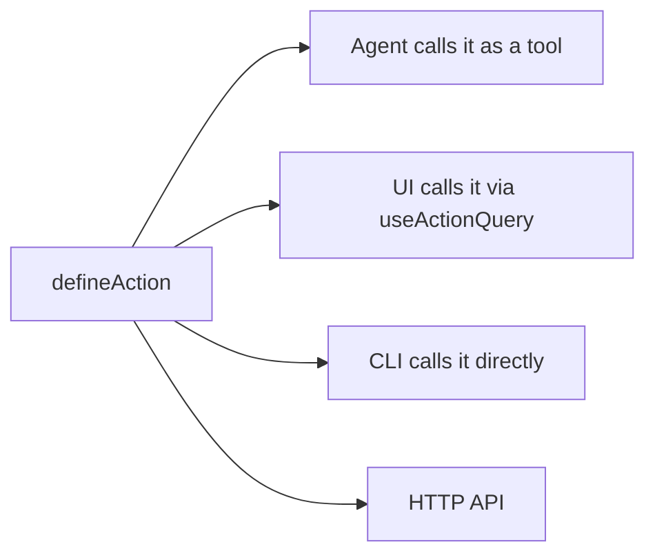

# Docs components

The docs site renders standard Markdown plus a set of MDX block components for
richer content. Each section below shows a live rendered example followed by
the exact MDX syntax that produced it.

---

## Callout

<Callout tone="info">

This is an `info` callout. Use it for background context or neutral notes. You can use **bold**, `inline code`, and [links](/docs/getting-started) inside.

</Callout>

<Callout tone="warning">

This is a `warning` callout. Use it for potential data loss, breaking changes, or hard-to-reverse steps. For example: restart `pnpm dev` after adding a new route file — the router only picks up files present at startup.

</Callout>

<Callout tone="success">

This is a `success` callout. Use it for the recommended path or to confirm a working approach.

</Callout>

<Callout tone="risk">

This is a `risk` callout. Use it for security implications or production caveats.

</Callout>

<Callout tone="decision">

This is a `decision` callout. Use it to surface a deliberate tradeoff the reader should understand.

</Callout>

```mdx
<Callout tone="info">

This is an `info` callout. Use it for background context or neutral notes. You can use **bold**, `inline code`, and [links](/docs/getting-started) inside.

</Callout>

<Callout tone="warning">

This is a `warning` callout. Use it for potential data loss, breaking changes, or hard-to-reverse steps. For example: restart `pnpm dev` after adding a new route file — the router only picks up files present at startup.

</Callout>

<Callout tone="success">

This is a `success` callout. Use it for the recommended path or to confirm a working approach.

</Callout>

<Callout tone="risk">

This is a `risk` callout. Use it for security implications or production caveats.

</Callout>

<Callout tone="decision">

This is a `decision` callout. Use it to surface a deliberate tradeoff the reader should understand.

</Callout>
```

| Tone       | When to use                                                  |
| ---------- | ------------------------------------------------------------ |
| `info`     | Background context, neutral notes                            |
| `warning`  | Potential data loss, breaking changes, hard-to-reverse steps |
| `success`  | Recommended option, confirmed working path                   |
| `risk`     | Security implications, production caveats                    |
| `decision` | Deliberate tradeoffs the reader should understand            |

Leave a blank line between the opening tag and the body, and another before the closing tag.

---

## Steps

<Steps>

### Install dependencies

Run the following inside your project directory:

```bash
pnpm install
```

### Start the dev server

```bash
pnpm dev
```

Open the local URL shown by the dev server. The app is ready when **VITE ready** appears in the terminal.

### Sign in

The first run shows a login screen. Use any credentials — local development does not send email.

</Steps>

````mdx
<Steps>

### Install dependencies

Run the following inside your project directory:

```bash
pnpm install
```

### Start the dev server

```bash
pnpm dev
```

Open the local URL shown by the dev server. The app is ready when **VITE ready** appears in the terminal.

### Sign in

The first run shows a login screen. Use any credentials — local development does not send email.

</Steps>
````

Each step is a `###` heading followed by the body content. Steps work best for 3–8 items. For 2 items a numbered list is fine. For longer procedures, split into multiple `<Steps>` blocks with a prose bridge between them.

---

## Sequence

<Sequence>

### A webhook **arrives** at the endpoint

### The payload is **verified** against its signature

### A job is **queued** for processing

---

### The queued job **runs** and updates the record

</Sequence>

```mdx
<Sequence>

### A webhook **arrives** at the endpoint

### The payload is **verified** against its signature

### A job is **queued** for processing

---

### The queued job **runs** and updates the record

</Sequence>
```

Each card is a `###` heading with a short phrase, not a paragraph — unlike `Steps`, there's no body content below the heading. Rows cap at three cards; a fourth wraps automatically into a new row connected by an elbow instead of an arrow, with no `---` required. A lone `---` line between two cards forces an earlier break, e.g. an intentional 2-then-2 split instead of waiting for the automatic three-card cap.

Prefix a card's heading with `:blue:`, `:green:`, `:red:`, or `:yellow:` — the same shortcode `Comparison` uses — to accent the one card that matters, e.g. which app handles a step:

```mdx
<Sequence>

### A support message arrives in Slack

### :blue: Dispatch recognizes it as a billing question

### The ticket is filed in the billing app

</Sequence>
```

Reserve the accent for the single card that matters; leaving every card unaccented keeps the chain reading as one even flow. A short 1–3 card sequence with no wrap stretches to fill the full width; a trailing row after a wrap (like the fourth card above) stays naturally sized instead of stretching.

---

## Cards

<Cards>

### :components: [Actions](/docs/actions-overview)

Typed operations callable from the agent, UI, CLI, and HTTP. Define once, call from anywhere.

### [Database](/docs/server-database)

PostgreSQL persistence with automatic migrations. PGlite locally, hosted Postgres in production.

### [Agent Surfaces](/docs/agent-surfaces)

Configure where the agent appears: full-page chat, sidebar panel, or embedded in a route.

### Skills

Plain-text instruction files that give the agent domain knowledge and task-specific behavior without code changes.

</Cards>

```mdx
<Cards>

### :components: [Actions](/docs/actions-overview)

Typed operations callable from the agent, UI, CLI, and HTTP. Define once, call from anywhere.

### [Database](/docs/server-database)

PostgreSQL persistence with automatic migrations. PGlite locally, hosted Postgres in production.

### [Agent Surfaces](/docs/agent-surfaces)

Configure where the agent appears: full-page chat, sidebar panel, or embedded in a route.

### Skills

Plain-text instruction files that give the agent domain knowledge and task-specific behavior without code changes.

</Cards>
```

Each card is a `###` heading (optionally linked) followed by the description. Cards without a link render as plain info boxes with no hover state or arrow. Prefix the heading with `:icon-name:` to add an icon in its own column to the left of the title and body — useful for a set of cards that represent distinct categories rather than a features list. Icons come from a curated set, not an arbitrary Tabler icon name:

| Icon key     | Renders                                 |
| ------------ | --------------------------------------- |
| `robot`      | agent / autonomous behavior             |
| `components` | UI, hooks, composable pieces            |
| `server`     | backend, transport, infrastructure      |
| `plug`       | integrations, connected tools           |
| `network`    | cross-app or distributed communication  |
| `terminal`   | CLI, scripts, terminal-driven workflows |
| `calendar`   | scheduling, dates, time-based features  |

The grid defaults to 3 columns. Set `columns` (1-4) on the opening tag to override it, e.g. `<Cards columns={2}>`. Below 640px the grid always collapses to a single column regardless of `columns`.

---

## Notice

<Notice tone="risk" title="Bold, not subtle">

Use `Notice` when a `Callout` would be too easy to skim past — something the reader must not miss, like a destructive action or a hard requirement. It shares the same five tones as `Callout` (`info`, `decision`, `risk`, `warning`, `success`) but renders as a filled card with an icon and optional title instead of a left-border note.

</Notice>

```mdx
<Notice tone="risk" title="Bold, not subtle">

Use `Notice` when a `Callout` would be too easy to skim past — something the reader must not miss, like a destructive action or a hard requirement.

</Notice>
```

`title` is optional — omit it for a shorter card with just the icon and body. Leave a blank line between the opening tag and the body, same as `Callout`. Reach for `Callout` first; use `Notice` only when a subtle left-border note isn't enough attention.

---

## Banner

<Banner
  tone="warning"
  body="This page describes a beta API. Check the release notes before using it."
/>

```mdx
<Banner
  tone="warning"
  body="This page describes a beta API. Check the release notes before using it."
/>
```

`Banner` is self-closing — `body` is a flat attribute (kept short and single-purpose on purpose), not markdown children. Place it right under a page's title or a section heading — deprecated, beta, moved, version-scoped. For content the reader needs to actually read (not just notice), use `Notice` or `Callout` instead.

---

## Accordion

<Accordion>

### Do I need Toolkit to use Core?

No. Toolkit is optional shared UI — Core works standalone.

### Can I mix Templates and Toolkit?

Yes, most first-party templates already do.

### Where do I ask questions?

The `#agent-native` Discord channel, linked in the site header.

</Accordion>

```mdx
<Accordion>

### Do I need Toolkit to use Core?

No. Toolkit is optional shared UI — Core works standalone.

### Can I mix Templates and Toolkit?

Yes, most first-party templates already do.

</Accordion>
```

Same authoring shape as `Steps`/`Cards` — a `### Question` heading per item followed by its answer — but each item renders collapsed behind native `<details>`. Best for FAQ-style content where most readers only need one or two entries, not a full top-to-bottom read.

---

## Badge

<Badge label="Beta" color="orange" icon="rocket" />

<Badge label="Deprecated" color="red" />

<Badge label="v9.1+" color="blue" shape="pill" />

<Badge label="Server-only" color="gray" stroke />

```mdx
<Badge label="Beta" color="orange" icon="rocket" />

<Badge label="Deprecated" color="red" />

<Badge label="v9.1+" color="blue" shape="pill" />

<Badge label="Server-only" color="gray" stroke />
```

A small status chip for the top of a page or section. Self-closing, block-level only — **not** embeddable mid-sentence (the docs MDX pipeline only recognizes a custom component when its tag opens its own line, so `text <Badge label="x"/> more text` renders as literal text, not a chip). Place it on its own line, typically right after a heading. Leave a blank line between adjacent Badges (or any two block components) — without one, the scanner can't tell where one ends and the next begins and falls back to rendering literal text.

| Prop       | Values                                                                                                                                                 |
| ---------- | ------------------------------------------------------------------------------------------------------------------------------------------------------ |
| `color`    | `gray` · `blue` · `green` · `yellow` · `orange` · `red` · `purple` · `white` · `surface` · `white-destructive` · `surface-destructive`                 |
| `size`     | `xs` · `sm` · `md` · `lg`                                                                                                                              |
| `shape`    | `rounded` (default) · `pill`                                                                                                                           |
| `icon`     | one of a curated set — `circle-check`, `circle-info`, `alert-triangle`, `alert-octagon`, `ban`, `clock`, `star`, `flame`, `sparkles`, `lock`, `rocket` |
| `stroke`   | `true` for an outlined, transparent-background variant                                                                                                 |
| `disabled` | `true` to dim it for an inactive/unavailable state                                                                                                     |

---

## Comparison

<Comparison>

### Before

Every feature needs a separate API endpoint, a separate React query, and manual wiring between the AI response and UI state.

### After

Define one action. The agent calls it as a tool, the UI calls it through a React hook, and both read the same validated output.

</Comparison>

```mdx
<Comparison>

### Before

Every feature needs a separate API endpoint, a separate React query, and manual wiring between the AI response and UI state.

### After

Define one action. The agent calls it as a tool, the UI calls it through a React hook, and both read the same validated output.

</Comparison>
```

Add more `###` sections to get 3 or 4 columns (max 4). The red/green label accent applies automatically to headings that exactly match `Before`, `Old`, `Without` (red) or `After`, `New`, `With` (green).

For any other pairing, an explicit `:color:` prefix sets a column's accent directly, the same shortcode idiom `Cards` uses for `:icon:`:

```mdx
<Comparison>

### :blue: You ask

"Am I free Thursday afternoon?"

### :green: What happens

The agent answers in chat. Nothing on screen changes.

</Comparison>
```

`color` accepts `blue`, `green`, `red`, or `yellow`, matching `Badge`'s color naming. Each routes through a real theme token (the site's brand blue, or the same semantic red/yellow/green used elsewhere) rather than a raw color, so it stays correct in both themes. An explicit `color` always wins over the Before/After heuristic.

---

## Image

<Image
  src="/screenshots/dispatch.png"
  alt="Dispatch app screenshot showing the run history sidebar"
  align="left"
  width={320}
  caption="Dispatch's run history sidebar."
>

Aligning an image left or right turns it into a two-column row. The image sits on that side, and this markdown is the paired text on the other side. Leave `align` unset, or set it to `"full"`, for a normal full-width image with no paired text.

</Image>

```mdx
<Image
  src="/screenshots/dispatch.png"
  alt="Dispatch app screenshot showing the run history sidebar"
  align="left"
  width={320}
  caption="Dispatch's run history sidebar."
>

Aligning an image left or right turns it into a two-column row. The image sits on that side, and this markdown is the paired text on the other side. Leave `align` unset, or set it to `"full"`, for a normal full-width image with no paired text.

</Image>
```

`alt` is required. `align` is `"full"` (the default), `"left"`, or `"right"`. `width` is an optional pixel hint for the image column when aligned, and has no effect on `"full"`. `caption` renders in small muted text under the image. Anything between the open and close tags is markdown, and becomes the paired text next to the image when aligned, or plain content below it when full width. Omit the children entirely for a self-closing `<Image ... />` with no paired text.

Hovering the image reveals a top-right expand button that opens it in a larger popup. If the image has paired text (or a caption), the popup stacks it below the image instead of beside it, since the two-column layout only makes sense at the inline aligned size.

For a plain full-width image with no paired text, omit `align` (or set it to `"full"`) and skip the children entirely:

<Image
  src="/screenshots/mail.png"
  alt="Mail app screenshot showing the inbox and reading pane"
  caption="The default inbox view."
/>

```mdx
<Image
  src="/screenshots/mail.png"
  alt="Mail app screenshot showing the inbox and reading pane"
  caption="The default inbox view."
/>
```

---

## Video

No sample video ships in this repo, so this section shows syntax only rather than a live-rendered example. Swap `src` for a real `.mp4`/`.webm` file under `public/` to see it rendered.

```mdx
<Video
  src="/videos/product-tour.mp4"
  alt="A short screen recording of creating a new action from the CLI"
  align="right"
  width={320}
  caption="Creating an action from the CLI."
>

Same shape as `Image`, aligned the other way this time. The video sits on the right, and this text sits on the left. `src` must be a direct video file, mp4 or webm. Third-party embed links like YouTube or Loom aren't supported, since that would need an `<iframe>`, which the docs system doesn't allow for security reasons.

</Video>
```

Identical attributes to `Image` (`src`, `alt`, `align`, `width`, `caption`, and paired markdown children), except `src` must point to a direct video file rather than an embed link. `alt` becomes the video's `aria-label`, since `<video>` has no native `alt` attribute.

Pass `autoplay` to play the video automatically once it's visible. It always forces `muted` alongside it, since browsers block autoplay with sound regardless of the attribute. It also never autoplays for a viewer with `prefers-reduced-motion: reduce` set. That viewer instead gets a normal paused player, and pressing play themselves gives them full, unmuted playback rather than a silently-muted one.

Pass `loop` to restart the video from the beginning once it ends. It's independent of `autoplay`, so a looping video that isn't set to autoplay just loops once the viewer presses play themselves.

The same full-width form applies here too, omit `align` and the children for a plain full-width video:

```mdx
<Video
  src="/videos/product-tour.mp4"
  alt="A full walkthrough recording of building an action end to end"
  caption="Building an action end to end."
/>
```

---

## Signature

<Signature
  id="docs-components-signature"
  name="askUserQuestion"
  params={[
    {
      name: "input",
      type: "AskUserQuestionInput",
      description: "The question, its options, and how it should behave.",
      fields: [
        {
          name: "question",
          type: "string",
          description:
            "The complete question. Clear, specific, ends with a question mark.",
        },
        {
          name: "header",
          type: "string",
          optional: true,
          description:
            'Very short chip/heading, about 12 characters, e.g. `"Date range"`.',
        },
        {
          name: "options",
          type: "AskUserQuestionOption[]",
          description: "2-4 distinct options.",
        },
        {
          name: "allowFreeText",
          type: "boolean",
          optional: true,
          default: "true",
          description: 'Adds a free-text "Other" option.',
        },
        {
          name: "allowMultiple",
          type: "boolean",
          optional: true,
          default: "false",
          description: "Multi-select instead of single-select.",
        },
      ],
    },
  ]}
  returns={{
    type: "Promise<AskUserQuestionResult>",
    description:
      'The picked value, `value[]` when `allowMultiple`, the typed "Other" text, or `null` if skipped.',
  }}
/>

```mdx
<Signature
  id="docs-components-signature"
  name="askUserQuestion"
  params={[
    {
      name: "input",
      type: "AskUserQuestionInput",
      description: "The question, its options, and how it should behave.",
      fields: [
        {
          name: "question",
          type: "string",
          description:
            "The complete question. Clear, specific, ends with a question mark.",
        },
        {
          name: "header",
          type: "string",
          optional: true,
          description:
            'Very short chip/heading, about 12 characters, e.g. `"Date range"`.',
        },
        {
          name: "options",
          type: "AskUserQuestionOption[]",
          description: "2-4 distinct options.",
        },
        {
          name: "allowFreeText",
          type: "boolean",
          optional: true,
          default: "true",
          description: 'Adds a free-text "Other" option.',
        },
        {
          name: "allowMultiple",
          type: "boolean",
          optional: true,
          default: "false",
          description: "Multi-select instead of single-select.",
        },
      ],
    },
  ]}
  returns={{
    type: "Promise<AskUserQuestionResult>",
    description:
      'The picked value, `value[]` when `allowMultiple`, the typed "Other" text, or `null` if skipped.',
  }}
/>
```

`Signature` is self-closing. `name` plus `params` build the code-style call line shown at the top (an optional param renders as `name?: type`). Each param is `{ name, type, optional?, default?, description }`, matching a plain field. An object-shaped param (like `input` above) can add a nested `fields` array of the same shape to break down its properties, so one block replaces both a hand-written signature line and a separate options table. `returns` is optional and takes the same `{ type, description? }` shape. Descriptions render through the normal markdown pipeline, so backticks and bold work.

Use this over a hand-written `ts` fence plus a prose bullet list whenever a reference page documents a specific function, hook, or action's call shape, per the `writing-reference-docs` skill.

---

## kbd — keyboard shortcut

Press [[⌘K]] to open the command palette. Save with [[Ctrl+S]] before running the dev server. Navigate fields with [[Tab]] and [[Shift+Tab]].

```mdx
Press [[⌘K]] to open the command palette. Save with [[Ctrl+S]] before running the dev server. Navigate fields with [[Tab]] and [[Shift+Tab]].
```

Double brackets around the key sequence; no MDX component needed. Works anywhere in regular Markdown paragraphs.

---

## Mermaid diagram



````mdx

````

Use a fenced code block with the `mermaid` language tag. Mermaid supports flowcharts (`graph`), sequence diagrams (`sequenceDiagram`), entity-relationship diagrams (`erDiagram`), and more. See [mermaid.js.org](https://mermaid.js.org/intro/) for the full syntax reference.

---

## FileTree

<FileTree
  id="docs-components-filetree"
  entries={[
    {
      path: "actions/analyze-text.ts",
      change: "added",
      note: "New action — callable from agent, UI, and CLI",
    },
    { path: "actions/list-text-analyses.ts", change: "added" },
    { path: "app/routes/analyses.tsx", change: "added" },
    {
      path: "server/db/schema.ts",
      change: "added",
      note: "Define the app-owned table",
    },
    {
      path: "server/plugins/db.ts",
      change: "added",
      note: "Run additive migrations",
    },
  ]}
/>

```mdx
<FileTree
  id="docs-components-filetree"
  entries={[
    {
      path: "actions/analyze-text.ts",
      change: "added",
      note: "New action — callable from agent, UI, and CLI",
    },
    { path: "actions/list-text-analyses.ts", change: "added" },
    { path: "app/routes/analyses.tsx", change: "added" },
    {
      path: "server/db/schema.ts",
      change: "added",
      note: "Define the app-owned table",
    },
    {
      path: "server/plugins/db.ts",
      change: "added",
      note: "Run additive migrations",
    },
  ]}
/>
```

FileTree is **self-closing** (`/>`). It does not accept Markdown children — if you use open/close tags with content inside you will get a parse error.

Each entry in `entries` is an object with a `path` key (slash-delimited) and optional fields:

| Field      | Values                                                  | Effect                               |
| ---------- | ------------------------------------------------------- | ------------------------------------ |
| `change`   | `"added"` \| `"modified"` \| `"removed"` \| `"renamed"` | Colored badge on the row             |
| `note`     | any string                                              | Expandable annotation shown on hover |
| `snippet`  | code string                                             | Expandable code preview              |
| `language` | e.g. `"ts"`                                             | Syntax highlighting for the snippet  |

---

## Tabs

<TabsBlock
  id="docs-components-tabs"
  tabs={[
    {
      id: "pnpm",
      label: "pnpm",
      blocks: [
        {
          type: "code",
          id: "pnpm-install",
          data: { code: "pnpm install", language: "bash" },
        },
      ],
    },
    {
      id: "npm",
      label: "npm",
      blocks: [
        {
          type: "code",
          id: "npm-install",
          data: { code: "npm install", language: "bash" },
        },
      ],
    },
    {
      id: "yarn",
      label: "yarn",
      blocks: [
        {
          type: "code",
          id: "yarn-install",
          data: { code: "yarn install", language: "bash" },
        },
      ],
    },
  ]}
/>

```mdx
<TabsBlock
  id="docs-components-tabs"
  tabs={[
    {
      id: "pnpm",
      label: "pnpm",
      blocks: [
        {
          type: "code",
          id: "pnpm-install",
          data: { code: "pnpm install", language: "bash" },
        },
      ],
    },
    {
      id: "npm",
      label: "npm",
      blocks: [
        {
          type: "code",
          id: "npm-install",
          data: { code: "npm install", language: "bash" },
        },
      ],
    },
    {
      id: "yarn",
      label: "yarn",
      blocks: [
        {
          type: "code",
          id: "yarn-install",
          data: { code: "yarn install", language: "bash" },
        },
      ],
    },
  ]}
/>
```

`TabsBlock` is self-closing. The entire structure is one JSON `tabs` attribute. Each tab's content is a `blocks` array where each item is a block object with `type`, `id`, and `data` matching that block's schema. Tabs works best for short parallel code snippets (one code block per tab). For richer multi-block content per tab, use a visual editor rather than hand-authoring the JSON.

---

## Columns

<Columns
  id="docs-components-columns"
  columns={[
    {
      id: "col-manual",
      label: "Manual approach",
      blocks: [
        {
          type: "code",
          id: "manual-code",
          data: {
            code: "const res = await fetch('/api/analyses')\nconst data = await res.json()",
            language: "ts",
          },
        },
      ],
    },
    {
      id: "col-actions",
      label: "With actions",
      blocks: [
        {
          type: "code",
          id: "action-code",
          data: {
            code: "const { data } = useActionQuery('list-text-analyses', {})",
            language: "ts",
          },
        },
      ],
    },
  ]}
/>

```mdx
<Columns
  id="docs-components-columns"
  columns={[
    {
      id: "col-manual",
      label: "Manual approach",
      blocks: [
        {
          type: "code",
          id: "manual-code",
          data: {
            code: "const res = await fetch('/api/analyses')\nconst data = await res.json()",
            language: "ts",
          },
        },
      ],
    },
    {
      id: "col-actions",
      label: "With actions",
      blocks: [
        {
          type: "code",
          id: "action-code",
          data: {
            code: "const { data } = useActionQuery('list-text-analyses', {})",
            language: "ts",
          },
        },
      ],
    },
  ]}
/>
```

Like `TabsBlock`, `Columns` is self-closing with a single JSON `columns` attribute. Each column has an optional `label` header and a `blocks` array. For comparing prose rather than code, `Comparison` is easier to hand-author.

---

## When to use which component

| Situation                                             | Component                            |
| ----------------------------------------------------- | ------------------------------------ |
| Reader must not miss something, inline in prose       | `Callout` (warning / info / success) |
| Reader must not miss something, standalone            | `Notice`                             |
| Deprecated/beta/version notice at page or section top | `Banner`                             |
| Status or version tag at page or section top          | `Badge`                              |
| Sequential procedure with titled steps                | `Steps`                              |
| Ordered chain of short connected event cards          | `Sequence`                           |
| FAQ-style content, one answer at a time               | `Accordion`                          |
| Navigation or feature overview grid                   | `Cards`                              |
| Before vs. after, old vs. new (prose)                 | `Comparison`                         |
| Same task in multiple tools or frameworks             | `Tabs`                               |
| Side-by-side code (labeled columns)                   | `Columns`                            |
| Project directory structure                           | `FileTree`                           |
| A function/hook/action's call shape                   | `Signature`                          |
| An image, full width or with paired text              | `Image`                              |
| A video, full width or with paired text               | `Video`                              |
| Inline keyboard shortcut                              | `[[Key]]`                            |
| Architecture or flow diagram                          | Mermaid fence                        |
