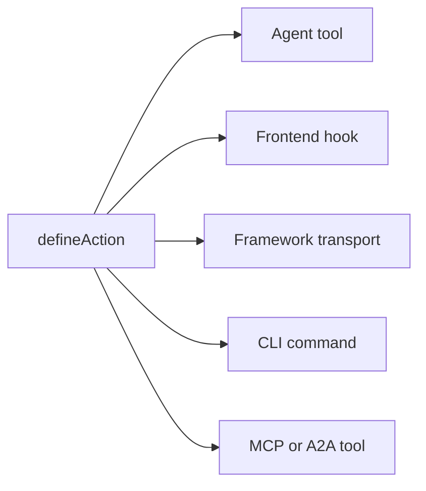

# Key Concepts

How Agent-Native apps work under the hood: the principles and the architecture. This page is the contract: the fixed rules an app has to follow to count as Agent-Native. For the vision and the case for building this way, see [What is Agent-Native?](/docs/what-is-agent-native).

## The three layers {#three-layers}

Agent-Native is a framework with three layers:

| Layer                                      | What it is                                                                                                                                                                                            |
| ------------------------------------------ | ----------------------------------------------------------------------------------------------------------------------------------------------------------------------------------------------------- |
| **Core: the framework**                    | The foundational runtime contract: actions, PostgreSQL/PGlite and Drizzle helpers, auth, application state, agent execution, access checks, routing, and live sync. Every app can use Core directly.  |
| **Toolkit: optional reusable pieces**      | Shared app-building UI and product systems such as primitives, editors, sharing, collaboration, settings, and agent UX. Apps can use, compose, or fork the pieces they need.                          |
| **Templates: optional apps built on Core** | Complete, domain-specific apps with routes, schema, actions, instructions, and visual identity. First-party and custom templates commonly use Toolkit, and can be forked and used as starting points. |

Core is the foundation. Toolkit and Templates are optional: a template can use Toolkit, but Toolkit is not required to build an app on Core.

## The architecture {#the-architecture}

At runtime, every Agent-Native app is three things working together:

- **Agent:** The autonomous AI. It reads data, writes data, runs actions, and uses whatever tools are configured. When its frame is intentionally granted workspace access and write tooling, it can also modify the app's own source. Customizable with skills and instructions.
- **Application:** The product surface around the agent. It may start as chat, add native inline results, grow into a small control plane, or become a full React UI with dashboards, flows, and visualizations.
- **Computer:** The database, browser, and configured tool runtimes the agent acts through. Agents work through the app's own action and data surface; that same surface can optionally be exposed over MCP, but external MCP servers stay an add-on, not the foundation.

The diagram below shows the agent and the application side by side, both with two-way arrows into one shared computer layer underneath. Neither one owns the data. Instead, they read and write the same PostgreSQL/PGlite store, so a change either side makes is visible to the other immediately, with no sync layer to build in between.

<Diagram id="doc-block-t1f7pj" title="Agent, application, and computer" summary="Three layers working together over one shared PostgreSQL/PGlite store. The agent and the application both read and write the same data.">

```html
<div class="diagram-arch">
  <div class="diagram-row">
    <div class="diagram-card">
      <span class="diagram-pill accent">Agent</span
      ><small class="diagram-muted"
        >reads + writes data, runs actions, uses configured tools</small
      >
    </div>
    <div class="diagram-card">
      <span class="diagram-pill">Application</span
      ><small class="diagram-muted"
        >chat, inline results, control plane, or full React UI</small
      >
    </div>
  </div>
  <div class="diagram-arrow diagram-muted" aria-hidden="true">
    &darr;&nbsp;&uarr;
  </div>
  <div class="diagram-box" data-rough>
    Computer<br /><small class="diagram-muted"
      >PostgreSQL/PGlite database · browser · code execution</small
    >
  </div>
</div>
```

```css
.diagram-arch {
  display: flex;
  flex-direction: column;
  align-items: center;
  gap: 10px;
}
.diagram-arch .diagram-row {
  display: flex;
  gap: 12px;
  flex-wrap: wrap;
  justify-content: center;
}
.diagram-arch .diagram-card {
  display: flex;
  flex-direction: column;
  gap: 6px;
  padding: 14px 16px;
  min-width: 220px;
}
.diagram-arch .diagram-arrow {
  font-size: 20px;
  line-height: 1;
}
.diagram-arch .diagram-box {
  text-align: center;
  padding: 12px 18px;
}
```

</Diagram>

That same agent-application-computer loop is what runs locally and in production. Automation-first apps run it straight from the folder with `pnpm agent`; UI apps mount the embedded agent panel and add `pnpm dev`. In the cloud, Builder.io hosts the identical loop as a managed frame: the environment that runs the agent next to your app. It handles collaboration, visual editing, and infrastructure for you.

## Agent building blocks {#agent-building-blocks}

Every Agent-Native app has the same agent building blocks, regardless of whether
the product surface is chat-first, automation-first, or a full UI. Each one lives
in its own file:

<FileTree
  id="doc-block-1ae57y4"
  title="Guidance and behavior"
  entries={[
    {
      path: "AGENTS.md",
      note: "always-on instructions: purpose, core rules, state keys, action index, skills index",
    },
    {
      path: ".agents/skills/<name>/SKILL.md",
      note: "reusable behavior: workflow steps, policies, examples, references, and do/don't lists",
    },
    {
      path: "actions/<name>.ts",
      note: "executable capability: typed operation exposed to the agent, UI, CLI, HTTP, MCP, A2A, jobs, and webhooks",
    },
  ]}
/>

A turn is one exchange with the agent: it reads its context, decides what to do, and responds. Loaded every turn means the file re-enters that context each time, not just once at session start.

| Building block   | File                             | Use it for                                                                                          | Loaded when                                           |
| ---------------- | -------------------------------- | --------------------------------------------------------------------------------------------------- | ----------------------------------------------------- |
| **Instructions** | `AGENTS.md`                      | Stable guidance the agent should carry into every task: what the app is, invariants, tone, indexes  | Every turn                                            |
| **Skills**       | `.agents/skills/<name>/SKILL.md` | Reusable behavior: how to follow a workflow, apply a policy, inspect evidence, or verify an output  | On demand when the skill description matches the task |
| **Actions**      | `actions/<name>.ts`              | Real operations: read or write data, call APIs, send messages, run approvals, produce typed results | Listed as tools every turn; executed only when called |

Skills and actions work together. A skill teaches the agent how to do a class of
work; an action is the code path it can call while doing that work. For example,
a `customer-research` skill might tell the agent which sources to inspect and
how to summarize evidence, while `search-crm` and `create-brief` actions fetch
and write the actual data.

Five rules govern the architecture:

1. **Data lives in PostgreSQL:** all app state lives in the database via Drizzle ORM.
2. **All AI goes through the agent:** no inline LLM calls; every AI interaction flows through the agent chat bridge.
3. **Actions for agent operations:** complex work runs as a typed action, not inline code.
4. **Live sync keeps the UI in sync:** database changes stream over SSE, with polling as the universal fallback.
5. **Application state in PostgreSQL:** ephemeral UI state lives in the database, readable by both agent and UI.

## The four-area checklist {#four-area-checklist}

Every user-facing feature should update all applicable areas. Skipping an applicable area breaks the Agent-Native contract; forcing a screen onto an automation that no human needs to browse is also a smell.

- **1. UI:** Page, component, or dialog the user interacts with.
- **2. Action:** Agent-callable action in `actions/` for the same operation.
- **3. Skills:** Update `AGENTS.md` and/or create a skill documenting the pattern.
- **4. App-State:** Navigation state, view-screen data, and navigate commands.

A feature with only UI is invisible to the agent. A full UI feature with only actions is invisible to the user. A feature without app-state means the agent is blind to what the user is doing. An automation-first operation can legitimately start with action + instructions and add chat, UI, or app-state later when humans need to browse, approve, configure, or share it.

## What Agent-Native includes {#what-you-get-for-free}

Adopting the framework is valuable mostly because of what you stop having to build. The moment your app follows the five rules above, you inherit:

| Feature                              | What it gives you                                                                                                                                                                                                                                                                                                                                                                    |
| ------------------------------------ | ------------------------------------------------------------------------------------------------------------------------------------------------------------------------------------------------------------------------------------------------------------------------------------------------------------------------------------------------------------------------------------ |
| One action = every surface           | Every action defined with `defineAction()` is simultaneously an agent tool, a typesafe frontend hook (`useActionQuery` / `useActionMutation`), a framework-owned HTTP transport, a CLI command, an MCP tool for external clients, and an A2A tool for other Agent-Native apps. Optional `link` and `mcpApp` metadata add deep links and MCP Apps UI without a second implementation. |
| Full agent resources per user        | Skills, shared `LEARNINGS.md`, personal `memory/MEMORY.md`, `AGENTS.md`, custom sub-agents, scheduled jobs, and connected MCP servers. All PostgreSQL-backed, no dev-box required. See [Agent Resources](/docs/agent-resources).                                                                                                                                                     |
| Drop-in React components             | `<AgentPanel />` and `<AgentSidebar />` render chat + resources anywhere in your app. See [Drop-in Agent](/docs/drop-in-agent).                                                                                                                                                                                                                                                      |
| BYO agent chat runtimes              | The same chat UI can sit on top of OpenAI Agents, OpenAI Responses, Claude Agent SDK, Vercel AI SDK, AG-UI, or your own normalized HTTP stream. See [Native Chat UI](/docs/native-chat-ui#byo-agent-runtimes).                                                                                                                                                                       |
| Live sync between agent and UI       | Same-process writes stream immediately over `/_agent-native/events`; a lightweight poll keeps serverless, cron, and cross-process writes convergent. Mutating actions invalidate action-backed queries automatically, so agent-created records appear without a manual refresh. See [Live Sync](#polling-sync) below.                                                                |
| Auth, orgs, RBAC                     | Better Auth with orgs/members/roles is wired in for every template. See [Authentication](/docs/authentication). For more than one user, start with [Organizations, Teams & Permissions](/docs/organizations-teams-permissions).                                                                                                                                                      |
| Context awareness                    | The agent always knows what the user is looking at through the `navigation` app-state key. See [Context Awareness](/docs/context-awareness).                                                                                                                                                                                                                                         |
| MCP client + server, both directions | The app ingests MCP servers (local, remote, hub-shared) _and_ exposes its own actions as an MCP server. See [MCP Clients](/docs/mcp-clients) and [MCP Protocol](/docs/mcp-protocol).                                                                                                                                                                                                 |
| Inter-app delegation                 | Agents in different apps talk over [A2A](/docs/a2a-protocol). Same-origin deploys skip JWT; cross-origin uses a shared `A2A_SECRET`.                                                                                                                                                                                                                                                 |
| Sub-agent teams                      | Spawn a sub-agent with its own thread and tools, surfaced as a chip inline in chat. See [Agent Teams](/docs/agent-teams).                                                                                                                                                                                                                                                            |
| Portability                          | PostgreSQL with local PGlite and hosted Postgres, any Nitro-compatible host (Node, Workers, Netlify, Vercel, Deno, Lambda, Bun).                                                                                                                                                                                                                                                     |

## Data in PostgreSQL {#data-in-sql}

All application state lives in PostgreSQL via Drizzle ORM. Local development uses PGlite; hosted deployments use the PostgreSQL connection in `DATABASE_URL`. See [Database](/docs/server-database).

Core PostgreSQL stores are auto-created and available in every template:

- `application_state`: ephemeral UI state (navigation, drafts, selections)
- `settings`: persistent key-value config
- `oauth_tokens`: OAuth credentials
- `sessions`: auth sessions

Each row below expands to show its fields:

<DataModel
  id="doc-block-4w0fu8"
  title="Core PostgreSQL stores"
  summary={
    "Auto-created in every template. The agent and UI both read and write these."
  }
  entities={[
    {
      id: "application_state",
      name: "application_state",
      note: "Ephemeral UI state the agent reads for context",
      fields: [
        {
          name: "key",
          type: "text",
          pk: true,
          note: "e.g. 'navigation'",
        },
        {
          name: "value",
          type: "json",
          note: "view, selection, drafts",
        },
      ],
    },
    {
      id: "settings",
      name: "settings",
      note: "Persistent key-value config",
      fields: [
        {
          name: "key",
          type: "text",
          pk: true,
        },
        {
          name: "value",
          type: "json",
        },
      ],
    },
    {
      id: "oauth_tokens",
      name: "oauth_tokens",
      note: "OAuth credentials",
      fields: [
        {
          name: "provider",
          type: "text",
          pk: true,
        },
        {
          name: "token",
          type: "text",
        },
      ],
    },
    {
      id: "sessions",
      name: "sessions",
      note: "Auth sessions",
      fields: [
        {
          name: "id",
          type: "text",
          pk: true,
        },
        {
          name: "userId",
          type: "text",
        },
      ],
    },
  ]}
/>

To add your own domain data, define a table with the same schema helpers used by the core stores above:

```ts
// Drizzle schema for domain data
import { table, text, integer } from "@agent-native/core/db/schema";

export const forms = table("forms", {
  id: text("id").primaryKey(),
  title: text("title").notNull(),
  schema: text("schema").notNull(), // JSON
  ownerEmail: text("owner_email"),
  createdAt: integer("created_at").notNull(),
});
```

Both you and the agent can inspect that data from the terminal, without a separate SQL client:

```bash
# Core actions for quick database inspection
pnpm action db-schema                                       # show all tables
pnpm action db-query --sql "SELECT * FROM forms"
```

`db-schema` prints every table's columns and types. `db-query` runs read-only SQL directly, which is useful for checking an action's writes without opening a database client.

<Callout tone="decision">

The production agent chat plugin defaults raw SQL tools to read-only
(`frameworkTools: { database: "read" }`), so agents inspect app-owned data with
`db-schema` / `db-query` and perform writes through typed app actions. Set
`database: "write"` (or `true`) only for deliberate maintenance surfaces that
should also expose scoped `db-exec` / `db-patch`; set `database: "off"` /
`false` to require typed app actions for all data access.

`frameworkTools` governs the rest of the framework's own tools the same way —
sharing, review comments, version history, feature flags, localization, audit,
context X-Ray, profile, automations, docs, resources, web, cross-app delegation,
chat, and email. See
[Production Agent Tools](/docs/actions-agent-tools#production-agent-tools) for the full
list, the `"minimal"` preset, and why disabling a group leaves its HTTP routes
mounted.

</Callout>

## Agent chat bridge {#agent-chat-bridge}

The UI never calls an LLM directly. When a user clicks "Generate chart" or "Write summary", the UI sends a message to the agent via `postMessage`. The agent does the work. It has full conversation history, skills, instructions, and the ability to iterate.

```ts
// Delegate AI work to the agent from a React component
import { sendToAgentChat } from "@agent-native/core/client/agent-chat";
sendToAgentChat({
  message: "Generate a chart showing signups by source",
  context: "Dashboard ID: main, date range: last 30 days",
  submit: true,
});
```

In short:

- **AI is non-deterministic**: You need conversation flow to give feedback and iterate, not one-shot buttons.
- **Context matters**: The agent has the app's instructions, skills, and history. An inline call has none of that.
- **The agent can do more**: It can run actions, browse the web, and chain multiple steps together.

**[External execution](/docs/a2a-protocol)**

Because everything goes through the agent and actions, any app can be driven from Slack, Telegram, scheduled jobs, scripts, or another agent via A2A.

## Actions system {#actions-system}

When the agent needs to do something complex, like calling an API, processing data, or querying the database, it runs an **action**. Actions are TypeScript files in `actions/` that export a default `defineAction()`:

```ts filename="actions/fetch-data.ts"
import { defineAction } from "@agent-native/core/action";
import { z } from "zod";

// One action powers every app surface: UI, agent, HTTP, MCP, A2A, and CLI.
export default defineAction({
  description: "Fetch data from a source API.",
  schema: z.object({
    source: z.string().describe("Data source key, e.g. 'signups'"),
  }),
  run: async ({ source }) => {
    const res = await fetch(`https://api.example.com/${source}`);
    return await res.json();
  },
});
```

This action fetches JSON from a source API and returns it. `defineAction()` wraps the function with a zod schema for its input (`source`), so the framework can validate that input, generate a JSON Schema the agent can call, and infer types for the frontend hook, all from this one definition.

One `defineAction()` call reaches five different consumers automatically. The diagram shows the fan-out from a single action; the list below explains what each consumer gets:



- **Agent tool:** the agent sees it with the zod-derived JSON Schema and can call it.
- **Frontend hook:** `useActionMutation("fetch-data")` with full TypeScript inference.
- **Framework transport:** auto-mounted behind the client hooks.
- **CLI:** `pnpm action fetch-data --source=signups` for scripting and agent dev loops.
- **MCP tool / A2A tool:** when MCP server or A2A is enabled, the same action shows up there too.

Every consumer calls the same underlying function, so there is only one implementation to write and maintain. See [Actions](/docs/actions-overview) for the full reference.

## Live sync {#polling-sync}

When the agent changes data, the UI needs to reflect that without a manual refresh. `useDbSync()` is what makes that automatic. Same-process writes stream over `/_agent-native/events`; `/_agent-native/poll` remains the cross-process and serverless fallback. When the agent writes to the database (application state, settings, or domain data), a version counter increments and the client invalidates the relevant React Query caches.

SSE covers the common case instead of WebSockets because it gives same-process writes an immediate path to the browser with plain HTTP, while the version-counter poll stays as a fallback that works in every deployment environment, including serverless and edge, where persistent sockets may not be available.

```ts
// Client: subscribe to agent/UI data changes once near the app shell
import { useDbSync } from "@agent-native/core/client/hooks";
useDbSync({ queryClient });
```

Call this once, near the root of the app. It subscribes the whole app to change events, so any component using `useActionQuery` or a source-versioned `useQuery` refetches automatically when the data it reads changes.

The flow is:

1. Agent runs an action that writes to the database
2. The server emits a change event with a source such as `"action"` or `"settings"`
3. `useDbSync` receives it over SSE or the polling fallback
4. `useActionQuery` hooks and source-versioned `useQuery` hooks refetch
5. Components render the new data without a page reload

The diagram traces that same sequence end to end:

<Diagram id="doc-block-87e1c3" title="Live sync flow" summary={"An agent write becomes a UI render with no manual refresh. SSE first, polling as the universal fallback."}>

```html
<div class="diagram-sync">
  <div class="diagram-node">
    Agent action<br /><small class="diagram-muted">writes to DB</small>
  </div>
  <div class="diagram-arrow diagram-muted" aria-hidden="true">&rarr;</div>
  <div class="diagram-node">
    Change event<br /><small class="diagram-muted"
      >source: action / settings</small
    >
  </div>
  <div class="diagram-arrow diagram-muted" aria-hidden="true">&rarr;</div>
  <div class="diagram-panel center">
    <span class="diagram-pill accent">useDbSync</span
    ><small class="diagram-muted">SSE &middot; poll fallback</small>
  </div>
  <div class="diagram-arrow diagram-muted" aria-hidden="true">&rarr;</div>
  <div class="diagram-node">
    Query refetch<br /><small class="diagram-muted">render, no reload</small>
  </div>
</div>
```

```css
.diagram-sync {
  display: flex;
  align-items: center;
  gap: 10px;
  flex-wrap: wrap;
}
.diagram-sync .diagram-arrow {
  font-size: 22px;
  line-height: 1;
}
.diagram-sync .center {
  display: flex;
  flex-direction: column;
  align-items: center;
  gap: 4px;
  padding: 10px 14px;
}
```

</Diagram>

This works in all deployment environments, including serverless and edge, because it uses the database instead of in-memory state or file system watchers.

## Context awareness {#context-awareness}

The agent always knows what the user is looking at. The UI writes a `navigation` key to application-state on every route change. The agent reads it via the `view-screen` action before acting.

For example, when you open an email thread the UI upserts a row like:

```json
{ "key": "navigation", "value": { "view": "thread", "threadId": "th_abc123" } }
```

<Callout tone="info">

The UI writes this on route change; the agent reads it (via `view-screen`) before taking any action, so it always knows which thread, chart, or slide you're focused on.

</Callout>

See [Context Awareness](/docs/context-awareness) for the full pattern: navigation state, view-screen, navigate commands, and jitter prevention.

## One action, many surfaces {#protocols}

Implement a domain operation once as an action; the framework exposes it to every consumer. The same `defineAction()` becomes an agent tool, a typesafe UI hook, an HTTP endpoint, a CLI command, an MCP tool, and an A2A tool, with optional `link`, `mcpApp`, native-widget metadata, or Generative UI wrappers added only when a surface needs richer interaction. Skills and instructions cover behavior.

For the full protocol/surface matrix (MCP server and OAuth, MCP Apps, A2A, deep links, native chat widgets, Generative UI, AgentChatRuntime connectors, Agent Web, and the adapter horizon for ACP and A2UI), and for choosing a product shape (chat, inline UI, full app pages, embedded sidecar, automation, or external-agent access), see [Agent Surfaces](/docs/agent-surfaces).

## App code and customization {#agent-modifies-code}

The framework does not grant the embedded agent ambient access to an app's
source code. In a deployed app, the agent normally works through actions,
PostgreSQL-backed state, and configured integrations. It can edit components, routes,
styles, and actions when its frame is intentionally granted workspace and write
tooling. Templates are complete apps that you can fork and customize in your
own repository and development workflow either way. For runtime customization
without source changes, use [Extensions](/docs/extensions).

## PostgreSQL by default {#hosting-agnostic}

Two architectural rules keep apps consistent across PostgreSQL and hosts:

- **PostgreSQL.** Write schemas with `@agent-native/core/db/schema` and reads/writes with Drizzle's query DSL. Use raw PostgreSQL SQL only for additive migrations or one-off maintenance. See [Database](/docs/server-database).
- **Hosting-agnostic.** The server runs on Nitro and compiles to any deployment target. Never use Node-specific APIs (`fs`, `child_process`, `path`) in server routes or plugins, and never assume a persistent server process. Serverless and edge are stateless, so keep all state in SQL. See [Deployment](/docs/deployment).

## Agent Resources {#workspace}

Every user gets a personal set of **agent resources**: instructions, skills, memory, custom sub-agents, scheduled jobs, and connected MCP servers, all stored in PostgreSQL/PGlite rather than files. That makes Claude-Code-level customization viable inside multi-tenant SaaS without spinning up a container per user. See [Agent Resources](/docs/agent-resources).

## Related building blocks {#building-blocks}

These sit on top of the same contract and have their own deep dives:

- **[Dispatch](/docs/dispatch):** the workspace control plane, with a shared inbox, secrets vault, scheduled jobs, and an orchestrator that delegates to specialist apps over A2A.
- **[Extensions](/docs/extensions):** sandboxed Alpine.js mini-apps the agent creates at runtime, with no source changes or migrations.
- **[A2A Protocol](/docs/a2a-protocol):** how apps in the same workspace discover and call each other over JSON-RPC.

## What's next {#deep-dives}

<Cards>

### [What is Agent-Native?](/docs/what-is-agent-native)

The vision and philosophy behind these rules.

### [Context Awareness](/docs/context-awareness)

Navigation state, view-screen, and navigate commands in depth.

### [Sync Internals](/docs/client-sync-internals)

The change-version mechanism behind live sync, for syncing a raw `useQuery`.

### [Skills Guide](/docs/skills-guide)

Framework skills, domain skills, and creating custom skills.

### [Native Chat UI](/docs/native-chat-ui)

Action-declared tables, charts, and BYO runtime posture.

### [Agent Surfaces](/docs/agent-surfaces)

Chat, native inline UI, full app pages, embedded sidecar, automation, and external-agent paths.

### [A2A Protocol](/docs/a2a-protocol)

Agent-to-agent communication.

</Cards>
