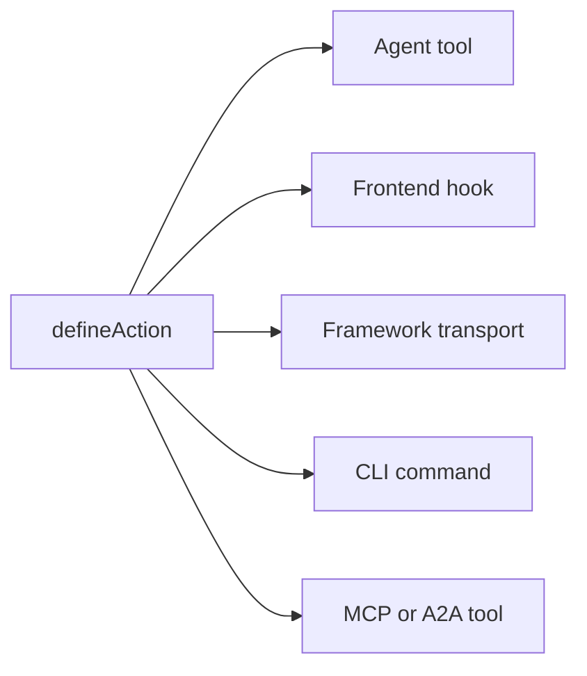

# المفاهيم الأساسية

كيفية عمل تطبيقات Agent-Native من الداخل: المبادئ والبنية المعمارية. هذه الصفحة هي العقد: القواعد الثابتة التي يجب أن يتبعها التطبيق ليُحسب agent-native. للاطلاع على الرؤية ومبرر البناء بهذه الطريقة، راجع [ما هو Agent-Native؟](/docs/what-is-agent-native).

## الطبقات الثلاث {#three-layers}

Agent-Native هو إطار عمل مكوَّن من ثلاث طبقات:

| الطبقة                                           | ما هي                                                                                                                                                                                                             |
| ------------------------------------------------ | ----------------------------------------------------------------------------------------------------------------------------------------------------------------------------------------------------------------- |
| **Core: الإطار**                                 | العقد الأساسي لوقت التشغيل: الإجراءات، ومساعدات PostgreSQL/PGlite وDrizzle، والمصادقة، وحالة التطبيق، وتنفيذ الوكيل، وفحوصات الوصول، والتوجيه (routing)، والمزامنة المباشرة. يمكن لكل تطبيق استخدام Core مباشرةً. |
| **Toolkit: قطع اختيارية قابلة لإعادة الاستخدام** | UI مشتركة لبناء التطبيقات وأنظمة منتج مثل العناصر الأولية، والمحررات، والمشاركة، والتعاون، والإعدادات، وتجربة الوكيل (agent UX). يمكن للتطبيقات استخدام القطع التي تحتاجها أو تركيبها أو عمل fork لها.            |
| **Templates: تطبيقات اختيارية مبنية على Core**   | تطبيقات كاملة خاصة بمجال معيَّن، بمسارات، ومخطط، وإجراءات، وتعليمات، وهوية بصرية. تستخدم Templates الرسمية والمخصصة عادةً Toolkit، ويمكن عمل fork لها واستخدامها كنقاط انطلاق.                                    |

Core هو الأساس. Toolkit وTemplates اختياريان: يمكن لقالب (template) استخدام Toolkit، لكن Toolkit ليس شرطًا لبناء تطبيق على Core.

## الهندسة المعمارية {#the-architecture}

في وقت التشغيل، كل تطبيق Agent-Native هو ثلاثة أشياء تعمل معًا:

- **الوكيل:** الذكاء الاصطناعي المستقل. يقرأ البيانات، ويكتبها، ويُشغِّل الإجراءات، ويستخدم أي أدوات مُهيَّأة. عندما يُمنح إطاره عمدًا وصولًا إلى مساحة العمل وأدوات كتابة، يمكنه أيضًا تعديل الكود المصدري للتطبيق نفسه. قابل للتخصيص بالمهارات والتعليمات.
- **التطبيق:** سطح المنتج حول الوكيل. قد يبدأ كدردشة، ثم يضيف نتائج مضمَّنة أصلية، وينمو ليصبح مستوى تحكم صغيرًا، أو يصبح UI كاملًا مبنيًا بـ React مع لوحات معلومات، وتدفقات، ومرئيات.
- **الكمبيوتر:** قاعدة البيانات، والمتصفح، وأوقات تشغيل الأدوات المُهيَّأة التي يتصرف الوكيل من خلالها. يعمل الوكلاء عبر سطح الإجراءات والبيانات الخاص بالتطبيق نفسه؛ ويمكن اختياريًا عرض هذا السطح نفسه عبر MCP، لكن خوادم MCP الخارجية تبقى إضافة، وليست الأساس.

يُظهر المخطط أدناه الوكيل والتطبيق جنبًا إلى جنب، وكلاهما بسهمين ثنائيي الاتجاه إلى طبقة كمبيوتر مشتركة واحدة أسفلهما. لا يملك أي منهما البيانات. بدلًا من ذلك، يقرآن ويكتبان إلى نفس متجر SQL، بحيث يكون أي تغيير يُجريه أي طرف مرئيًا للطرف الآخر فورًا، دون طبقة مزامنة يجب بناؤها بينهما.

<Diagram id="doc-block-t1f7pj" title="الوكيل، والتطبيق، والكمبيوتر" summary="ثلاث طبقات تعمل معًا فوق متجر SQL واحد مشترك. يقرأ الوكيل والتطبيق كلاهما نفس البيانات ويكتبانها.">

```html
<div class="diagram-arch">
  <div class="diagram-row">
    <div class="diagram-card">
      <span class="diagram-pill accent">الوكيل</span
      ><small class="diagram-muted"
        >يقرأ + يكتب البيانات، يُشغِّل الإجراءات، يستخدم الأدوات
        المُهيَّأة</small
      >
    </div>
    <div class="diagram-card">
      <span class="diagram-pill">التطبيق</span
      ><small class="diagram-muted"
        >دردشة، نتائج مضمَّنة، مستوى تحكم، أو UI كامل بـ React</small
      >
    </div>
  </div>
  <div class="diagram-arrow diagram-muted" aria-hidden="true">
    &darr;&nbsp;&uarr;
  </div>
  <div class="diagram-box" data-rough>
    الكمبيوتر<br /><small class="diagram-muted"
      >قاعدة بيانات SQL · متصفح · تنفيذ كود</small
    >
  </div>
</div>
```

```css
.diagram-arch {
  display: flex;
  flex-direction: column;
  align-items: center;
  gap: 10px;
}
.diagram-arch .diagram-row {
  display: flex;
  gap: 12px;
  flex-wrap: wrap;
  justify-content: center;
}
.diagram-arch .diagram-card {
  display: flex;
  flex-direction: column;
  gap: 6px;
  padding: 14px 16px;
  min-width: 220px;
}
.diagram-arch .diagram-arrow {
  font-size: 20px;
  line-height: 1;
}
.diagram-arch .diagram-box {
  text-align: center;
  padding: 12px 18px;
}
```

</Diagram>

نفس حلقة الوكيل-التطبيق-الكمبيوتر هذه هي ما يعمل محليًا وفي الإنتاج. تُشغِّلها تطبيقات الأتمتة أولاً مباشرةً من المجلد باستخدام `pnpm agent`؛ بينما تُثبِّت تطبيقات UI لوحة الوكيل المضمَّنة وتضيف `pnpm dev`. في السحابة، يستضيف Builder.io نفس الحلقة كإطار مُدار: البيئة التي تُشغِّل الوكيل بجانب تطبيقك. وهو يتولى التعاون، والتحرير المرئي، والبنية التحتية نيابةً عنك.

## عناصر بناء الوكيل {#agent-building-blocks}

كل تطبيق Agent-Native يملك نفس عناصر بناء الوكيل، بغض النظر عمّا إذا كان
سطح المنتج دردشة أولًا، أو أتمتة أولًا، أو UI كاملًا. يعيش كل عنصر
في ملفه الخاص:

<FileTree
  id="doc-block-1ae57y4"
  title="الإرشاد والسلوك"
  entries={[
    {
      path: "AGENTS.md",
      note: "تعليمات دائمة التفعيل: الغرض، القواعد الأساسية، مفاتيح الحالة، فهرس الإجراءات، فهرس المهارات",
    },
    {
      path: ".agents/skills/<name>/SKILL.md",
      note: "سلوك قابل لإعادة الاستخدام: خطوات سير العمل، والسياسات، والأمثلة، والمراجع، وقوائم ما يجب وما لا يجب فعله",
    },
    {
      path: "actions/<name>.ts",
      note: "قدرة قابلة للتنفيذ: عملية مكتوبة الأنواع مكشوفة للوكيل، وUI، وCLI، وHTTP، وMCP، وA2A، والمهام، والـwebhooks",
    },
  ]}
/>

الدور الواحد هو تبادل واحد مع الوكيل: يقرأ سياقه، ويقرر ما يجب فعله، ثم يستجيب. "يُحمَّل في كل دور" يعني أن الملف يعود إلى ذلك السياق في كل مرة، وليس مرة واحدة فقط عند بدء الجلسة.

| كتلة البناء   | الملف                            | استخدمه من أجل                                                                                                               | يُحمَّل عندما                                      |
| ------------- | -------------------------------- | ---------------------------------------------------------------------------------------------------------------------------- | -------------------------------------------------- |
| **التعليمات** | `AGENTS.md`                      | توجيه ثابت يجب أن يحمله الوكيل إلى كل مهمة: ما هو التطبيق، الثوابت، النبرة، الفهارس                                          | كل دور                                             |
| **المهارات**  | `.agents/skills/<name>/SKILL.md` | سلوك قابل لإعادة الاستخدام: كيفية اتباع سير عمل، أو تطبيق سياسة، أو فحص أدلة، أو التحقق من مخرَج                             | عند الطلب، عندما يطابق وصف المهارة المهمة          |
| **الإجراءات** | `actions/<name>.ts`              | عمليات حقيقية: قراءة البيانات أو كتابتها، واستدعاء واجهات API، وإرسال الرسائل، وتشغيل الموافقات، وإنتاج نتائج مكتوبة الأنواع | مُدرجة كأدوات في كل دور؛ تُنفَّذ فقط عند استدعائها |

تعمل المهارات والإجراءات معًا. تُعلّم المهارة الوكيل كيفية القيام بفئة من
العمل؛ والإجراء هو مسار الكود الذي يمكنه استدعاؤه أثناء القيام بذلك العمل. على سبيل المثال،
قد تخبر مهارة `customer-research` الوكيل بالمصادر التي يجب فحصها و
كيفية تلخيص الأدلة، بينما يقوم إجراءا `search-crm` و`create-brief`
بجلب البيانات الفعلية وكتابتها.

تحكم خمس قواعد البنية المعمارية:

1. **البيانات موجودة في PostgreSQL:** تعيش كل حالة التطبيق في قاعدة البيانات عبر Drizzle ORM.
2. **كل الذكاء الاصطناعي يمر عبر الوكيل:** لا توجد استدعاءات LLM مضمَّنة؛ يتدفق كل تفاعل بالذكاء الاصطناعي عبر جسر دردشة الوكيل.
3. **الإجراءات لعمليات الوكيل:** يعمل العمل المعقد كإجراء مكتوب الأنواع، وليس كود مضمَّن.
4. **المزامنة المباشرة تُبقي UI متزامنة:** تتدفق تغييرات قاعدة البيانات عبر SSE، مع الاستقصاء كإجراء احتياطي عام.
5. **حالة التطبيق في PostgreSQL:** تعيش حالة UI العابرة في قاعدة البيانات، وتكون قابلة للقراءة من الوكيل وUI معًا.

## قائمة التحقق ذات المجالات الأربعة {#four-area-checklist}

يجب أن تُحدِّث كل ميزة تواجه المستخدم جميع المجالات القابلة للتطبيق. تخطي مجال قابل للتطبيق يكسر عقد Agent-Native؛ كما أن فرض شاشة على أتمتة لا يحتاج أي إنسان لتصفحها يُعد أيضًا مؤشر خلل.

- **1. UI:** الصفحة أو المكوّن أو مربع الحوار الذي يتفاعل معه المستخدم.
- **2. الإجراء:** إجراء قابل لاستدعاء الوكيل في `actions/` لنفس العملية.
- **3. المهارات:** حدِّث `AGENTS.md` و/أو أنشئ مهارة توثِّق النمط.
- **4. حالة التطبيق:** حالة التنقل، وبيانات `view-screen`، وأوامر `navigate`.

الميزة التي تحتوي على UI فقط تكون غير مرئية للوكيل. ميزة UI كاملة تحتوي على إجراءات فقط تكون غير مرئية للمستخدم. الميزة التي لا تملك حالة تطبيق تعني أن الوكيل أعمى عمّا يفعله المستخدم. يمكن لعملية الأتمتة أولاً أن تبدأ بشكل مشروع بإجراء + تعليمات، ثم تضيف الدردشة أو UI أو حالة التطبيق لاحقًا عندما يحتاج البشر إلى تصفحها أو الموافقة عليها أو تهيئتها أو مشاركتها.

## ما الذي يتضمنه Agent-Native {#what-you-get-for-free}

تكمن قيمة اعتماد الإطار غالبًا فيما تتوقف عن الحاجة إلى بنائه. بمجرد أن يتبع تطبيقك القواعد الخمس أعلاه، فإنك ترث:

| الميزة                                    | ما الذي تحصل عليه                                                                                                                                                                                                                                                                                                                                      |
| ----------------------------------------- | ------------------------------------------------------------------------------------------------------------------------------------------------------------------------------------------------------------------------------------------------------------------------------------------------------------------------------------------------------ |
| إجراء واحد = كل سطح                       | كل إجراء مُعرَّف باستخدام `defineAction()` هو في الوقت نفسه أداة وكيل، وخطاف واجهة أمامية آمن للأنواع (`useActionQuery` / `useActionMutation`)، ونقل HTTP مملوك للإطار، وأمر CLI، وأداة MCP للعملاء الخارجيين، وأداة A2A لتطبيقات Agent-Native الأخرى. تضيف البيانات الوصفية الاختيارية `link` و`mcpApp` روابط عميقة وواجهات MCP Apps بدون تنفيذ ثانٍ. |
| موارد وكيل كاملة لكل مستخدم               | المهارات، و`LEARNINGS.md` المشتركة، و`memory/MEMORY.md` الشخصية، و`AGENTS.md`، ووكلاء فرعيون مخصصون، ومهام مجدولة، وخوادم MCP متصلة. جميعها مدعومة بـ SQL، دون الحاجة إلى صندوق تطوير. راجع [موارد الوكيل](/docs/agent-resources).                                                                                                                     |
| مكونات React جاهزة للإضافة                | يعرض `<AgentPanel />` و`<AgentSidebar />` الدردشة + الموارد في أي مكان في تطبيقك. راجع [Drop-in Agent](/docs/drop-in-agent).                                                                                                                                                                                                                           |
| أوقات تشغيل دردشة وكيل توفرها بنفسك (BYO) | يمكن لنفس واجهة الدردشة أن تعمل فوق OpenAI Agents، أو OpenAI Responses، أو Claude Agent SDK، أو Vercel AI SDK، أو AG-UI، أو تدفق HTTP مُوحَّد خاص بك. راجع [واجهة المحادثة الأصيلة](/docs/native-chat-ui#byo-agent-runtimes).                                                                                                                          |
| مزامنة مباشرة بين الوكيل وUI              | تتدفق الكتابات داخل نفس العملية فورًا عبر `/_agent-native/events`؛ ويُبقي استقصاء خفيف الوزن عمليات الكتابة بدون خادم، وcron، وعبر العمليات متقاربة. تُبطل الإجراءات المُغيِّرة للبيانات الاستعلامات المدعومة بالإجراءات تلقائيًا، بحيث تظهر السجلات التي أنشأها الوكيل دون تحديث يدوي. راجع [المزامنة المباشرة](#polling-sync) أدناه.                 |
| المصادقة، والمؤسسات، وRBAC                | Better Auth مع المؤسسات/الأعضاء/الأدوار موصولة مسبقًا في كل قالب. راجع [المصادقة](/docs/authentication). لأكثر من مستخدم واحد، ابدأ بـ [المؤسسات والفرق والأذونات](/docs/organizations-teams-permissions).                                                                                                                                             |
| الوعي بالسياق                             | يعرف الوكيل دائمًا ما ينظر إليه المستخدم من خلال مفتاح حالة التطبيق `navigation`. راجع [الوعي بالسياق](/docs/context-awareness).                                                                                                                                                                                                                       |
| عميل وخادم MCP، في الاتجاهين              | يستوعب التطبيق خوادم MCP (محلية، أو بعيدة، أو مشتركة عبر hub) _و_ يعرض إجراءاته الخاصة كخادم MCP. راجع [عملاء MCP](/docs/mcp-clients) و[MCP Protocol](/docs/mcp-protocol).                                                                                                                                                                             |
| التفويض بين التطبيقات                     | تتحدث الوكلاء في تطبيقات مختلفة عبر [A2A](/docs/a2a-protocol). عمليات النشر من نفس الأصل تتخطى JWT؛ ويستخدم النشر عبر الأصول `A2A_SECRET` مشتركًا.                                                                                                                                                                                                     |
| فرق الوكلاء الفرعيين                      | أنشئ وكيلًا فرعيًا بخيطه وأدواته الخاصة، يظهر كشريحة مضمَّنة في الدردشة. راجع [Agent Teams](/docs/agent-teams).                                                                                                                                                                                                                                        |
| قابلية النقل                              | PostgreSQL مع PGlite محليًا وPostgres مستضافًا، وأي مضيف متوافق مع Nitro (Node، وWorkers، وNetlify، وVercel، وDeno، وLambda، وBun).                                                                                                                                                                                                                    |

## البيانات في PostgreSQL {#data-in-sql}

تعيش كل حالة التطبيق في PostgreSQL عبر Drizzle ORM. تستخدم المخططات مساعدات PostgreSQL وPGlite؛ وتوجد إعدادات `DATABASE_URL` وقواعد التشغيل في [Database](/docs/server-database).

يتم إنشاء متاجر SQL الأساسية تلقائيًا وهي متاحة في كل قالب:

- `application_state`: حالة UI عابرة (التنقل، المسودات، التحديدات)
- `settings`: تهيئة قيمة-مفتاح دائمة
- `oauth_tokens`: بيانات اعتماد OAuth
- `sessions`: جلسات المصادقة

يتوسع كل صف أدناه لعرض حقوله:

<DataModel
  id="doc-block-4w0fu8"
  title="متاجر SQL الأساسية"
  summary={
    "تُنشأ تلقائيًا في كل قالب. يقرأ الوكيل وUI كلاهما هذه العناصر ويكتبان إليها."
  }
  entities={[
    {
      id: "application_state",
      name: "application_state",
      note: "حالة UI عابرة يقرأها الوكيل للسياق",
      fields: [
        {
          name: "key",
          type: "text",
          pk: true,
          note: "على سبيل المثال 'navigation'",
        },
        {
          name: "value",
          type: "json",
          note: "العرض، التحديد، المسودات",
        },
      ],
    },
    {
      id: "settings",
      name: "settings",
      note: "تهيئة قيمة-مفتاح دائمة",
      fields: [
        {
          name: "key",
          type: "text",
          pk: true,
        },
        {
          name: "value",
          type: "json",
        },
      ],
    },
    {
      id: "oauth_tokens",
      name: "oauth_tokens",
      note: "بيانات اعتماد OAuth",
      fields: [
        {
          name: "provider",
          type: "text",
          pk: true,
        },
        {
          name: "token",
          type: "text",
        },
      ],
    },
    {
      id: "sessions",
      name: "sessions",
      note: "جلسات المصادقة",
      fields: [
        {
          name: "id",
          type: "text",
          pk: true,
        },
        {
          name: "userId",
          type: "text",
        },
      ],
    },
  ]}
/>

لإضافة بياناتك الخاصة بالمجال، عرِّف جدولًا باستخدام نفس مساعدات المخطط المستخدمة في المتاجر الأساسية أعلاه:

```ts
// Drizzle schema for domain data
import { table, text, integer } from "@agent-native/core/db/schema";

export const forms = table("forms", {
  id: text("id").primaryKey(),
  title: text("title").notNull(),
  schema: text("schema").notNull(), // JSON
  ownerEmail: text("owner_email"),
  createdAt: integer("created_at").notNull(),
});
```

يمكنك أنت والوكيل معًا فحص تلك البيانات من الطرفية، دون الحاجة إلى عميل SQL منفصل:

```bash
# إجراءات Core لفحص قاعدة البيانات بسرعة
pnpm action db-schema                                       # show all tables
pnpm action db-query --sql "SELECT * FROM forms"
```

تطبع `db-schema` أعمدة كل جدول وأنواعها. تُشغِّل `db-query` SQL للقراءة فقط مباشرةً، وهو أمر مفيد للتحقق من كتابات إجراء ما دون فتح عميل قاعدة بيانات.

<Callout tone="decision">

يقوم البرنامج الإضافي للدردشة مع وكيل الإنتاج بتعيين أدوات SQL الخام إلى القراءة فقط افتراضيًا (`frameworkTools: { database: "read" }`)، لذلك يفحص الوكلاء بيانات التطبيق باستخدام `db-schema` / `db-query` ويجرون عمليات الكتابة عبر actions التطبيق المكتوبة. عيّن `database: "write"` (أو `true`) فقط لأسطح الصيانة المقصودة التي يجب أن تعرض `db-exec` / `db-patch` ذات النطاق؛ أو عيّن `database: "off"` / `false` للمطالبة بالتطبيق المكتوب actions لجميع البيانات الوصول.

</Callout>

يتحكم `frameworkTools` ببقية أدوات الإطار نفسها بالطريقة ذاتها: المشاركة، وتعليقات المراجعة، وسجل الإصدارات، وfeature flags، والتعريب، والتدقيق، وContext X-Ray، والملف الشخصي، والأتمتة، وdocs، وresources، وweb، والتفويض بين التطبيقات، والمحادثة، والبريد. راجع [Production Agent Tools](/docs/actions-agent-tools#production-agent-tools) للقائمة الكاملة والإعداد المسبق `"minimal"` وسبب بقاء مسارات HTTP مثبّتة عند إيقاف مجموعة.

## جسر دردشة الوكيل {#agent-chat-bridge}

لا يستدعي UI أبدًا LLM مباشرةً. عندما ينقر المستخدم على "إنشاء رسم بياني" أو "كتابة ملخص"، يرسل UI رسالة إلى الوكيل عبر `postMessage`. يقوم الوكيل بالعمل. لديه سجل المحادثة الكامل، والمهارات، والتعليمات، والقدرة على التكرار.

```ts
// Delegate AI work to the agent from a React component
import { sendToAgentChat } from "@agent-native/core/client/agent-chat";
sendToAgentChat({
  message: "Generate a chart showing signups by source",
  context: "Dashboard ID: main, date range: last 30 days",
  submit: true,
});
```

باختصار:

- **الذكاء الاصطناعي غير حتمي:** تحتاج إلى تدفق محادثة لتقديم الملاحظات والتكرار، وليس أزرارًا تُستخدم مرة واحدة.
- **السياق مهم:** يمتلك الوكيل تعليمات التطبيق ومهاراته وسجله. الاستدعاء المضمَّن لا يملك أيًا من ذلك.
- **يمكن للوكيل فعل المزيد:** يمكنه تشغيل إجراءات، وتصفح الويب، وربط خطوات متعددة معًا.

**[التنفيذ الخارجي](/docs/a2a-protocol)**

بما أن كل شيء يمر عبر الوكيل والإجراءات، يمكن تشغيل أي تطبيق من Slack، أو Telegram، أو مهام مجدولة، أو نصوص برمجية، أو وكيل آخر عبر A2A.

## نظام الإجراءات {#actions-system}

عندما يحتاج الوكيل إلى القيام بشيء معقد، مثل استدعاء API، أو معالجة بيانات، أو الاستعلام عن قاعدة البيانات، فإنه يُشغِّل **إجراءً**. الإجراءات هي ملفات TypeScript في `actions/` تُصدِّر `defineAction()` افتراضيًا:

```ts filename="actions/fetch-data.ts"
import { defineAction } from "@agent-native/core/action";
import { z } from "zod";

// One action powers every app surface: UI, agent, HTTP, MCP, A2A, and CLI.
export default defineAction({
  description: "Fetch data from a source API.",
  schema: z.object({
    source: z.string().describe("Data source key, e.g. 'signups'"),
  }),
  run: async ({ source }) => {
    const res = await fetch(`https://api.example.com/${source}`);
    return await res.json();
  },
});
```

يجلب هذا الإجراء JSON من واجهة API مصدر ويعيده. يغلِّف `defineAction()` الدالة بمخطط zod لمدخلها (`source`)، بحيث يمكن للإطار التحقق من صحة ذلك المدخل، وتوليد مخطط JSON يمكن للوكيل استدعاءه، واستنتاج الأنواع لخطاف الواجهة الأمامية، كل ذلك من هذا التعريف الواحد.

يصل استدعاء `defineAction()` واحد تلقائيًا إلى خمسة مستهلكين مختلفين. يوضح المخطط الانتشار من إجراء واحد؛ وتشرح القائمة أدناه ما يحصل عليه كل مستهلك:



- **أداة الوكيل:** يراها الوكيل بمخطط JSON المشتق من zod ويمكنه استدعاؤها.
- **خطاف الواجهة الأمامية:** `useActionMutation("fetch-data")` مع استدلال TypeScript كامل.
- **نقل الإطار:** يُثبَّت تلقائيًا خلف خطافات العميل.
- **CLI:** `pnpm action fetch-data --source=signups` للبرمجة النصية وحلقات تطوير الوكيل.
- **أداة MCP / أداة A2A:** عند تفعيل خادم MCP أو A2A، يظهر نفس الإجراء هناك أيضًا.

يستدعي كل مستهلك نفس الدالة الأساسية، لذا لا يوجد سوى تنفيذ واحد يجب كتابته وصيانته. راجع [الإجراءات](/docs/actions-overview) للحصول على المرجع الكامل.

## المزامنة المباشرة {#polling-sync}

عندما يُغيِّر الوكيل البيانات، يحتاج UI إلى عكس ذلك دون تحديث يدوي. `useDbSync()` هو ما يجعل ذلك تلقائيًا. تتدفق الكتابات داخل نفس العملية عبر `/_agent-native/events`؛ ويبقى `/_agent-native/poll` هو الإجراء الاحتياطي عبر العمليات وبدون خادم. عندما يكتب الوكيل إلى قاعدة البيانات (حالة التطبيق، أو الإعدادات، أو بيانات المجال)، يزداد عداد الإصدار ويُبطل العميل ذواكر التخزين المؤقت لـ React Query ذات الصلة.

يعتمد النظام على SSE بدلًا من WebSockets لتغطية الحالة الشائعة، لأنه يمنح الكتابات داخل نفس العملية مسارًا فوريًا إلى المتصفح عبر HTTP عادي، بينما يبقى الاستقصاء المعتمد على عداد الإصدار إجراءً احتياطيًا يعمل في كل بيئة نشر، بما في ذلك serverless وedge، حيث قد لا تتوفر مقابس (sockets) دائمة.

```ts
// Client: subscribe to agent/UI data changes once near the app shell
import { useDbSync } from "@agent-native/core/client/hooks";
useDbSync({ queryClient });
```

استدعِ هذا مرة واحدة، بالقرب من جذر التطبيق. فهو يشترك بالتطبيق بأكمله في أحداث التغيير، بحيث تُعيد أي مكوِّن يستخدم `useActionQuery` أو `useQuery` ذات إصدار مصدر جلب البيانات تلقائيًا عندما تتغير البيانات التي يقرؤها.

التدفق هو:

1. يُشغِّل الوكيل إجراءً يكتب إلى قاعدة البيانات
2. يُصدر الخادم حدث تغيير بمصدر مثل `"action"` أو `"settings"`
3. يتلقاه `useDbSync` عبر SSE أو الإجراء الاحتياطي بالاستقصاء
4. تُعيد خطافات `useActionQuery` وخطافات `useQuery` ذات إصدار مصدر الجلب
5. تعرض المكونات البيانات الجديدة دون إعادة تحميل الصفحة

يتتبع المخطط نفس هذا التسلسل من البداية إلى النهاية:

<Diagram id="doc-block-87e1c3" title="تدفق المزامنة المباشرة" summary={"تصبح كتابة الوكيل عرضًا في UI دون تحديث يدوي. SSE أولًا، والاستقصاء كإجراء احتياطي عام."}>

```html
<div class="diagram-sync">
  <div class="diagram-node">
    إجراء الوكيل<br /><small class="diagram-muted"
      >يكتب إلى قاعدة البيانات</small
    >
  </div>
  <div class="diagram-arrow diagram-muted" aria-hidden="true">&rarr;</div>
  <div class="diagram-node">
    حدث تغيير<br /><small class="diagram-muted"
      >source: action / settings</small
    >
  </div>
  <div class="diagram-arrow diagram-muted" aria-hidden="true">&rarr;</div>
  <div class="diagram-panel center">
    <span class="diagram-pill accent">useDbSync</span
    ><small class="diagram-muted">SSE &middot; الاستقصاء الاحتياطي</small>
  </div>
  <div class="diagram-arrow diagram-muted" aria-hidden="true">&rarr;</div>
  <div class="diagram-node">
    إعادة جلب الاستعلام<br /><small class="diagram-muted"
      >عرض، بدون إعادة تحميل</small
    >
  </div>
</div>
```

```css
.diagram-sync {
  display: flex;
  align-items: center;
  gap: 10px;
  flex-wrap: wrap;
}
.diagram-sync .diagram-arrow {
  font-size: 22px;
  line-height: 1;
}
.diagram-sync .center {
  display: flex;
  flex-direction: column;
  align-items: center;
  gap: 4px;
  padding: 10px 14px;
}
```

</Diagram>

يعمل هذا في جميع بيئات النشر، بما في ذلك serverless وedge، لأنه يستخدم قاعدة البيانات بدلاً من الحالة داخل الذاكرة أو مراقبي نظام الملفات.

## الوعي بالسياق {#context-awareness}

يعرف الوكيل دائمًا ما ينظر إليه المستخدم. يكتب UI مفتاح `navigation` إلى application-state عند كل تغيير للمسار. يقرأه الوكيل عبر إجراء `view-screen` قبل التصرف.

على سبيل المثال، عند فتح سلسلة رسائل بريد إلكتروني، يُدرج UI أو يُحدِّث صفًا مثل:

```json
{ "key": "navigation", "value": { "view": "thread", "threadId": "th_abc123" } }
```

<Callout tone="info">

يكتب UI هذا عند تغيير المسار؛ ويقرأه الوكيل (عبر `view-screen`) قبل اتخاذ أي إجراء، بحيث يعرف دائمًا أي سلسلة رسائل، أو رسم بياني، أو شريحة تُركِّز عليها.

</Callout>

راجع [الوعي بالسياق](/docs/context-awareness) للاطلاع على النمط الكامل: حالة التنقل، وview-screen، وأوامر navigate، ومنع الاهتزاز.

## إجراء واحد، وأسطح متعددة {#protocols}

نفِّذ عملية المجال مرة واحدة كإجراء؛ ويعرضها الإطار لكل مستهلك. يصبح نفس `defineAction()` أداة وكيل، وخطاف UI آمن الأنواع، ونقطة نهاية HTTP، وأمر CLI، وأداة MCP، وأداة A2A، مع إضافة بيانات وصفية اختيارية مثل `link`، أو `mcpApp`، أو عنصر واجهة أصلي، أو أغلفة Generative UI فقط عندما يحتاج سطح ما إلى تفاعل أغنى. تغطي المهارات والتعليمات السلوك.

للاطلاع على مصفوفة البروتوكولات/الأسطح الكاملة (خادم MCP وOAuth، وMCP Apps، وA2A، والروابط العميقة، وعناصر واجهة الدردشة الأصلية، وGenerative UI، وموصلات AgentChatRuntime، وAgent Web، وأفق المحوِّلات لـ ACP وA2UI)، ولاختيار شكل المنتج (دردشة، أو UI مضمَّن، أو صفحات تطبيق كاملة، أو sidecar مضمَّن، أو أتمتة، أو وصول وكيل خارجي)، راجع [أسطح الوكيل](/docs/agent-surfaces).

## كود التطبيق والتخصيص {#agent-modifies-code}

لا يمنح الإطار الوكيلَ المضمَّن وصولًا محيطيًا (ambient) تلقائيًا إلى الكود المصدري للتطبيق. في التطبيق المنشور،
يعمل الوكيل عادةً من خلال الإجراءات، والحالة المدعومة بـ SQL، والتكاملات المهيَّأة. يمكنه تحرير المكوِّنات، والمسارات،
والأنماط، والإجراءات عندما يُمنح إطاره عمدًا وصولًا إلى مساحة العمل
وأدوات كتابة. Templates هي تطبيقات كاملة يمكنك عمل fork لها وتخصيصها في مستودعك
ومسار تطويرك الخاصين على أي حال. للتخصيص في وقت التشغيل
دون تغييرات في الكود المصدري، استخدم [Extensions](/docs/extensions).

## PostgreSQL افتراضيًا {#hosting-agnostic}

تحافظ قاعدتان معماريتان على اتساق التطبيقات بين PGlite وPostgres المستضاف وعبر أهداف الاستضافة:

- **PostgreSQL.** اكتب المخططات باستخدام `@agent-native/core/db/schema` والقراءة والكتابة باستخدام Drizzle. استخدم SQL الخاص بـPostgreSQL فقط للترحيلات الإضافية أو الصيانة لمرة واحدة، وحافظ على التوافق مع PGlite. راجع [Database](/docs/server-database).
- **لا تعتمد على استضافة معيَّنة.** يعمل الخادم على Nitro ويُصرَّف إلى أي هدف نشر. لا تستخدم أبدًا واجهات برمجة خاصة بـ Node (`fs`، `child_process`، `path`) في مسارات الخادم أو الإضافات، ولا تفترض أبدًا وجود عملية خادم دائمة. serverless وedge عديما الحالة، لذا احتفظ بكل الحالة في SQL. راجع [النشر](/docs/deployment).

## موارد الوكيل {#workspace}

يحصل كل مستخدم على مجموعة شخصية من **موارد الوكيل**: التعليمات، والمهارات، والذاكرة، والوكلاء الفرعيون المخصصون، والمهام المجدولة، وخوادم MCP المتصلة، وكلها مخزَّنة في SQL بدلًا من الملفات. هذا يجعل التخصيص على مستوى Claude Code قابلًا للتطبيق داخل SaaS متعدد المستأجرين دون تشغيل حاوية لكل مستخدم. راجع [موارد الوكيل](/docs/agent-resources).

## عناصر بناء ذات صلة {#building-blocks}

تقع هذه العناصر فوق نفس العقد ولها تفصيلاتها العميقة الخاصة:

- **[Dispatch](/docs/dispatch):** مستوى التحكم في مساحة العمل، مع بريد وارد مشترك، وخزنة أسرار، ومهام مجدولة، ومنسِّق يفوِّض إلى تطبيقات متخصصة عبر A2A.
- **[Extensions](/docs/extensions):** تطبيقات Alpine.js مصغَّرة معزولة (sandboxed) ينشئها الوكيل في وقت التشغيل، دون تغييرات في الكود المصدري أو عمليات ترحيل.
- **[بروتوكول A2A](/docs/a2a-protocol):** كيف تكتشف التطبيقات في نفس مساحة العمل بعضها البعض وتستدعيه عبر JSON-RPC.

## الخطوات التالية {#deep-dives}

<Cards>

### [ما هو Agent-Native؟](/docs/what-is-agent-native)

الرؤية والفلسفة الكامنتان وراء هذه القواعد.

### [الوعي بالسياق](/docs/context-awareness)

حالة التنقل، وview-screen، وأوامر navigate بالتفصيل.

### [آليات المزامنة الداخلية](/docs/client-sync-internals)

آلية إصدار التغيير الكامنة خلف المزامنة المباشرة، لمزامنة `useQuery` مخصص.

### [دليل المهارات](/docs/skills-guide)

مهارات الإطار، ومهارات المجال، وإنشاء مهارات مخصصة.

### [واجهة المحادثة الأصيلة](/docs/native-chat-ui)

جداول ورسوم بيانية مُعلَنة من الإجراءات، ووضعية أوقات تشغيل BYO.

### [أسطح الوكيل](/docs/agent-surfaces)

الدردشة، وUI مضمَّن أصلي، وصفحات تطبيق كاملة، وsidecar مضمَّن، وأتمتة، ومسارات الوكيل الخارجي.

### [بروتوكول A2A](/docs/a2a-protocol)

التواصل من وكيل إلى وكيل.

</Cards>
