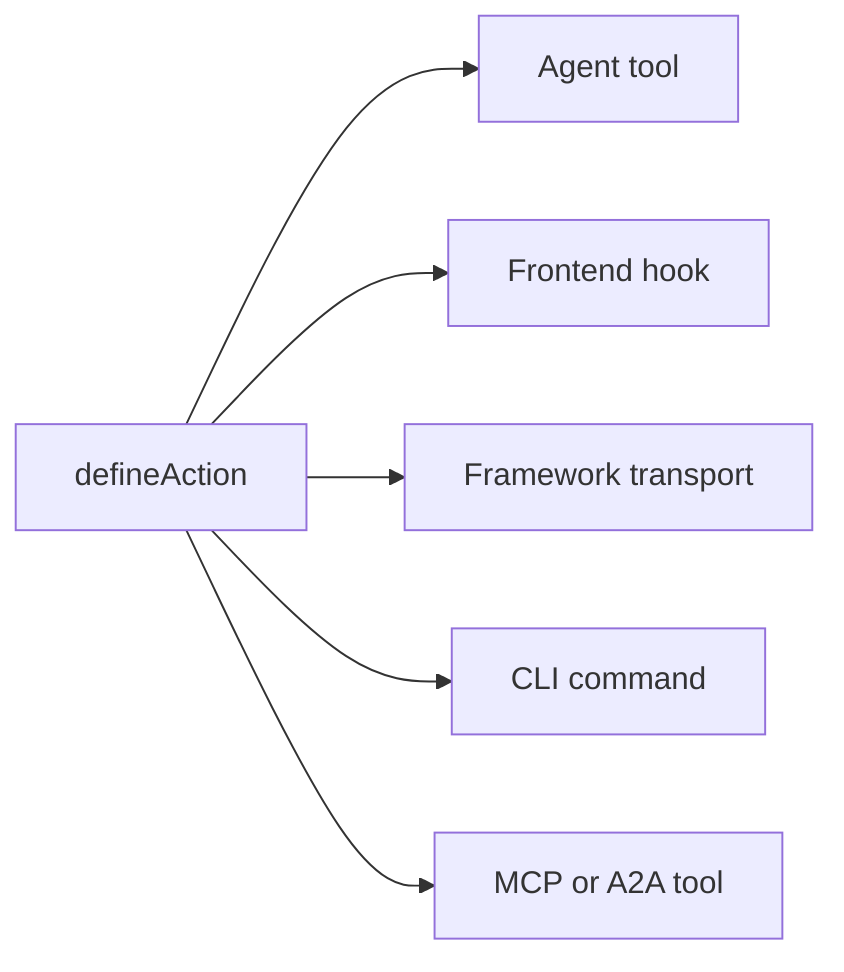

# Kernkonzepte

Wie Agent-Native-Apps im Detail funktionieren: die Prinzipien und die Architektur. Diese Seite ist der Vertrag: die festen Regeln, denen eine App folgen muss, um als Agent-Native zu gelten. Für die Vision und die Begründung, warum man so baut, siehe [Was ist Agent-Native?](/docs/what-is-agent-native).

## Die drei Ebenen {#three-layers}

Agent-Native ist ein Framework mit drei Ebenen:

| Ebene                                              | Was es ist                                                                                                                                                                                                                                  |
| -------------------------------------------------- | ------------------------------------------------------------------------------------------------------------------------------------------------------------------------------------------------------------------------------------------- |
| **Core: das Framework**                            | Der grundlegende Laufzeitvertrag: Aktionen, PostgreSQL/PGlite- und Drizzle-Hilfsfunktionen, Auth, Anwendungsstatus, Agentenausführung, Zugriffsprüfungen, Routing und Live-Synchronisierung. Jede App kann Core direkt verwenden.           |
| **Toolkit: optionale wiederverwendbare Bausteine** | Gemeinsame UI- und Produktsysteme zum App-Bau, etwa Primitives, Editoren, Freigabe, Zusammenarbeit, Einstellungen und Agent-UX. Apps können die benötigten Bausteine verwenden, kombinieren oder forken.                                    |
| **Templates: optionale Apps auf Core-Basis**       | Vollständige, domänenspezifische Apps mit Routen, Schema, Aktionen, Anweisungen und visueller Identität. Erstanbieter- und benutzerdefinierte Templates verwenden häufig Toolkit und können geforkt und als Ausgangspunkt verwendet werden. |

Core ist die Grundlage. Toolkit und Templates sind optional: Ein Template kann Toolkit verwenden, aber Toolkit ist nicht erforderlich, um eine App auf Core aufzubauen.

## Die Architektur {#the-architecture}

Zur Laufzeit ist jede Agent-Native-App drei Dinge, die zusammenarbeiten:

- **Agent:** Die autonome KI. Sie liest Daten, schreibt Daten, führt Aktionen aus und verwendet alle konfigurierten Tools. Wenn ihrem Frame absichtlich Workspace-Zugriff und Schreib-Tooling gewährt wird, kann sie auch den eigenen Quellcode der App ändern. Anpassbar mit Skills und Anweisungen.
- **Anwendung:** Die Produktoberfläche rund um den Agenten. Sie kann als Chat beginnen, native Inline-Ergebnisse hinzufügen, zu einer kleinen Steuerzentrale heranwachsen oder zu einer vollständigen React-UI mit Dashboards, Abläufen und Visualisierungen werden.
- **Computer:** Die Datenbank, der Browser und die konfigurierten Tool-Laufzeiten, über die der Agent handelt. Agenten arbeiten über die eigene Aktions- und Datenoberfläche der App; dieselbe Oberfläche kann optional über MCP freigegeben werden, aber externe MCP-Server bleiben ein Add-on, nicht das Fundament.

Das folgende Diagramm zeigt den Agenten und die Anwendung nebeneinander, beide mit Doppelpfeilen in eine gemeinsame Computer-Ebene darunter. Keiner von beiden besitzt die Daten. Stattdessen lesen und schreiben sie denselben SQL-Speicher, sodass eine Änderung von der einen Seite sofort für die andere sichtbar ist, ohne dass dazwischen eine Sync-Schicht gebaut werden muss.

<Diagram id="doc-block-t1f7pj" title="Agent, Anwendung und Computer" summary="Drei Ebenen, die über einem gemeinsamen SQL-Speicher zusammenarbeiten. Der Agent und die Anwendung lesen und schreiben beide dieselben Daten.">

```html
<div class="diagram-arch">
  <div class="diagram-row">
    <div class="diagram-card">
      <span class="diagram-pill accent">Agent</span
      ><small class="diagram-muted"
        >liest + schreibt Daten, führt Aktionen aus, nutzt konfigurierte
        Tools</small
      >
    </div>
    <div class="diagram-card">
      <span class="diagram-pill">Anwendung</span
      ><small class="diagram-muted"
        >Chat, Inline-Ergebnisse, Steuerzentrale oder vollständige
        React-UI</small
      >
    </div>
  </div>
  <div class="diagram-arrow diagram-muted" aria-hidden="true">
    &darr;&nbsp;&uarr;
  </div>
  <div class="diagram-box" data-rough>
    Computer<br /><small class="diagram-muted"
      >SQL-Datenbank · Browser · Codeausführung</small
    >
  </div>
</div>
```

```css
.diagram-arch {
  display: flex;
  flex-direction: column;
  align-items: center;
  gap: 10px;
}
.diagram-arch .diagram-row {
  display: flex;
  gap: 12px;
  flex-wrap: wrap;
  justify-content: center;
}
.diagram-arch .diagram-card {
  display: flex;
  flex-direction: column;
  gap: 6px;
  padding: 14px 16px;
  min-width: 220px;
}
.diagram-arch .diagram-arrow {
  font-size: 20px;
  line-height: 1;
}
.diagram-arch .diagram-box {
  text-align: center;
  padding: 12px 18px;
}
```

</Diagram>

Dieselbe Agent-Anwendung-Computer-Schleife läuft lokal und in Produktion. Automation-first-Apps führen sie direkt aus dem Ordner mit `pnpm agent` aus; UI-Apps binden das eingebettete Agent-Panel ein und ergänzen `pnpm dev`. In der Cloud hostet Builder.io dieselbe Schleife als verwaltetes Frame: die Umgebung, die den Agenten neben Ihrer App ausführt. Sie übernimmt Zusammenarbeit, visuelles Bearbeiten und Infrastruktur für Sie.

## Bausteine des Agenten {#agent-building-blocks}

Jede Agent-Native-App hat dieselben Bausteine des Agenten, unabhängig davon, ob
die Produktoberfläche Chat-first, Automation-first oder eine vollständige UI ist. Jeder Baustein
lebt in seiner eigenen Datei:

<FileTree
  id="doc-block-1ae57y4"
  title="Anleitung und Verhalten"
  entries={[
    {
      path: "AGENTS.md",
      note: "immer aktive Anweisungen: Zweck, Kernregeln, Status-Schlüssel, Aktionsindex, Skills-Index",
    },
    {
      path: ".agents/skills/<name>/SKILL.md",
      note: "wiederverwendbares Verhalten: Workflow-Schritte, Richtlinien, Beispiele, Referenzen und Do/Don't-Listen",
    },
    {
      path: "actions/<name>.ts",
      note: "ausführbare Fähigkeit: typisierte Operation, die dem Agenten, der UI, der CLI, HTTP, MCP, A2A, Jobs und Webhooks zur Verfügung steht",
    },
  ]}
/>

Eine Runde ist ein Austausch mit dem Agenten: Er liest seinen Kontext, entscheidet, was zu tun ist, und antwortet. „Bei jeder Runde geladen" bedeutet, dass die Datei jedes Mal erneut in diesen Kontext gelangt, nicht nur einmal zu Sitzungsbeginn.

| Baustein        | Datei                            | Wofür                                                                                                                                       | Geladen wann                                                     |
| --------------- | -------------------------------- | ------------------------------------------------------------------------------------------------------------------------------------------- | ---------------------------------------------------------------- |
| **Anweisungen** | `AGENTS.md`                      | Stabile Anleitung, die der Agent in jede Aufgabe mitnehmen soll: was die App ist, Invarianten, Ton, Indizes                                 | Jede Runde                                                       |
| **Skills**      | `.agents/skills/<name>/SKILL.md` | Wiederverwendbares Verhalten: wie man einem Workflow folgt, eine Richtlinie anwendet, Belege prüft oder eine Ausgabe verifiziert            | Bei Bedarf, wenn die Skill-Beschreibung zur Aufgabe passt        |
| **Actions**     | `actions/<name>.ts`              | Echte Operationen: Daten lesen oder schreiben, APIs aufrufen, Nachrichten senden, Genehmigungen durchführen, typisierte Ergebnisse erzeugen | Als Tools bei jeder Runde aufgelistet; ausgeführt nur bei Aufruf |

Skills und Actions arbeiten zusammen. Ein Skill bringt dem Agenten bei, wie er eine
Klasse von Arbeit erledigt; eine Aktion ist der Codepfad, den er dabei aufrufen kann. Ein
Skill `customer-research` könnte dem Agenten beispielsweise sagen, welche Quellen er prüfen
und wie er Belege zusammenfassen soll, während die Aktionen `search-crm` und `create-brief`
die eigentlichen Daten abrufen und schreiben.

Fünf Regeln bestimmen die Architektur:

1. **Daten leben in PostgreSQL:** Der gesamte App-Zustand lebt in der Datenbank via Drizzle ORM.
2. **Alle KI läuft über den Agenten:** keine Inline-LLM-Aufrufe; jede KI-Interaktion läuft über die Agent-Chat-Bridge.
3. **Aktionen für Agentenoperationen:** komplexe Arbeit läuft als typisierte Aktion, nicht als Inline-Code.
4. **Live Sync hält die UI synchron:** Datenbankänderungen werden über SSE gestreamt, mit Polling als universellem Fallback.
5. **Anwendungsstatus in PostgreSQL:** flüchtiger UI-Zustand lebt in der Datenbank, lesbar sowohl von Agent als auch UI.

## Die Vier-Bereiche-Checkliste {#four-area-checklist}

Jedes benutzerseitige Feature sollte alle zutreffenden Bereiche aktualisieren. Einen zutreffenden Bereich auszulassen bricht den Agent-Native-Vertrag; einer Automatisierung, die kein Mensch durchsuchen muss, einen Bildschirm aufzuzwingen, ist ebenfalls ein Smell.

- **1. UI:** Seite, Komponente oder Dialog, mit der/dem der Benutzer interagiert.
- **2. Aktion:** Agentenaufrufbare Aktion in `actions/` für denselben Vorgang.
- **3. Skills:** `AGENTS.md` aktualisieren und/oder einen Skill erstellen, der das Muster dokumentiert.
- **4. App-State:** Navigationsstatus, view-screen-Daten und navigate-Befehle.

Ein Feature mit nur UI ist für den Agenten unsichtbar. Ein vollständiges UI-Feature mit nur Aktionen ist für den Benutzer unsichtbar. Ein Feature ohne App-State bedeutet, dass der Agent nicht sieht, was der Benutzer tut. Ein Automation-first-Vorgang kann legitim mit Aktion + Anweisungen beginnen und später Chat, UI oder App-State hinzufügen, wenn Menschen ihn durchsuchen, genehmigen, konfigurieren oder teilen müssen.

## Was Agent-Native enthält {#what-you-get-for-free}

Das Framework zu übernehmen ist vor allem deshalb wertvoll, weil man dadurch vieles nicht mehr selbst bauen muss. Sobald Ihre App den fünf obigen Regeln folgt, erben Sie:

| Feature                                    | Was es Ihnen gibt                                                                                                                                                                                                                                                                                                                                                                                               |
| ------------------------------------------ | --------------------------------------------------------------------------------------------------------------------------------------------------------------------------------------------------------------------------------------------------------------------------------------------------------------------------------------------------------------------------------------------------------------- |
| Eine Aktion = jede Oberfläche              | Jede mit `defineAction()` definierte Aktion ist gleichzeitig ein Agenten-Tool, ein typsicherer Frontend-Hook (`useActionQuery` / `useActionMutation`), ein Framework-eigener HTTP-Transport, ein CLI-Befehl, ein MCP-Tool für externe Clients und ein A2A-Tool für andere Agent-Native-Apps. Optionale `link`- und `mcpApp`-Metadaten fügen Deep Links und MCP-Apps-UI hinzu, ohne eine zweite Implementierung. |
| Vollständige Agent-Ressourcen pro Benutzer | Skills, gemeinsame `LEARNINGS.md`, persönliche `memory/MEMORY.md`, `AGENTS.md`, benutzerdefinierte Sub-Agenten, geplante Jobs und verbundene MCP-Server. Alles SQL-basiert, keine Dev-Box erforderlich. Siehe [Agent Resources](/docs/agent-resources).                                                                                                                                                         |
| Drop-in React-Komponenten                  | `<AgentPanel />` und `<AgentSidebar />` rendern Chat + Ressourcen überall in Ihrer App. Siehe [Drop-in Agent](/docs/drop-in-agent).                                                                                                                                                                                                                                                                             |
| BYO Agent-Chat-Runtimes                    | Dieselbe Chat-UI kann auf OpenAI Agents, OpenAI Responses, Claude Agent SDK, Vercel AI SDK, AG-UI oder Ihrem eigenen normalisierten HTTP-Stream aufsetzen. Siehe [Nativer Chat-Oberfläche](/docs/native-chat-ui#byo-agent-runtimes).                                                                                                                                                                            |
| Live Sync zwischen Agent und UI            | Schreibvorgänge im selben Prozess werden sofort über `/_agent-native/events` gestreamt; ein leichtgewichtiges Polling hält serverlose, Cron- und prozessübergreifende Schreibvorgänge konvergent. Mutierende Aktionen invalidieren aktionsbasierte Queries automatisch, sodass vom Agenten erstellte Datensätze ohne manuelles Neuladen erscheinen. Siehe [Live Sync](#polling-sync) weiter unten.              |
| Auth, Orgs, RBAC                           | Better Auth mit Orgs/Mitgliedern/Rollen ist in jedes Template fest verdrahtet. Siehe [Authentication](/docs/authentication). Für mehr als einen Benutzer beginnen Sie mit [Organizations, Teams & Permissions](/docs/organizations-teams-permissions).                                                                                                                                                          |
| Kontextbewusstsein                         | Der Agent weiß über den App-State-Key `navigation` immer, was der Benutzer gerade betrachtet. Siehe [Kontextbewusstsein](/docs/context-awareness).                                                                                                                                                                                                                                                              |
| MCP-Client + -Server, beide Richtungen     | Die App nimmt MCP-Server auf (lokal, remote, Hub-geteilt) _und_ stellt ihre eigenen Aktionen als MCP-Server bereit. Siehe [MCP Clients](/docs/mcp-clients) und [MCP Protocol](/docs/mcp-protocol).                                                                                                                                                                                                              |
| App-übergreifende Delegation               | Agenten in unterschiedlichen Apps kommunizieren über [A2A](/docs/a2a-protocol). Same-Origin-Deployments überspringen JWT; Cross-Origin verwendet ein gemeinsames `A2A_SECRET`.                                                                                                                                                                                                                                  |
| Sub-Agent-Teams                            | Erzeugen Sie einen Sub-Agenten mit eigenem Thread und eigenen Tools, dargestellt als Chip inline im Chat. Siehe [Agent Teams](/docs/agent-teams).                                                                                                                                                                                                                                                               |
| Portabilität                               | PostgreSQL mit lokalem PGlite und gehostetem Postgres sowie jeder Nitro-kompatible Host (Node, Workers, Netlify, Vercel, Deno, Lambda, Bun).                                                                                                                                                                                                                                                                    |

## Daten in PostgreSQL {#data-in-sql}

Der gesamte Anwendungsstatus lebt über Drizzle ORM in PostgreSQL. Die Schemas verwenden die PostgreSQL- und PGlite-Helfer; `DATABASE_URL` und die Betriebsregeln finden Sie unter [Database](/docs/server-database).

Core-PostgreSQL-Stores werden automatisch erstellt und sind in jedem Template verfügbar:

- `application_state`: flüchtiger UI-Zustand (Navigation, Entwürfe, Auswahlen)
- `settings`: persistente Key-Value-Konfiguration
- `oauth_tokens`: OAuth-Anmeldedaten
- `sessions`: Auth-Sitzungen

Jede Zeile unten lässt sich aufklappen, um ihre Felder anzuzeigen:

<DataModel
  id="doc-block-4w0fu8"
  title="Core-PostgreSQL-Stores"
  summary={
    "Automatisch in jedem Template erstellt. Sowohl der Agent als auch die UI lesen und schreiben diese."
  }
  entities={[
    {
      id: "application_state",
      name: "application_state",
      note: "Flüchtiger UI-Zustand, den der Agent für Kontext liest",
      fields: [
        {
          name: "key",
          type: "text",
          pk: true,
          note: "z. B. 'navigation'",
        },
        {
          name: "value",
          type: "json",
          note: "Ansicht, Auswahl, Entwürfe",
        },
      ],
    },
    {
      id: "settings",
      name: "settings",
      note: "Persistente Key-Value-Konfiguration",
      fields: [
        {
          name: "key",
          type: "text",
          pk: true,
        },
        {
          name: "value",
          type: "json",
        },
      ],
    },
    {
      id: "oauth_tokens",
      name: "oauth_tokens",
      note: "OAuth-Anmeldedaten",
      fields: [
        {
          name: "provider",
          type: "text",
          pk: true,
        },
        {
          name: "token",
          type: "text",
        },
      ],
    },
    {
      id: "sessions",
      name: "sessions",
      note: "Auth-Sitzungen",
      fields: [
        {
          name: "id",
          type: "text",
          pk: true,
        },
        {
          name: "userId",
          type: "text",
        },
      ],
    },
  ]}
/>

Um eigene Domänendaten hinzuzufügen, definieren Sie eine Tabelle mit denselben Schema-Hilfsfunktionen, die auch die Core-Stores oben verwenden:

```ts
// Drizzle schema for domain data
import { table, text, integer } from "@agent-native/core/db/schema";

export const forms = table("forms", {
  id: text("id").primaryKey(),
  title: text("title").notNull(),
  schema: text("schema").notNull(), // JSON
  ownerEmail: text("owner_email"),
  createdAt: integer("created_at").notNull(),
});
```

Sowohl Sie als auch der Agent können diese Daten vom Terminal aus untersuchen, ohne einen separaten SQL-Client:

```bash
# Core-Actions für die schnelle Datenbankprüfung
pnpm action db-schema                                       # show all tables
pnpm action db-query --sql "SELECT * FROM forms"
```

`db-schema` gibt die Spalten und Typen jeder Tabelle aus. `db-query` führt schreibgeschütztes SQL direkt aus, was nützlich ist, um die Schreibvorgänge einer Aktion zu überprüfen, ohne einen Datenbank-Client zu öffnen.

<Callout tone="decision">

Das Produktions-Agent-Chat-Plugin setzt rohe SQL-Werkzeuge standardmäßig auf read-only (`frameworkTools: { database: "read" }`). Agenten prüfen App-Daten mit `db-schema` / `db-query` und schreiben über typisierte App-Actions. Setze `database: "write"` (oder `true`) nur für bewusste Wartungsflächen, die auch scoped `db-exec` / `db-patch` anbieten sollen; setze `database: "off"` / `false`, um für jeden Datenzugriff typisierte App-Actions zu verlangen.

`frameworkTools` steuert die übrigen framework-eigenen Tools genauso: Sharing, Review-Kommentare, Versionshistorie, Feature-Flags, Lokalisierung, Audit, Context X-Ray, Profil, Automatisierungen, Docs, Resources, Web, App-übergreifende Delegation, Chat und E-Mail. Siehe [Production Agent Tools](/docs/actions-agent-tools#production-agent-tools) für die vollständige Liste, das `"minimal"`-Preset und warum eine abgeschaltete Gruppe ihre HTTP-Routen behält.

</Callout>

## Agent-Chat-Brücke {#agent-chat-bridge}

Die UI ruft niemals direkt ein LLM auf. Wenn ein Benutzer auf „Diagramm erstellen" oder „Zusammenfassung schreiben" klickt, sendet die UI über `postMessage` eine Nachricht an den Agenten. Der Agent erledigt die Arbeit. Er hat den vollständigen Gesprächsverlauf, Skills, Anweisungen und die Fähigkeit zu iterieren.

```ts
// Delegate AI work to the agent from a React component
import { sendToAgentChat } from "@agent-native/core/client/agent-chat";
sendToAgentChat({
  message: "Generate a chart showing signups by source",
  context: "Dashboard ID: main, date range: last 30 days",
  submit: true,
});
```

Kurz gesagt:

- **KI ist nicht deterministisch**: Sie brauchen einen Gesprächsverlauf, um Feedback zu geben und zu iterieren, nicht Einweg-Buttons.
- **Kontext ist wichtig**: Der Agent hat die Anweisungen, Skills und den Verlauf der App. Ein Inline-Aufruf hat nichts davon.
- **Der Agent kann mehr**: Er kann Aktionen ausführen, im Web browsen und mehrere Schritte miteinander verketten.

**[External execution](/docs/a2a-protocol)**

Da alles über den Agenten und Aktionen läuft, kann jede App von Slack, Telegram, geplanten Jobs, Skripten oder einem anderen Agenten über A2A gesteuert werden.

## Actions-System {#actions-system}

Wenn der Agent etwas Komplexes tun muss, etwa eine API aufrufen, Daten verarbeiten oder die Datenbank abfragen, führt er eine **Aktion** aus. Aktionen sind TypeScript-Dateien in `actions/`, die standardmäßig ein `defineAction()` exportieren:

```ts filename="actions/fetch-data.ts"
import { defineAction } from "@agent-native/core/action";
import { z } from "zod";

// One action powers every app surface: UI, agent, HTTP, MCP, A2A, and CLI.
export default defineAction({
  description: "Fetch data from a source API.",
  schema: z.object({
    source: z.string().describe("Data source key, e.g. 'signups'"),
  }),
  run: async ({ source }) => {
    const res = await fetch(`https://api.example.com/${source}`);
    return await res.json();
  },
});
```

Diese Aktion holt JSON von einer Quell-API ab und gibt es zurück. `defineAction()` umschließt die Funktion mit einem Zod-Schema für ihre Eingabe (`source`), sodass das Framework diese Eingabe validieren, ein JSON Schema erzeugen kann, das der Agent aufrufen kann, und Typen für den Frontend-Hook ableiten kann – alles aus dieser einen Definition.

Ein einzelner `defineAction()`-Aufruf erreicht automatisch fünf verschiedene Verbraucher. Das Diagramm zeigt die Verteilung von einer einzelnen Aktion aus; die Liste darunter erklärt, was jeder Verbraucher erhält:



- **Agenten-Tool:** Der Agent sieht sie mit dem von Zod abgeleiteten JSON Schema und kann sie aufrufen.
- **Frontend-Hook:** `useActionMutation("fetch-data")` mit vollständiger TypeScript-Inferenz.
- **Framework-Transport:** automatisch hinter den Client-Hooks eingebunden.
- **CLI:** `pnpm action fetch-data --source=signups` für Skripterstellung und Agent-Dev-Schleifen.
- **MCP-Tool / A2A-Tool:** Wenn MCP-Server oder A2A aktiviert ist, taucht dieselbe Aktion auch dort auf.

Jeder Verbraucher ruft dieselbe zugrunde liegende Funktion auf, sodass es nur eine Implementierung zu schreiben und zu warten gibt. Die vollständige Referenz finden Sie unter [Actions](/docs/actions-overview).

## Live Sync {#polling-sync}

Wenn der Agent Daten ändert, muss die UI das ohne manuelles Neuladen widerspiegeln. `useDbSync()` macht das automatisch. Schreibvorgänge im selben Prozess werden über `/_agent-native/events` gestreamt; `/_agent-native/poll` bleibt der prozessübergreifende und serverlose Fallback. Wenn der Agent in die Datenbank schreibt (Anwendungsstatus, Einstellungen oder Domänendaten), erhöht sich ein Versionszähler und der Client invalidiert die relevanten React-Query-Caches.

```ts
// Client: subscribe to agent/UI data changes once near the app shell
import { useDbSync } from "@agent-native/core/client/hooks";
useDbSync({ queryClient });
```

Rufen Sie dies einmal auf, nahe der Wurzel der App. Dadurch abonniert die gesamte App Änderungsereignisse, sodass jede Komponente, die `useActionQuery` oder ein quellversioniertes `useQuery` verwendet, automatisch neu abruft, wenn sich die gelesenen Daten ändern.

SSE deckt den häufigsten Fall ab statt WebSockets, weil es Schreibvorgängen im selben Prozess einen unmittelbaren Weg zum Browser über einfaches HTTP verschafft, während der Versionszähler-Poll als Fallback erhalten bleibt, der in jeder Deployment-Umgebung funktioniert – einschließlich serverlos und Edge, wo dauerhafte Sockets möglicherweise nicht verfügbar sind.

Der Ablauf ist:

1. Der Agent führt eine Aktion aus, die in die Datenbank schreibt
2. Der Server sendet ein Änderungsereignis mit einer Quelle wie `"action"` oder `"settings"`
3. `useDbSync` empfängt es über SSE oder den Polling-Fallback
4. `useActionQuery`-Hooks und quellversionierte `useQuery`-Hooks rufen erneut ab
5. Komponenten rendern die neuen Daten ohne Neuladen der Seite

Das Diagramm zeichnet genau diese Abfolge von Anfang bis Ende nach:

<Diagram id="doc-block-87e1c3" title="Live-Sync-Ablauf" summary={"Ein Schreibvorgang des Agenten wird ohne manuelles Neuladen zu einem UI-Render. Zuerst SSE, Polling als universeller Fallback."}>

```html
<div class="diagram-sync">
  <div class="diagram-node">
    Agent-Aktion<br /><small class="diagram-muted">schreibt in DB</small>
  </div>
  <div class="diagram-arrow diagram-muted" aria-hidden="true">&rarr;</div>
  <div class="diagram-node">
    Änderungsereignis<br /><small class="diagram-muted"
      >Quelle: action / settings</small
    >
  </div>
  <div class="diagram-arrow diagram-muted" aria-hidden="true">&rarr;</div>
  <div class="diagram-panel center">
    <span class="diagram-pill accent">useDbSync</span
    ><small class="diagram-muted">SSE &middot; Poll-Fallback</small>
  </div>
  <div class="diagram-arrow diagram-muted" aria-hidden="true">&rarr;</div>
  <div class="diagram-node">
    Query-Neuabruf<br /><small class="diagram-muted"
      >Render, kein Neuladen</small
    >
  </div>
</div>
```

```css
.diagram-sync {
  display: flex;
  align-items: center;
  gap: 10px;
  flex-wrap: wrap;
}
.diagram-sync .diagram-arrow {
  font-size: 22px;
  line-height: 1;
}
.diagram-sync .center {
  display: flex;
  flex-direction: column;
  align-items: center;
  gap: 4px;
  padding: 10px 14px;
}
```

</Diagram>

Das funktioniert in allen Deployment-Umgebungen, einschließlich serverlos und Edge, weil die Datenbank verwendet wird statt In-Memory-Zustand oder Dateisystem-Watcher.

## Kontextbewusstsein {#context-awareness}

Der Agent weiß immer, was der Benutzer gerade betrachtet. Die UI schreibt bei jeder Routenänderung einen `navigation`-Key in den Anwendungsstatus. Der Agent liest ihn über die Aktion `view-screen`, bevor er handelt.

Wenn Sie beispielsweise einen E-Mail-Thread öffnen, fügt die UI eine Zeile wie diese ein oder aktualisiert sie:

```json
{ "key": "navigation", "value": { "view": "thread", "threadId": "th_abc123" } }
```

<Callout tone="info">

Die UI schreibt dies bei jeder Routenänderung; der Agent liest es (über `view-screen`), bevor er irgendeine Aktion durchführt, sodass er immer weiß, auf welchen Thread, welches Diagramm oder welche Folie Sie gerade fokussiert sind.

</Callout>

Das vollständige Muster – Navigationsstatus, view-screen, navigate-Befehle und Jitter-Vermeidung – finden Sie unter [Kontextbewusstsein](/docs/context-awareness).

## Eine Aktion, viele Oberflächen {#protocols}

Implementieren Sie einen Domänenvorgang einmal als Aktion; das Framework stellt ihn jedem Verbraucher zur Verfügung. Dasselbe `defineAction()` wird zu einem Agenten-Tool, einem typsicheren UI-Hook, einem HTTP-Endpunkt, einem CLI-Befehl, einem MCP-Tool und einem A2A-Tool, mit optionalen `link`-, `mcpApp`-, Native-Widget-Metadaten oder Generative-UI-Wrappern, die nur hinzugefügt werden, wenn eine Oberfläche reichhaltigere Interaktion benötigt. Skills und Anweisungen decken das Verhalten ab.

Die vollständige Protokoll-/Oberflächen-Matrix (MCP-Server und OAuth, MCP Apps, A2A, Deep Links, native Chat-Widgets, Generative UI, AgentChatRuntime-Connectoren, Agent Web und der Adapter-Horizont für ACP und A2UI) sowie die Wahl einer Produktform (Chat, Inline-UI, vollständige App-Seiten, eingebetteter Sidecar, Automatisierung oder Zugriff durch externe Agenten) finden Sie unter [Agent-Oberflächen](/docs/agent-surfaces).

## App-Code und Anpassung {#agent-modifies-code}

Das Framework gewährt dem eingebetteten Agenten keinen impliziten Zugriff auf den Quellcode
einer App. In einer bereitgestellten App arbeitet der Agent normalerweise über Aktionen,
SQL-basierten Zustand und konfigurierte Integrationen. Er kann Komponenten, Routen,
Styles und Aktionen bearbeiten, wenn seinem Frame absichtlich Workspace- und Schreib-Tooling
gewährt wird. Templates sind vollständige Apps, die Sie in Ihrem eigenen Repository und
Entwicklungsworkflow forken und anpassen können, so oder so. Für Laufzeitanpassung
ohne Quellcodeänderungen verwenden Sie [Extensions](/docs/extensions).

## PostgreSQL als Standard {#hosting-agnostic}

Zwei Architekturregeln halten Apps zwischen lokalem PGlite, gehostetem Postgres und den verschiedenen Hosting-Zielen konsistent:

- **PostgreSQL.** Schreiben Sie Schemas mit `@agent-native/core/db/schema` und erledigen Sie Lese- und Schreibvorgänge mit Drizzle. Verwenden Sie rohes PostgreSQL-SQL nur für additive Migrationen oder einmalige Wartung und halten Sie es mit PGlite kompatibel. Siehe [Database](/docs/server-database).
- **Hosting-agnostisch.** Der Server läuft auf Nitro und kompiliert zu jedem Deployment-Ziel. Verwenden Sie in Server-Routen oder -Plugins niemals Node-spezifische APIs (`fs`, `child_process`, `path`), und gehen Sie niemals von einem dauerhaften Serverprozess aus. Serverless und Edge sind zustandslos, also halten Sie den gesamten Zustand in SQL. Siehe [Deployment](/docs/deployment).

## Agent Resources {#workspace}

Jeder Benutzer erhält ein persönliches Set an **Agent Resources**: Anweisungen, Skills, Memory, benutzerdefinierte Sub-Agenten, geplante Jobs und verbundene MCP-Server, alle in SQL statt in Dateien gespeichert. Das macht Anpassung auf Claude-Code-Niveau innerhalb von Multi-Tenant-SaaS möglich, ohne pro Benutzer einen Container hochzufahren. Siehe [Agent Resources](/docs/agent-resources).

## Verwandte Bausteine {#building-blocks}

Diese bauen auf demselben Vertrag auf und haben eigene Deep Dives:

- **[Dispatch](/docs/dispatch):** die Workspace-Steuerzentrale, mit gemeinsamem Posteingang, Secrets Vault, geplanten Jobs und einem Orchestrator, der über A2A an spezialisierte Apps delegiert.
- **[Extensions](/docs/extensions):** sandboxed Alpine.js-Mini-Apps, die der Agent zur Laufzeit erstellt, ohne Quellcodeänderungen oder Migrationen.
- **[A2A-Protokoll](/docs/a2a-protocol):** wie Apps im selben Workspace einander über JSON-RPC entdecken und aufrufen.

## Was kommt als nächstes {#deep-dives}

<Cards>

### [Was ist Agent-Native?](/docs/what-is-agent-native)

Die Vision und Philosophie hinter diesen Regeln.

### [Kontextbewusstsein](/docs/context-awareness)

Navigationsstatus, view-screen und navigate-Befehle im Detail.

### [Sync-Interna](/docs/client-sync-internals)

Der Änderungsversions-Mechanismus hinter Live-Sync, zum Synchronisieren einer eigenen `useQuery`.

### [Skills-Anleitung](/docs/skills-guide)

Framework-Skills, Domain-Skills und das Erstellen eigener Skills.

### [Nativer Chat-Oberfläche](/docs/native-chat-ui)

Von Aktionen deklarierte Tabellen, Diagramme und BYO-Runtime-Haltung.

### [Agent-Oberflächen](/docs/agent-surfaces)

Chat, native Inline-UI, vollständige App-Seiten, eingebetteter Sidecar, Automatisierung und Pfade für externe Agenten.

### [A2A-Protokoll](/docs/a2a-protocol)

Agent-zu-Agent-Kommunikation.

</Cards>
