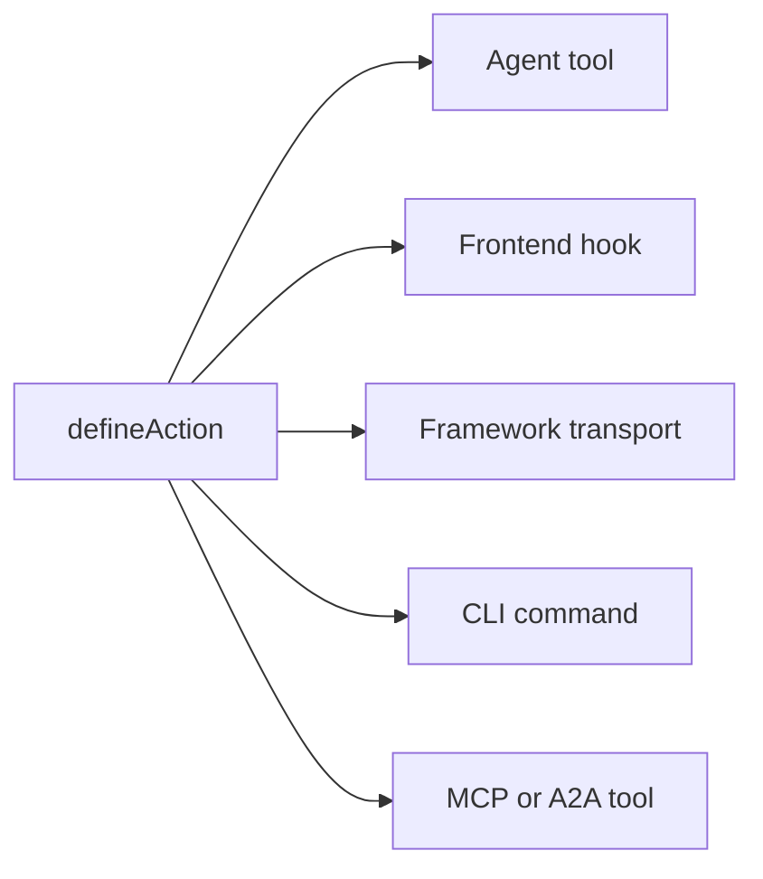

# Conceptos clave

Cómo funcionan por dentro las aplicaciones Agent-Native: los principios y la arquitectura. Esta página es el contrato: las reglas fijas que una aplicación debe seguir para contar como agent-native. Para conocer la visión y los argumentos a favor de construir de esta manera, consulta [¿Qué es Agent-Native?](/docs/what-is-agent-native).

## Las tres capas {#three-layers}

Agent-Native es un framework con tres capas:

| Capa                                                           | Qué es                                                                                                                                                                                                                                                              |
| -------------------------------------------------------------- | ------------------------------------------------------------------------------------------------------------------------------------------------------------------------------------------------------------------------------------------------------------------- |
| **Core: el framework**                                         | El contrato fundamental de ejecución: actions, helpers de PostgreSQL/PGlite y Drizzle, autenticación, estado de la aplicación, ejecución del agente, comprobaciones de acceso, enrutamiento y sincronización en vivo. Toda aplicación puede usar Core directamente. |
| **Toolkit: piezas reutilizables opcionales**                   | UI y sistemas de producto compartidos para construir aplicaciones, como primitivas, editores, uso compartido, colaboración, configuración y UX del agente. Las aplicaciones pueden usar, combinar o bifurcar las piezas que necesiten.                              |
| **Plantillas: aplicaciones opcionales construidas sobre Core** | Aplicaciones completas y específicas de dominio con rutas, esquema, actions, instrucciones e identidad visual. Las plantillas propias y las personalizadas suelen usar Toolkit, y se pueden bifurcar y usar como punto de partida.                                  |

Core es la base. Toolkit y las Plantillas son opcionales: una plantilla puede usar Toolkit, pero Toolkit no es necesario para construir una aplicación sobre Core.

## La arquitectura {#the-architecture}

En tiempo de ejecución, cada aplicación Agent-Native es tres cosas funcionando juntas:

- **Agente:** La IA autónoma. Lee datos, escribe datos, ejecuta actions y usa las herramientas que estén configuradas. Cuando su frame recibe intencionadamente acceso al workspace y herramientas de escritura, también puede modificar el código fuente propio de la aplicación. Personalizable con skills e instrucciones.
- **Aplicación:** La superficie de producto alrededor del agente. Puede empezar como chat, añadir resultados nativos en línea, crecer hasta convertirse en un pequeño plano de control, o convertirse en una interfaz React completa con paneles, flujos y visualizaciones.
- **Computadora:** La base de datos, el navegador y los runtimes de herramientas configurados a través de los cuales actúa el agente. Los agentes trabajan a través de la propia superficie de actions y datos de la aplicación; esa misma superficie se puede exponer opcionalmente mediante MCP, pero los servidores MCP externos siguen siendo un complemento, no la base.

El diagrama de abajo muestra al agente y a la aplicación lado a lado, ambos con flechas bidireccionales hacia una única capa de computadora compartida debajo. Ninguno de los dos es dueño de los datos. En cambio, ambos leen y escriben en el mismo almacén SQL, de modo que un cambio realizado por cualquiera de los dos es visible para el otro de inmediato, sin necesidad de construir una capa de sincronización intermedia.

<Diagram id="doc-block-t1f7pj" title="Agente, aplicación y computadora" summary="Tres capas trabajando juntas sobre un único almacén SQL compartido. El agente y la aplicación leen y escriben los mismos datos.">

```html
<div class="diagram-arch">
  <div class="diagram-row">
    <div class="diagram-card">
      <span class="diagram-pill accent">Agente</span
      ><small class="diagram-muted"
        >lee y escribe datos, ejecuta acciones, usa herramientas
        configuradas</small
      >
    </div>
    <div class="diagram-card">
      <span class="diagram-pill">Aplicación</span
      ><small class="diagram-muted"
        >chat, resultados en línea, plano de control o UI React completa</small
      >
    </div>
  </div>
  <div class="diagram-arrow diagram-muted" aria-hidden="true">
    &darr;&nbsp;&uarr;
  </div>
  <div class="diagram-box" data-rough>
    Computadora<br /><small class="diagram-muted"
      >base de datos SQL · navegador · ejecución de código</small
    >
  </div>
</div>
```

```css
.diagram-arch {
  display: flex;
  flex-direction: column;
  align-items: center;
  gap: 10px;
}
.diagram-arch .diagram-row {
  display: flex;
  gap: 12px;
  flex-wrap: wrap;
  justify-content: center;
}
.diagram-arch .diagram-card {
  display: flex;
  flex-direction: column;
  gap: 6px;
  padding: 14px 16px;
  min-width: 220px;
}
.diagram-arch .diagram-arrow {
  font-size: 20px;
  line-height: 1;
}
.diagram-arch .diagram-box {
  text-align: center;
  padding: 12px 18px;
}
```

</Diagram>

Ese mismo bucle agente-aplicación-computadora es lo que se ejecuta localmente y en producción. Las aplicaciones automation-first lo ejecutan directamente desde la carpeta con `pnpm agent`; las aplicaciones con UI montan el panel de agente integrado y añaden `pnpm dev`. En la nube, Builder.io aloja ese mismo bucle como un frame gestionado: el entorno que ejecuta el agente junto a tu aplicación. Se encarga de la colaboración, la edición visual y la infraestructura por ti.

## Bloques de construcción del agente {#agent-building-blocks}

Cada aplicación Agent-Native tiene los mismos bloques de construcción del agente,
sin importar si la superficie del producto es chat-first, automation-first o una
UI completa. Cada uno vive en su propio archivo:

<FileTree
  id="doc-block-1ae57y4"
  title="Guía y comportamiento"
  entries={[
    {
      path: "AGENTS.md",
      note: "instrucciones siempre activas: propósito, reglas principales, claves de estado, índice de actions, índice de skills",
    },
    {
      path: ".agents/skills/<name>/SKILL.md",
      note: "comportamiento reutilizable: pasos del flujo de trabajo, políticas, ejemplos, referencias y listas de qué hacer y qué no hacer",
    },
    {
      path: "actions/<name>.ts",
      note: "capacidad ejecutable: operación tipada expuesta al agente, la UI, CLI, HTTP, MCP, A2A, jobs y webhooks",
    },
  ]}
/>

Un turno es un intercambio con el agente: lee su contexto, decide qué hacer y responde. Que se cargue en cada turno significa que el archivo vuelve a entrar en ese contexto cada vez, no solo una vez al inicio de la sesión.

| Bloque de construcción | Archivo                          | Úsalo para                                                                                                                          | Se carga cuando                                                             |
| ---------------------- | -------------------------------- | ----------------------------------------------------------------------------------------------------------------------------------- | --------------------------------------------------------------------------- |
| **Instrucciones**      | `AGENTS.md`                      | Guía estable que el agente debe llevar a cada tarea: qué es la aplicación, invariantes, tono, índices                               | Cada turno                                                                  |
| **Skills**             | `.agents/skills/<name>/SKILL.md` | Comportamiento reutilizable: cómo seguir un flujo de trabajo, aplicar una política, inspeccionar evidencia o verificar un resultado | Bajo demanda, cuando la descripción de la skill coincide con la tarea       |
| **Actions**            | `actions/<name>.ts`              | Operaciones reales: leer o escribir datos, llamar a APIs, enviar mensajes, ejecutar aprobaciones, producir resultados tipados       | Listadas como herramientas en cada turno; se ejecutan solo cuando se llaman |

Skills y actions trabajan juntos. Una habilidad le enseña al agente cómo
realizar una clase de trabajo; una acción es la ruta de código que puede
llamar mientras realiza ese trabajo. Por ejemplo, una habilidad
`customer-research` podría indicarle al agente qué fuentes inspeccionar y
cómo resumir la evidencia, mientras que las actions `search-crm` y
`create-brief` obtienen y escriben los datos reales.

Cinco reglas rigen la arquitectura:

1. **Los datos viven en PostgreSQL:** todo el estado de la aplicación vive en la base de datos a través de Drizzle ORM.
2. **Toda la IA pasa por el agente:** no hay llamadas a LLM en línea; toda interacción de IA fluye a través del puente de chat del agente.
3. **Actions para las operaciones del agente:** el trabajo complejo se ejecuta como una acción tipada, no como código en línea.
4. **La sincronización en vivo mantiene la UI sincronizada:** los cambios de la base de datos se transmiten por SSE, con el sondeo como respaldo universal.
5. **El estado de la aplicación en PostgreSQL:** el estado efímero de la UI vive en la base de datos, y tanto el agente como la UI pueden leerlo.

## La lista de verificación de las cuatro áreas {#four-area-checklist}

Toda funcionalidad orientada al usuario debe actualizar todas las áreas aplicables. Omitir un área aplicable rompe el contrato Agent-Native; forzar una pantalla en una automatización que ningún humano necesita explorar también es una mala señal.

- **1. UI:** Página, componente o cuadro de diálogo con el que interactúa el usuario.
- **2. Acción:** Acción invocable por el agente en `actions/` para la misma operación.
- **3. Skills:** Actualiza `AGENTS.md` y/o crea una skill que documente el patrón.
- **4. Estado de la aplicación:** Estado de navegación, datos de view-screen y comandos navigate.

Una funcionalidad con solo UI es invisible para el agente. Una funcionalidad de UI completa con solo actions es invisible para el usuario. Una funcionalidad sin estado de aplicación significa que el agente no ve lo que está haciendo el usuario. Una operación automation-first puede empezar legítimamente con acción + instrucciones y añadir chat, UI o estado de aplicación más adelante, cuando los humanos necesiten explorarla, aprobarla, configurarla o compartirla.

## Qué incluye Agent-Native {#what-you-get-for-free}

Adoptar el framework es valioso sobre todo por lo que dejas de tener que construir. En el momento en que tu aplicación sigue las cinco reglas anteriores, heredas:

| Función                                        | Qué te ofrece                                                                                                                                                                                                                                                                                                                                                                                                                                                        |
| ---------------------------------------------- | -------------------------------------------------------------------------------------------------------------------------------------------------------------------------------------------------------------------------------------------------------------------------------------------------------------------------------------------------------------------------------------------------------------------------------------------------------------------- |
| Una acción = cada superficie                   | Cada acción definida con `defineAction()` es simultáneamente una herramienta de agente, un hook de frontend con seguridad de tipos (`useActionQuery` / `useActionMutation`), un transporte HTTP propiedad del framework, un comando CLI, una herramienta MCP para clientes externos y una herramienta A2A para otras aplicaciones agent-native. Los metadatos opcionales `link` y `mcpApp` añaden enlaces profundos y UI de MCP Apps sin una segunda implementación. |
| Recursos completos del agente por usuario      | Skills, `LEARNINGS.md` compartido, `memory/MEMORY.md` personal, `AGENTS.md`, subagentes personalizados, jobs programados y servidores MCP conectados. Todo respaldado por SQL, sin necesidad de un dev-box. Consulta [Agent Resources](/docs/agent-resources).                                                                                                                                                                                                       |
| Componentes React listos para usar             | `<AgentPanel />` y `<AgentSidebar />` renderizan el chat y los recursos en cualquier parte de tu aplicación. Consulta [Drop-in Agent](/docs/drop-in-agent).                                                                                                                                                                                                                                                                                                          |
| Runtimes de chat del agente BYO                | La misma UI de chat puede montarse sobre OpenAI Agents, OpenAI Responses, Claude Agent SDK, Vercel AI SDK, AG-UI o tu propio stream HTTP normalizado. Consulta [Chat nativo UI](/docs/native-chat-ui#byo-agent-runtimes).                                                                                                                                                                                                                                            |
| Sincronización en vivo entre el agente y la UI | Las escrituras del mismo proceso se transmiten de inmediato por `/_agent-native/events`; un sondeo ligero mantiene convergentes las escrituras serverless, de cron y entre procesos. Las actions que mutan invalidan automáticamente las consultas respaldadas por acciones, de modo que los registros creados por el agente aparecen sin necesidad de refrescar manualmente. Consulta [Sincronización en vivo](#polling-sync) más abajo.                            |
| Auth, organizaciones, RBAC                     | Better Auth con organizaciones/miembros/roles viene integrado en cada plantilla. Consulta [Authentication](/docs/authentication). Para más de un usuario, empieza por [Organizations, Teams & Permissions](/docs/organizations-teams-permissions).                                                                                                                                                                                                                   |
| Conciencia del contexto                        | El agente siempre sabe qué está mirando el usuario, a través de la clave de estado de aplicación `navigation`. Consulta [Conciencia del contexto](/docs/context-awareness).                                                                                                                                                                                                                                                                                          |
| Cliente y servidor MCP, en ambas direcciones   | La aplicación ingiere servidores MCP (locales, remotos, compartidos por hub) _y_ expone sus propias actions como un servidor MCP. Consulta [MCP Clients](/docs/mcp-clients) y [MCP Protocol](/docs/mcp-protocol).                                                                                                                                                                                                                                                    |
| Delegación entre aplicaciones                  | Los agentes de distintas aplicaciones se comunican mediante [A2A](/docs/a2a-protocol). Los despliegues del mismo origen omiten el JWT; entre orígenes distintos se usa un `A2A_SECRET` compartido.                                                                                                                                                                                                                                                                   |
| Equipos de subagentes                          | Genera un subagente con su propio hilo y herramientas, que aparece como un chip en línea en el chat. Consulta [Agent Teams](/docs/agent-teams).                                                                                                                                                                                                                                                                                                                      |
| Portabilidad                                   | PostgreSQL con PGlite local y Postgres alojado, además de cualquier host compatible con Nitro (Node, Workers, Netlify, Vercel, Deno, Lambda, Bun).                                                                                                                                                                                                                                                                                                                   |

## Datos en PostgreSQL {#data-in-sql}

Todo el estado de la aplicación vive en PostgreSQL a través de Drizzle ORM. Los esquemas utilizan los asistentes de PostgreSQL y PGlite; la configuración de `DATABASE_URL` y las reglas de ejecución están en [Database](/docs/server-database).

Los almacenes SQL de Core se crean automáticamente y están disponibles en cada plantilla:

- `application_state`: estado efímero de la UI (navegación, borradores, selecciones)
- `settings`: configuración persistente de clave-valor
- `oauth_tokens`: credenciales OAuth
- `sessions`: sesiones de autenticación

Cada fila de abajo se expande para mostrar sus campos:

<DataModel
  id="doc-block-4w0fu8"
  title="Almacenes SQL de Core"
  summary={
    "Se crean automáticamente en cada plantilla. Tanto el agente como la UI los leen y escriben."
  }
  entities={[
    {
      id: "application_state",
      name: "application_state",
      note: "Estado efímero de la UI que el agente lee para obtener contexto",
      fields: [
        {
          name: "key",
          type: "text",
          pk: true,
          note: "p. ej. 'navigation'",
        },
        {
          name: "value",
          type: "json",
          note: "vista, selección, borradores",
        },
      ],
    },
    {
      id: "settings",
      name: "settings",
      note: "Configuración persistente de clave-valor",
      fields: [
        {
          name: "key",
          type: "text",
          pk: true,
        },
        {
          name: "value",
          type: "json",
        },
      ],
    },
    {
      id: "oauth_tokens",
      name: "oauth_tokens",
      note: "Credenciales OAuth",
      fields: [
        {
          name: "provider",
          type: "text",
          pk: true,
        },
        {
          name: "token",
          type: "text",
        },
      ],
    },
    {
      id: "sessions",
      name: "sessions",
      note: "Sesiones de autenticación",
      fields: [
        {
          name: "id",
          type: "text",
          pk: true,
        },
        {
          name: "userId",
          type: "text",
        },
      ],
    },
  ]}
/>

Para añadir tus propios datos de dominio, define una tabla con los mismos helpers de esquema usados por los almacenes principales anteriores:

```ts
// Drizzle schema for domain data
import { table, text, integer } from "@agent-native/core/db/schema";

export const forms = table("forms", {
  id: text("id").primaryKey(),
  title: text("title").notNull(),
  schema: text("schema").notNull(), // JSON
  ownerEmail: text("owner_email"),
  createdAt: integer("created_at").notNull(),
});
```

Tanto tú como el agente pueden inspeccionar esos datos desde la terminal, sin necesidad de un cliente SQL aparte:

```bash
# Actions de Core para una inspección rápida de la base de datos
pnpm action db-schema                                       # show all tables
pnpm action db-query --sql "SELECT * FROM forms"
```

`db-schema` imprime las columnas y los tipos de cada tabla. `db-query` ejecuta SQL de solo lectura directamente, lo cual es útil para comprobar las escrituras de una acción sin abrir un cliente de base de datos.

<Callout tone="decision">

El complemento de chat del agente de producción deja las herramientas SQL sin formato en modo lectura por defecto (`frameworkTools: { database: "read" }`), por lo que los agentes inspeccionan datos de la app con `db-schema` / `db-query` y escriben mediante actions tipadas de la app. Establece `database: "write"` (o `true`) solo para superficies de mantenimiento que también deban exponer `db-exec` / `db-patch` con alcance; usa `database: "off"` / `false` para requerir actions tipadas para todos los datos acceso.

</Callout>

`frameworkTools` gobierna igual el resto de las herramientas propias del framework: sharing, comentarios de revisión, historial de versiones, feature flags, localización, auditoría, Context X-Ray, perfil, automatizaciones, docs, resources, web, delegación entre apps, chat y email. Consulta [Production Agent Tools](/docs/actions-agent-tools#production-agent-tools) para la lista completa, el preset `"minimal"` y por qué desactivar un grupo deja sus rutas HTTP montadas.

## Puente de chat del agente {#agent-chat-bridge}

La UI nunca llama directamente a un LLM. Cuando un usuario hace clic en "Generar gráfico" o "Escribir resumen", la UI envía un mensaje al agente mediante `postMessage`. El agente hace el trabajo. Tiene el historial completo de la conversación, skills, instrucciones y la capacidad de iterar.

```ts
// Delegate AI work to the agent from a React component
import { sendToAgentChat } from "@agent-native/core/client/agent-chat";
sendToAgentChat({
  message: "Generate a chart showing signups by source",
  context: "Dashboard ID: main, date range: last 30 days",
  submit: true,
});
```

En resumen:

- **La IA no es determinista**: necesitas un flujo de conversación para dar feedback e iterar, no botones de un solo uso.
- **El contexto importa**: el agente tiene las instrucciones, las skills y el historial de la aplicación. Una llamada en línea no tiene nada de eso.
- **El agente puede hacer más**: puede ejecutar actions, navegar por la web y encadenar varios pasos.

**[External execution](/docs/a2a-protocol)**

Como todo pasa por el agente y las actions, cualquier aplicación se puede controlar desde Slack, Telegram, jobs programados, scripts u otro agente mediante A2A.

## Sistema de actions {#actions-system}

Cuando el agente necesita hacer algo complejo, como llamar a una API, procesar datos o consultar la base de datos, ejecuta una **acción**. Las actions son archivos TypeScript en `actions/` que exportan un `defineAction()` por defecto:

```ts filename="actions/fetch-data.ts"
import { defineAction } from "@agent-native/core/action";
import { z } from "zod";

// One action powers every app surface: UI, agent, HTTP, MCP, A2A, and CLI.
export default defineAction({
  description: "Fetch data from a source API.",
  schema: z.object({
    source: z.string().describe("Data source key, e.g. 'signups'"),
  }),
  run: async ({ source }) => {
    const res = await fetch(`https://api.example.com/${source}`);
    return await res.json();
  },
});
```

Esta acción obtiene JSON de una API de origen y lo devuelve. `defineAction()` envuelve la función con un schema de zod para su entrada (`source`), de modo que el framework puede validar esa entrada, generar un JSON Schema que el agente pueda llamar e inferir tipos para el hook de frontend, todo a partir de esta única definición.

Una sola llamada a `defineAction()` llega automáticamente a cinco consumidores distintos. El diagrama muestra la ramificación (fan-out) a partir de una única acción; la lista de abajo explica qué obtiene cada consumidor:



- **Herramienta de agente:** el agente la ve con el JSON Schema derivado de zod y puede llamarla.
- **Hook de frontend:** `useActionMutation("fetch-data")` con inferencia completa de TypeScript.
- **Transporte del framework:** montado automáticamente detrás de los hooks del cliente.
- **CLI:** `pnpm action fetch-data --source=signups` para scripts y bucles de desarrollo del agente.
- **Herramienta MCP / herramienta A2A:** cuando el servidor MCP o A2A está habilitado, la misma acción aparece también ahí.

Cada consumidor llama a la misma función subyacente, así que solo hay una implementación que escribir y mantener. Consulta [Actions](/docs/actions-overview) para la referencia completa.

## Sincronización en vivo {#polling-sync}

Cuando el agente cambia datos, la UI necesita reflejarlo sin un refresco manual. `useDbSync()` es lo que hace eso automático. Las escrituras del mismo proceso se transmiten por `/_agent-native/events`; `/_agent-native/poll` sigue siendo el respaldo entre procesos y para serverless. Cuando el agente escribe en la base de datos (estado de la aplicación, settings o datos de dominio), un contador de versión se incrementa y el cliente invalida las cachés relevantes de React Query.

SSE cubre el caso habitual en lugar de WebSockets porque ofrece a las escrituras del mismo proceso una vía inmediata hacia el navegador mediante HTTP simple, mientras que el sondeo por contador de versión sigue existiendo como respaldo que funciona en cualquier entorno de despliegue, incluidos serverless y edge, donde los sockets persistentes pueden no estar disponibles.

```ts
// Client: subscribe to agent/UI data changes once near the app shell
import { useDbSync } from "@agent-native/core/client/hooks";
useDbSync({ queryClient });
```

Llama a esto una vez, cerca de la raíz de la aplicación. Suscribe toda la aplicación a los eventos de cambio, de modo que cualquier componente que use `useActionQuery` o un `useQuery` con versión de origen vuelve a obtener los datos automáticamente cuando cambian los datos que lee.

El flujo es:

1. El agente ejecuta una acción que escribe en la base de datos
2. El servidor emite un evento de cambio con un origen (source) como `"action"` o `"settings"`
3. `useDbSync` lo recibe por SSE o por el respaldo de sondeo
4. Los hooks `useActionQuery` y los hooks `useQuery` con versión de origen vuelven a obtener los datos
5. Los componentes renderizan los nuevos datos sin recargar la página

El diagrama traza esa misma secuencia de principio a fin:

<Diagram id="doc-block-87e1c3" title="Flujo de sincronización en vivo" summary={"Una escritura del agente se convierte en un renderizado de la UI sin refresco manual. SSE primero, con sondeo como respaldo universal."}>

```html
<div class="diagram-sync">
  <div class="diagram-node">
    Acción del agente<br /><small class="diagram-muted">escribe en la BD</small>
  </div>
  <div class="diagram-arrow diagram-muted" aria-hidden="true">&rarr;</div>
  <div class="diagram-node">
    Evento de cambio<br /><small class="diagram-muted"
      >source: action / settings</small
    >
  </div>
  <div class="diagram-arrow diagram-muted" aria-hidden="true">&rarr;</div>
  <div class="diagram-panel center">
    <span class="diagram-pill accent">useDbSync</span
    ><small class="diagram-muted">SSE &middot; respaldo de sondeo</small>
  </div>
  <div class="diagram-arrow diagram-muted" aria-hidden="true">&rarr;</div>
  <div class="diagram-node">
    Recarga de consulta<br /><small class="diagram-muted"
      >renderiza, sin recarga</small
    >
  </div>
</div>
```

```css
.diagram-sync {
  display: flex;
  align-items: center;
  gap: 10px;
  flex-wrap: wrap;
}
.diagram-sync .diagram-arrow {
  font-size: 22px;
  line-height: 1;
}
.diagram-sync .center {
  display: flex;
  flex-direction: column;
  align-items: center;
  gap: 4px;
  padding: 10px 14px;
}
```

</Diagram>

Esto funciona en todos los entornos de despliegue, incluidos serverless y edge, porque usa la base de datos en lugar de estado en memoria o watchers del sistema de archivos.

## Conciencia del contexto {#context-awareness}

El agente siempre sabe qué está mirando el usuario. La UI escribe una clave `navigation` en application-state en cada cambio de ruta. El agente la lee mediante la acción `view-screen` antes de actuar.

Por ejemplo, cuando abres un hilo de correo la UI hace upsert de una fila como:

```json
{ "key": "navigation", "value": { "view": "thread", "threadId": "th_abc123" } }
```

<Callout tone="info">

La UI escribe esto en cada cambio de ruta; el agente lo lee (mediante `view-screen`) antes de realizar cualquier acción, de modo que siempre sabe en qué hilo, gráfico o diapositiva estás enfocado.

</Callout>

Consulta [Conciencia del contexto](/docs/context-awareness) para ver el patrón completo: estado de navegación, view-screen, comandos navigate y prevención de jitter.

## Una acción, muchas superficies {#protocols}

Implementa una operación de dominio una vez como acción; el framework la expone a todos los consumidores. El mismo `defineAction()` se convierte en una herramienta de agente, un hook de UI con seguridad de tipos, un endpoint HTTP, un comando CLI, una herramienta MCP y una herramienta A2A, con metadatos opcionales `link`, `mcpApp`, de widget nativo, o wrappers de Generative UI añadidos solo cuando una superficie necesita una interacción más rica. Skills e instrucciones cubren el comportamiento.

Para la matriz completa de protocolos/superficies (servidor MCP y OAuth, MCP Apps, A2A, enlaces profundos, widgets de chat nativos, Generative UI, conectores AgentChatRuntime, Agent Web y el horizonte de adaptadores para ACP y A2UI), y para elegir la forma de producto (chat, UI en línea, páginas de aplicación completas, sidecar integrado, automatización o acceso de agente externo), consulta [Superficies del agente](/docs/agent-surfaces).

## Código de la aplicación y personalización {#agent-modifies-code}

El framework no le otorga al agente integrado acceso ambiental al código fuente
de una aplicación. En una aplicación desplegada, el agente normalmente trabaja
mediante actions, estado respaldado por SQL e integraciones configuradas.
Puede editar componentes, rutas, estilos y actions cuando su frame recibe
intencionadamente workspace y herramientas de escritura. Las plantillas son
aplicaciones completas que puedes bifurcar y personalizar en tu propio
repositorio y flujo de desarrollo en cualquier caso. Para personalización en
tiempo de ejecución sin cambios en el código fuente, usa [Extensions](/docs/extensions).

## PostgreSQL por defecto {#hosting-agnostic}

Dos reglas arquitectónicas mantienen las aplicaciones coherentes entre PGlite, Postgres alojado y los distintos hosts:

- **PostgreSQL.** Escribe los esquemas con `@agent-native/core/db/schema` y realiza lecturas y escrituras con Drizzle. Usa SQL de PostgreSQL sin procesar solo para migraciones aditivas o mantenimiento puntual, y mantenlo compatible con PGlite. Consulta [Database](/docs/server-database).
- **Independiente del hosting.** El servidor se ejecuta sobre Nitro y compila para cualquier destino de despliegue. Nunca uses APIs específicas de Node (`fs`, `child_process`, `path`) en rutas o plugins del servidor, y nunca asumas un proceso de servidor persistente. Serverless y edge no tienen estado, así que mantén todo el estado en SQL. Consulta [Deployment](/docs/deployment).

## Recursos del agente {#workspace}

Cada usuario obtiene un conjunto personal de **recursos del agente**: instrucciones, skills, memoria, subagentes personalizados, jobs programados y servidores MCP conectados, todos almacenados en SQL en lugar de en archivos. Esto hace viable una personalización a nivel de Claude Code dentro de un SaaS multiinquilino sin necesidad de levantar un contenedor por usuario. Consulta [Agent Resources](/docs/agent-resources).

## Bloques de construcción relacionados {#building-blocks}

Estos se apoyan sobre el mismo contrato y tienen sus propias guías detalladas:

- **[Dispatch](/docs/dispatch):** el plano de control del workspace, con una bandeja de entrada compartida, una bóveda de secretos, jobs programados y un orquestador que delega en aplicaciones especializadas mediante A2A.
- **[Extensions](/docs/extensions):** mini-apps de Alpine.js en sandbox que el agente crea en tiempo de ejecución, sin cambios en el código fuente ni migraciones.
- **[Protocolo A2A](/docs/a2a-protocol):** cómo las aplicaciones del mismo workspace se descubren y se llaman entre sí mediante JSON-RPC.

## Qué sigue {#deep-dives}

<Cards>

### [¿Qué es Agent-Native?](/docs/what-is-agent-native)

La visión y la filosofía detrás de estas reglas.

### [Conciencia del contexto](/docs/context-awareness)

Estado de navegación, view-screen y comandos navigate en profundidad.

### [Sincronización interna](/docs/client-sync-internals)

El mecanismo de versión de cambios detrás de la sincronización en vivo, para sincronizar un `useQuery` propio.

### [Guía Skills](/docs/skills-guide)

Skills del framework, skills de dominio y creación de skills personalizadas.

### [Chat nativo UI](/docs/native-chat-ui)

Tablas y gráficos declarados por actions, y postura de runtime BYO.

### [Superficies del agente](/docs/agent-surfaces)

Chat, UI nativa en línea, páginas de aplicación completas, sidecar integrado, automatización y rutas de agente externo.

### [Protocolo A2A](/docs/a2a-protocol)

Comunicación entre agentes.

</Cards>
