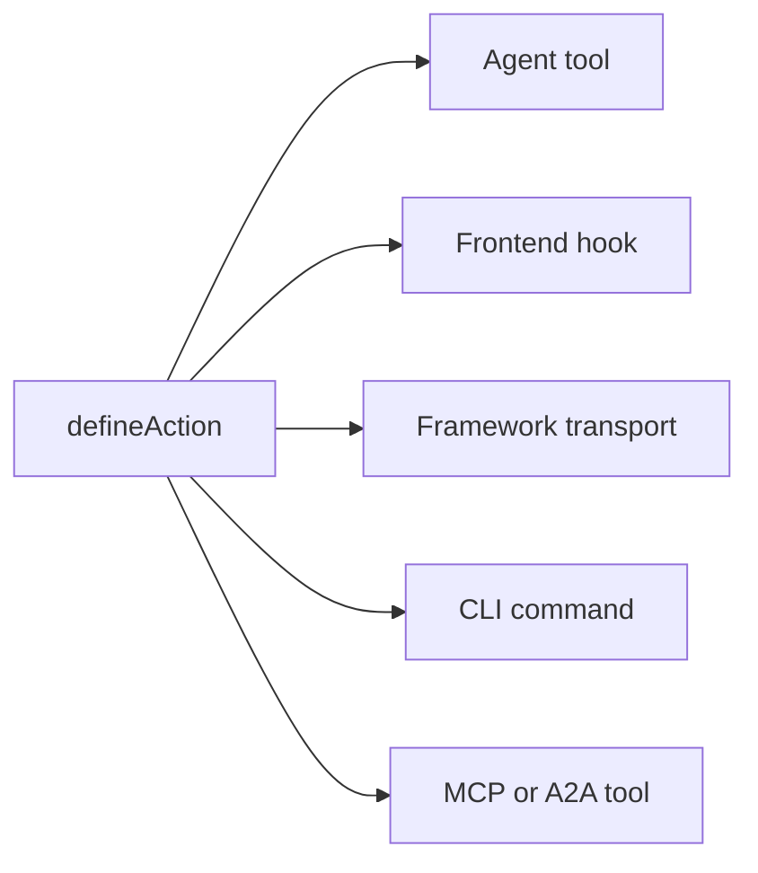

# Concepts clés

Fonctionnement des applications Agent-Native en coulisses : les principes et l'architecture. Cette page est le contrat : les règles fixes qu'une application doit respecter pour être considérée comme agent-native. Pour la vision et les arguments en faveur de cette approche, voir [Qu'est-ce qu'Agent-Native ?](/docs/what-is-agent-native).

## Les trois couches {#three-layers}

Agent-Native est un framework composé de trois couches :

| Couche                                                         | Ce que c'est                                                                                                                                                                                                                                                      |
| -------------------------------------------------------------- | ----------------------------------------------------------------------------------------------------------------------------------------------------------------------------------------------------------------------------------------------------------------- |
| **Core : le framework**                                        | Le contrat d'exécution fondamental : actions, assistants PostgreSQL/PGlite et Drizzle, authentification, état de l'application, exécution de l'agent, contrôles d'accès, routage et synchronisation en direct. Chaque application peut utiliser Core directement. |
| **Toolkit : briques réutilisables facultatives**               | UI de construction d'application partagée et systèmes produit tels que primitives, éditeurs, partage, collaboration, paramètres et UX de l'agent. Les applications peuvent utiliser, composer ou forker les pièces dont elles ont besoin.                         |
| **Templates : applications facultatives construites sur Core** | Applications complètes et spécifiques à un domaine, avec routes, schéma, actions, instructions et identité visuelle. Les templates officiels et personnalisés utilisent couramment Toolkit, et peuvent être forkés et utilisés comme points de départ.            |

Core est la base. Toolkit et Templates sont facultatifs : un template peut utiliser Toolkit, mais Toolkit n'est pas nécessaire pour construire une application sur Core.

## L'architecture {#the-architecture}

À l'exécution, chaque application Agent-Native est composée de trois éléments qui fonctionnent ensemble :

- **Agent :** l'IA autonome. Elle lit des données, écrit des données, exécute des actions et utilise les outils configurés. Lorsque son cadre reçoit intentionnellement un accès à l'espace de travail et des outils d'écriture, elle peut aussi modifier le code source de l'application elle-même. Personnalisable avec des skills et des instructions.
- **Application :** la surface produit autour de l'agent. Elle peut commencer par du chat, ajouter des résultats natifs en ligne, évoluer vers un petit plan de contrôle, ou devenir une UI React complète avec tableaux de bord, flux et visualisations.
- **Ordinateur :** la base de données, le navigateur et les environnements d'exécution d'outils configurés à travers lesquels l'agent agit. Les agents travaillent via la surface d'actions et de données propre à l'application ; cette même surface peut être exposée en option via MCP, mais les serveurs MCP externes restent un module complémentaire, pas le socle.

Le diagramme ci-dessous montre l'agent et l'application côte à côte, chacun avec des flèches bidirectionnelles vers une même couche ordinateur partagée en dessous. Aucun des deux ne possède les données. Ils lisent et écrivent plutôt le même magasin SQL, si bien qu'un changement effectué par l'un des deux est immédiatement visible pour l'autre, sans couche de synchronisation à construire entre les deux.

<Diagram id="doc-block-t1f7pj" title="Agent, application et ordinateur" summary="Trois couches qui fonctionnent ensemble sur un même magasin SQL partagé. L'agent et l'application lisent et écrivent tous deux les mêmes données.">

```html
<div class="diagram-arch">
  <div class="diagram-row">
    <div class="diagram-card">
      <span class="diagram-pill accent">Agent</span
      ><small class="diagram-muted"
        >lit et écrit des données, exécute des actions, utilise les outils
        configurés</small
      >
    </div>
    <div class="diagram-card">
      <span class="diagram-pill">Application</span
      ><small class="diagram-muted"
        >chat, résultats en ligne, plan de contrôle, ou UI React complète</small
      >
    </div>
  </div>
  <div class="diagram-arrow diagram-muted" aria-hidden="true">
    &darr;&nbsp;&uarr;
  </div>
  <div class="diagram-box" data-rough>
    Ordinateur<br /><small class="diagram-muted"
      >base de données SQL · navigateur · exécution de code</small
    >
  </div>
</div>
```

```css
.diagram-arch {
  display: flex;
  flex-direction: column;
  align-items: center;
  gap: 10px;
}
.diagram-arch .diagram-row {
  display: flex;
  gap: 12px;
  flex-wrap: wrap;
  justify-content: center;
}
.diagram-arch .diagram-card {
  display: flex;
  flex-direction: column;
  gap: 6px;
  padding: 14px 16px;
  min-width: 220px;
}
.diagram-arch .diagram-arrow {
  font-size: 20px;
  line-height: 1;
}
.diagram-arch .diagram-box {
  text-align: center;
  padding: 12px 18px;
}
```

</Diagram>

Cette même boucle agent-application-ordinateur est ce qui s'exécute en local et en production. Les applications automation-first l'exécutent directement depuis le dossier avec `pnpm agent` ; les applications UI montent le panneau d'agent intégré et ajoutent `pnpm dev`. Dans le cloud, Builder.io héberge la même boucle sous forme de cadre géré : l'environnement qui exécute l'agent à côté de votre application. Il gère la collaboration, l'édition visuelle et l'infrastructure pour vous.

## Blocs de construction de l'agent {#agent-building-blocks}

Chaque application Agent-Native possède les mêmes blocs de construction d'agent, que
la surface produit soit chat-first, automation-first, ou une UI complète. Chacun vit
dans son propre fichier :

<FileTree
  id="doc-block-1ae57y4"
  title="Guidage et comportement"
  entries={[
    {
      path: "AGENTS.md",
      note: "instructions toujours actives : objectif, règles fondamentales, clés d'état, index des actions, index des skills",
    },
    {
      path: ".agents/skills/<name>/SKILL.md",
      note: "comportement réutilisable : étapes de workflow, politiques, exemples, références et listes à faire/à ne pas faire",
    },
    {
      path: "actions/<name>.ts",
      note: "capacité exécutable : opération typée exposée à l'agent, à l'UI, au CLI, à l'HTTP, MCP, A2A, aux jobs et aux webhooks",
    },
  ]}
/>

Un tour est un échange avec l'agent : il lit son contexte, décide quoi faire, puis répond. « Chargé à chaque tour » signifie que le fichier réintègre ce contexte à chaque fois, pas seulement une fois au début de la session.

| Bloc de base     | Fichier                          | À utiliser pour                                                                                                                                 | Chargé quand                                                                       |
| ---------------- | -------------------------------- | ----------------------------------------------------------------------------------------------------------------------------------------------- | ---------------------------------------------------------------------------------- |
| **Instructions** | `AGENTS.md`                      | Directive stable que l'agent doit porter dans chaque tâche : ce qu'est l'application, les invariants, le ton, les index                         | Chaque tour                                                                        |
| **Skills**       | `.agents/skills/<name>/SKILL.md` | Comportement réutilisable : comment suivre un workflow, appliquer une politique, inspecter des preuves ou vérifier un résultat                  | À la demande, lorsque la description du skill correspond à la tâche                |
| **Actions**      | `actions/<name>.ts`              | Opérations réelles : lire ou écrire des données, appeler des API, envoyer des messages, exécuter des approbations, produire des résultats typés | Listées comme outils à chaque tour ; exécutées seulement quand elles sont appelées |

Skills et actions fonctionnent ensemble. Un skill apprend à l'agent comment réaliser
une catégorie de travail ; une action est le chemin de code qu'il peut appeler en
réalisant ce travail. Par exemple, un skill `customer-research` peut indiquer à
l'agent quelles sources inspecter et comment résumer les preuves, tandis que les
actions `search-crm` et `create-brief` récupèrent et écrivent les données réelles.

Cinq règles régissent l'architecture :

1. **Les données vivent dans PostgreSQL :** tout l'état de l'application vit dans la base de données via Drizzle ORM.
2. **Toute l'IA passe par l'agent :** aucun appel LLM en ligne ; chaque interaction IA transite par le pont de chat de l'agent.
3. **Des actions pour les opérations de l'agent :** le travail complexe s'exécute sous forme d'action typée, pas de code en ligne.
4. **La synchronisation en direct garde l'UI synchronisée :** les changements de base de données sont diffusés en flux via SSE, avec l'interrogation comme solution de repli universelle.
5. **L'état de l'application dans PostgreSQL :** l'état éphémère de l'UI vit dans la base de données, lisible à la fois par l'agent et l'UI.

## La liste de contrôle en quatre domaines {#four-area-checklist}

Chaque fonctionnalité destinée à l'utilisateur doit mettre à jour toutes les zones applicables. Ignorer une zone applicable rompt le contrat Agent-Native ; forcer un écran sur une automatisation qu'aucun humain n'a besoin de parcourir est également un signe révélateur.

- **1. UI :** page, composant ou boîte de dialogue avec laquelle l'utilisateur interagit.
- **2. Action :** action appelable par l'agent dans `actions/` pour la même opération.
- **3. Skills :** mettre à jour `AGENTS.md` et/ou créer un skill documentant le pattern.
- **4. App-State :** état de navigation, données view-screen et commandes navigate.

Une fonctionnalité avec uniquement une UI est invisible pour l'agent. Une fonctionnalité UI complète sans action correspondante est invisible pour l'utilisateur. Une fonctionnalité sans app-state signifie que l'agent est aveugle à ce que fait l'utilisateur. Une opération automation-first peut légitimement commencer par une action et des instructions, puis ajouter du chat, une UI ou de l'app-state plus tard, lorsque des humains ont besoin de la parcourir, de l'approuver, de la configurer ou de la partager.

## Ce qu'Agent-Native inclut {#what-you-get-for-free}

Adopter le framework est utile surtout pour ce que vous arrêtez de devoir construire. Dès que votre application suit les cinq règles ci-dessus, vous héritez de :

| Fonctionnalité                                  | Ce que cela vous apporte                                                                                                                                                                                                                                                                                                                                                                                                                         |
| ----------------------------------------------- | ------------------------------------------------------------------------------------------------------------------------------------------------------------------------------------------------------------------------------------------------------------------------------------------------------------------------------------------------------------------------------------------------------------------------------------------------ |
| Une action = toutes les surfaces                | Chaque action définie avec `defineAction()` est simultanément un outil d'agent, un hook frontend typesafe (`useActionQuery` / `useActionMutation`), un transport HTTP appartenant au framework, une commande CLI, un outil MCP pour les clients externes, et un outil A2A pour les autres applications agent-native. Les métadonnées facultatives `link` et `mcpApp` ajoutent des liens profonds et une UI MCP Apps sans seconde implémentation. |
| Ressources d'agent complètes par utilisateur    | Skills, `LEARNINGS.md` partagé, `memory/MEMORY.md` personnel, `AGENTS.md`, sous-agents personnalisés, jobs planifiés et serveurs MCP connectés. Le tout adossé à SQL, sans machine de développement nécessaire. Voir [Agent Resources](/docs/agent-resources).                                                                                                                                                                                   |
| Composants React prêts à l'emploi               | `<AgentPanel />` et `<AgentSidebar />` affichent le chat et les ressources n'importe où dans votre application. Voir [Drop-in Agent](/docs/drop-in-agent).                                                                                                                                                                                                                                                                                       |
| Environnements d'exécution de chat d'agent BYO  | La même UI de chat peut reposer sur OpenAI Agents, OpenAI Responses, Claude Agent SDK, Vercel AI SDK, AG-UI, ou votre propre flux HTTP normalisé. Voir [Chat natif UI](/docs/native-chat-ui#byo-agent-runtimes).                                                                                                                                                                                                                                 |
| Synchronisation en direct entre l'agent et l'UI | Les écritures dans le même processus sont diffusées immédiatement via `/_agent-native/events` ; une interrogation légère maintient la convergence des écritures serverless, cron et inter-processus. Les actions de mutation invalident automatiquement les requêtes adossées aux actions, si bien que les enregistrements créés par l'agent apparaissent sans actualisation manuelle. Voir [Live Sync](#polling-sync) ci-dessous.               |
| Auth, organisations, RBAC                       | Better Auth avec organisations/membres/rôles est intégré pour chaque template. Voir [Authentication](/docs/authentication). Pour plus d'un utilisateur, commencez par [Organizations, Teams & Permissions](/docs/organizations-teams-permissions).                                                                                                                                                                                               |
| Conscience du contexte                          | L'agent sait toujours ce que l'utilisateur regarde grâce à la clé d'app-state `navigation`. Voir [Conscience du contexte](/docs/context-awareness).                                                                                                                                                                                                                                                                                              |
| Client + serveur MCP, dans les deux sens        | L'application ingère des serveurs MCP (locaux, distants, partagés par hub) _et_ expose ses propres actions en tant que serveur MCP. Voir [MCP Clients](/docs/mcp-clients) et [MCP Protocol](/docs/mcp-protocol).                                                                                                                                                                                                                                 |
| Délégation inter-applications                   | Les agents de différentes applications communiquent via [A2A](/docs/a2a-protocol). Les déploiements de même origine se passent de JWT ; l'origine croisée utilise un `A2A_SECRET` partagé.                                                                                                                                                                                                                                                       |
| Équipes de sous-agents                          | Générez un sous-agent avec son propre fil et ses propres outils, présenté sous forme de puce en ligne dans le chat. Voir [Agent Teams](/docs/agent-teams).                                                                                                                                                                                                                                                                                       |
| Portabilité                                     | PostgreSQL avec PGlite local et Postgres hébergé, ainsi que tout hôte compatible Nitro (Node, Workers, Netlify, Vercel, Deno, Lambda, Bun).                                                                                                                                                                                                                                                                                                      |

## Données en PostgreSQL {#data-in-sql}

Tout l’état de l’application vit dans PostgreSQL via Drizzle ORM. Les schémas utilisent les aides PostgreSQL et PGlite ; la configuration `DATABASE_URL` et les règles d’exécution se trouvent dans [Database](/docs/server-database).

Les magasins SQL Core sont créés automatiquement et disponibles dans chaque template :

- `application_state` : état UI éphémère (navigation, brouillons, sélections)
- `settings` : configuration clé-valeur persistante
- `oauth_tokens` : identifiants OAuth
- `sessions` : sessions d'authentification

Chaque ligne ci-dessous se déploie pour afficher ses champs :

<DataModel
  id="doc-block-4w0fu8"
  title="Magasins SQL Core"
  summary={
    "Créés automatiquement dans chaque template. L'agent et l'UI les lisent et les écrivent tous deux."
  }
  entities={[
    {
      id: "application_state",
      name: "application_state",
      note: "État UI éphémère que l'agent lit pour le contexte",
      fields: [
        {
          name: "key",
          type: "text",
          pk: true,
          note: "par ex. 'navigation'",
        },
        {
          name: "value",
          type: "json",
          note: "vue, sélection, brouillons",
        },
      ],
    },
    {
      id: "settings",
      name: "settings",
      note: "Configuration clé-valeur persistante",
      fields: [
        {
          name: "key",
          type: "text",
          pk: true,
        },
        {
          name: "value",
          type: "json",
        },
      ],
    },
    {
      id: "oauth_tokens",
      name: "oauth_tokens",
      note: "Identifiants OAuth",
      fields: [
        {
          name: "provider",
          type: "text",
          pk: true,
        },
        {
          name: "token",
          type: "text",
        },
      ],
    },
    {
      id: "sessions",
      name: "sessions",
      note: "Sessions d'authentification",
      fields: [
        {
          name: "id",
          type: "text",
          pk: true,
        },
        {
          name: "userId",
          type: "text",
        },
      ],
    },
  ]}
/>

Pour ajouter vos propres données de domaine, définissez une table avec les mêmes assistants de schéma que ceux utilisés par les magasins core ci-dessus :

```ts
// Drizzle schema for domain data
import { table, text, integer } from "@agent-native/core/db/schema";

export const forms = table("forms", {
  id: text("id").primaryKey(),
  title: text("title").notNull(),
  schema: text("schema").notNull(), // JSON
  ownerEmail: text("owner_email"),
  createdAt: integer("created_at").notNull(),
});
```

Vous et l'agent pouvez tous deux inspecter ces données depuis le terminal, sans client SQL séparé :

```bash
# Actions Core pour une inspection rapide de la base de données
pnpm action db-schema                                       # show all tables
pnpm action db-query --sql "SELECT * FROM forms"
```

`db-schema` affiche les colonnes et types de chaque table. `db-query` exécute du SQL en lecture seule directement, ce qui est utile pour vérifier les écritures d'une action sans ouvrir de client de base de données.

<Callout tone="decision">

Le plug-in de chat de l'agent de production met les outils SQL bruts en lecture seule par défaut (`frameworkTools: { database: "read" }`), donc les agents inspectent les données avec `db-schema` / `db-query` et écrivent via les actions typées de l'application. Définissez `database: "write"` (ou `true`) seulement pour les surfaces de maintenance qui doivent exposer `db-exec` / `db-patch`; utilisez `database: "off"` / `false` pour exiger des actions typées pour tout accès aux données.

`frameworkTools` gouverne de la même façon les autres outils propres au framework : partage, commentaires de revue, historique de versions, feature flags, localisation, audit, Context X-Ray, profil, automatisations, docs, resources, web, délégation inter-apps, chat et email. Voir [Production Agent Tools](/docs/actions-agent-tools#production-agent-tools) pour la liste complète, le preset `"minimal"` et pourquoi désactiver un groupe laisse ses routes HTTP montées.

</Callout>

## Pont de discussion pour les agents {#agent-chat-bridge}

L'UI n'appelle jamais un LLM directement. Lorsqu'un utilisateur clique sur « Générer un graphique » ou « Rédiger un résumé », l'UI envoie un message à l'agent via `postMessage`. L'agent effectue le travail. Il dispose de l'historique complet de la conversation, des skills, des instructions et de la capacité d'itérer.

```ts
// Delegate AI work to the agent from a React component
import { sendToAgentChat } from "@agent-native/core/client/agent-chat";
sendToAgentChat({
  message: "Generate a chart showing signups by source",
  context: "Dashboard ID: main, date range: last 30 days",
  submit: true,
});
```

En bref :

- **L'IA est non déterministe** : vous avez besoin d'un flux de conversation pour donner du feedback et itérer, pas de boutons à usage unique.
- **Le contexte compte** : l'agent dispose des instructions, des skills et de l'historique de l'application. Un appel en ligne n'a rien de tout cela.
- **L'agent peut faire plus** : il peut exécuter des actions, naviguer sur le web et enchaîner plusieurs étapes.

**[Exécution externe](/docs/a2a-protocol)**

Comme tout passe par l'agent et les actions, n'importe quelle application peut être pilotée depuis Slack, Telegram, des jobs planifiés, des scripts, ou un autre agent via A2A.

## Système d'actions {#actions-system}

Lorsque l'agent doit faire quelque chose de complexe, comme appeler une API, traiter des données ou interroger la base de données, il exécute une **action**. Les actions sont des fichiers TypeScript dans `actions/` qui exportent un `defineAction()` par défaut :

```ts filename="actions/fetch-data.ts"
import { defineAction } from "@agent-native/core/action";
import { z } from "zod";

// One action powers every app surface: UI, agent, HTTP, MCP, A2A, and CLI.
export default defineAction({
  description: "Fetch data from a source API.",
  schema: z.object({
    source: z.string().describe("Data source key, e.g. 'signups'"),
  }),
  run: async ({ source }) => {
    const res = await fetch(`https://api.example.com/${source}`);
    return await res.json();
  },
});
```

Cette action récupère du JSON depuis une API source et le retourne. `defineAction()` encapsule la fonction avec un schéma zod pour son entrée (`source`), afin que le framework puisse valider cette entrée, générer un schéma JSON que l'agent peut appeler, et inférer les types pour le hook frontend, le tout à partir de cette seule définition.

Un seul appel à `defineAction()` atteint automatiquement cinq consommateurs différents. Le diagramme montre l'éventail à partir d'une seule action ; la liste ci-dessous explique ce que reçoit chaque consommateur :



- **Outil d'agent :** l'agent le voit avec le schéma JSON dérivé de zod et peut l'appeler.
- **Hook frontend :** `useActionMutation("fetch-data")` avec inférence TypeScript complète.
- **Transport du framework :** monté automatiquement derrière les hooks client.
- **CLI :** `pnpm action fetch-data --source=signups` pour le scripting et les boucles de développement de l'agent.
- **Outil MCP / outil A2A :** lorsque le serveur MCP ou A2A est activé, la même action y apparaît également.

Chaque consommateur appelle la même fonction sous-jacente, il n'y a donc qu'une seule implémentation à écrire et à maintenir. Voir [Actions](/docs/actions-overview) pour la référence complète.

## Synchronisation en direct {#polling-sync}

Lorsque l'agent modifie des données, l'UI doit le refléter sans actualisation manuelle. C'est `useDbSync()` qui rend cela automatique. Les écritures dans le même processus sont diffusées via `/_agent-native/events` ; `/_agent-native/poll` reste la solution de repli inter-processus et serverless. Lorsque l'agent écrit dans la base de données (état de l'application, settings ou données de domaine), un compteur de version s'incrémente et le client invalide les caches React Query pertinents.

Le SSE couvre le cas courant à la place des WebSockets car il offre aux écritures dans le même processus un chemin immédiat vers le navigateur en HTTP simple, tandis que l'interrogation par compteur de version reste une solution de repli qui fonctionne dans tout environnement de déploiement, y compris serverless et edge, là où les sockets persistants peuvent ne pas être disponibles.

```ts
// Client: subscribe to agent/UI data changes once near the app shell
import { useDbSync } from "@agent-native/core/client/hooks";
useDbSync({ queryClient });
```

Appelez-le une fois, près de la racine de l'application. Cela abonne toute l'application aux événements de changement, si bien que tout composant utilisant `useActionQuery` ou un `useQuery` versionné par source se rafraîchit automatiquement lorsque les données qu'il lit changent.

Le flux est :

1. L'agent exécute une action qui écrit dans la base de données
2. Le serveur émet un événement de changement avec une source telle que `"action"` ou `"settings"`
3. `useDbSync` le reçoit via SSE ou la solution de repli d'interrogation
4. Les hooks `useActionQuery` et les hooks `useQuery` versionnés par source se rafraîchissent
5. Les composants affichent les nouvelles données sans rechargement de page

Le diagramme retrace cette même séquence de bout en bout :

<Diagram id="doc-block-87e1c3" title="Flux de synchronisation en direct" summary={"Une écriture de l'agent devient un rendu UI sans actualisation manuelle. SSE en premier, interrogation comme solution de repli universelle."}>

```html
<div class="diagram-sync">
  <div class="diagram-node">
    Action d'agent<br /><small class="diagram-muted">écrit en base</small>
  </div>
  <div class="diagram-arrow diagram-muted" aria-hidden="true">&rarr;</div>
  <div class="diagram-node">
    Événement de changement<br /><small class="diagram-muted"
      >source : action / settings</small
    >
  </div>
  <div class="diagram-arrow diagram-muted" aria-hidden="true">&rarr;</div>
  <div class="diagram-panel center">
    <span class="diagram-pill accent">useDbSync</span
    ><small class="diagram-muted">SSE &middot; repli par interrogation</small>
  </div>
  <div class="diagram-arrow diagram-muted" aria-hidden="true">&rarr;</div>
  <div class="diagram-node">
    Rafraîchissement de requête<br /><small class="diagram-muted"
      >rendu, sans rechargement</small
    >
  </div>
</div>
```

```css
.diagram-sync {
  display: flex;
  align-items: center;
  gap: 10px;
  flex-wrap: wrap;
}
.diagram-sync .diagram-arrow {
  font-size: 22px;
  line-height: 1;
}
.diagram-sync .center {
  display: flex;
  flex-direction: column;
  align-items: center;
  gap: 4px;
  padding: 10px 14px;
}
```

</Diagram>

Cela fonctionne dans tous les environnements de déploiement, y compris serverless et edge, car cela utilise la base de données plutôt que l'état en mémoire ou les observateurs de système de fichiers.

## Conscience du contexte {#context-awareness}

L'agent sait toujours ce que l'utilisateur regarde. L'UI écrit une clé `navigation` dans l'application-state à chaque changement de route. L'agent la lit via l'action `view-screen` avant d'agir.

Par exemple, lorsque vous ouvrez un fil d'e-mail, l'UI fait un upsert d'une ligne comme :

```json
{ "key": "navigation", "value": { "view": "thread", "threadId": "th_abc123" } }
```

<Callout tone="info">

L'UI écrit ceci à chaque changement de route ; l'agent la lit (via `view-screen`) avant d'entreprendre toute action, de sorte qu'il sait toujours sur quel fil, graphique ou diapositive vous êtes concentré.

</Callout>

Voir [Conscience du contexte](/docs/context-awareness) pour le pattern complet : état de navigation, view-screen, commandes navigate et prévention du jitter.

## Une action, plusieurs surfaces {#protocols}

Implémentez une opération de domaine une seule fois sous forme d'action ; le framework l'expose à tous les consommateurs. Le même `defineAction()` devient un outil d'agent, un hook UI typesafe, un endpoint HTTP, une commande CLI, un outil MCP et un outil A2A, avec des métadonnées optionnelles `link`, `mcpApp`, de widget natif, ou des wrappers Generative UI ajoutés uniquement lorsqu'une surface a besoin d'une interaction plus riche. Les skills et les instructions couvrent le comportement.

Pour la matrice complète des protocoles/surfaces (serveur MCP et OAuth, MCP Apps, A2A, liens profonds, widgets de chat natifs, Generative UI, connecteurs AgentChatRuntime, Agent Web, et l'horizon d'adaptateurs pour ACP et A2UI), et pour choisir une forme de produit (chat, UI en ligne, pages d'application complètes, sidecar intégré, automatisation ou accès agent externe), voir [Surfaces d'agent](/docs/agent-surfaces).

## Code de l'application et personnalisation {#agent-modifies-code}

Le framework n'accorde pas à l'agent intégré un accès ambiant au code source de l'application. Dans une application déployée, l'agent travaille normalement via les actions, l'état adossé à SQL et les intégrations configurées. Il peut modifier des composants, des routes, des styles et des actions lorsque son cadre reçoit intentionnellement l'accès à l'espace de travail et des outils d'écriture. Les templates sont des applications complètes que vous pouvez forker et personnaliser dans votre propre dépôt et flux de développement, dans tous les cas. Pour une personnalisation à l'exécution sans modification du code source, utilisez [Extensions](/docs/extensions).

## PostgreSQL par défaut {#hosting-agnostic}

Deux règles d’architecture gardent les applications cohérentes entre PGlite, Postgres hébergé et les différentes cibles d’hébergement :

- **PostgreSQL.** Écrivez les schémas avec `@agent-native/core/db/schema` et utilisez Drizzle pour les lectures et écritures. Utilisez du SQL PostgreSQL brut uniquement pour les migrations additives ou la maintenance ponctuelle, en le gardant compatible avec PGlite. Voir [Database](/docs/server-database).
- **Indépendant de l'hébergement.** Le serveur s'exécute sur Nitro et se compile vers n'importe quelle cible de déploiement. N'utilisez jamais d'API spécifiques à Node (`fs`, `child_process`, `path`) dans les routes ou plugins serveur, et ne supposez jamais un processus serveur persistant. Serverless et edge sont sans état, gardez donc tout l'état dans SQL. Voir [Deployment](/docs/deployment).

## Agent Resources {#workspace}

Chaque utilisateur dispose d'un ensemble personnel de **ressources d'agent** : instructions, skills, mémoire, sous-agents personnalisés, jobs planifiés et serveurs MCP connectés, le tout stocké dans SQL plutôt que dans des fichiers. Cela rend viable une personnalisation de niveau Claude Code au sein d'un SaaS multi-tenant sans avoir à lancer un conteneur par utilisateur. Voir [Agent Resources](/docs/agent-resources).

## Blocs de construction associés {#building-blocks}

Ceux-ci reposent sur le même contrat et ont leurs propres approfondissements :

- **[Dispatch](/docs/dispatch) :** le plan de contrôle de l'espace de travail, avec une boîte de réception partagée, un coffre-fort de secrets, des jobs planifiés et un orchestrateur qui délègue à des applications spécialisées via A2A.
- **[Extensions](/docs/extensions) :** mini-applications Alpine.js en bac à sable que l'agent crée à l'exécution, sans modification du code source ni migrations.
- **[Protocole A2A](/docs/a2a-protocol) :** comment les applications d'un même espace de travail se découvrent et s'appellent mutuellement via JSON-RPC.

## Et ensuite {#deep-dives}

<Cards>

### [Qu'est-ce qu'Agent-Native ?](/docs/what-is-agent-native)

La vision et la philosophie derrière ces règles.

### [Conscience du contexte](/docs/context-awareness)

État de navigation, view-screen et commandes navigate en détail.

### [Synchronisation interne](/docs/client-sync-internals)

Le mécanisme de version de changement derrière la synchronisation en direct, pour synchroniser un `useQuery` personnalisé.

### [Guide Skills](/docs/skills-guide)

Skills du framework, skills de domaine, et création de skills personnalisés.

### [Chat natif UI](/docs/native-chat-ui)

Tableaux et graphiques déclarés par les actions, et posture d'exécution BYO.

### [Surfaces d'agent](/docs/agent-surfaces)

Chat, UI native en ligne, pages d'application complètes, sidecar intégré, automatisation et parcours d'agent externe.

### [Protocole A2A](/docs/a2a-protocol)

Communication agent à agent.

</Cards>
