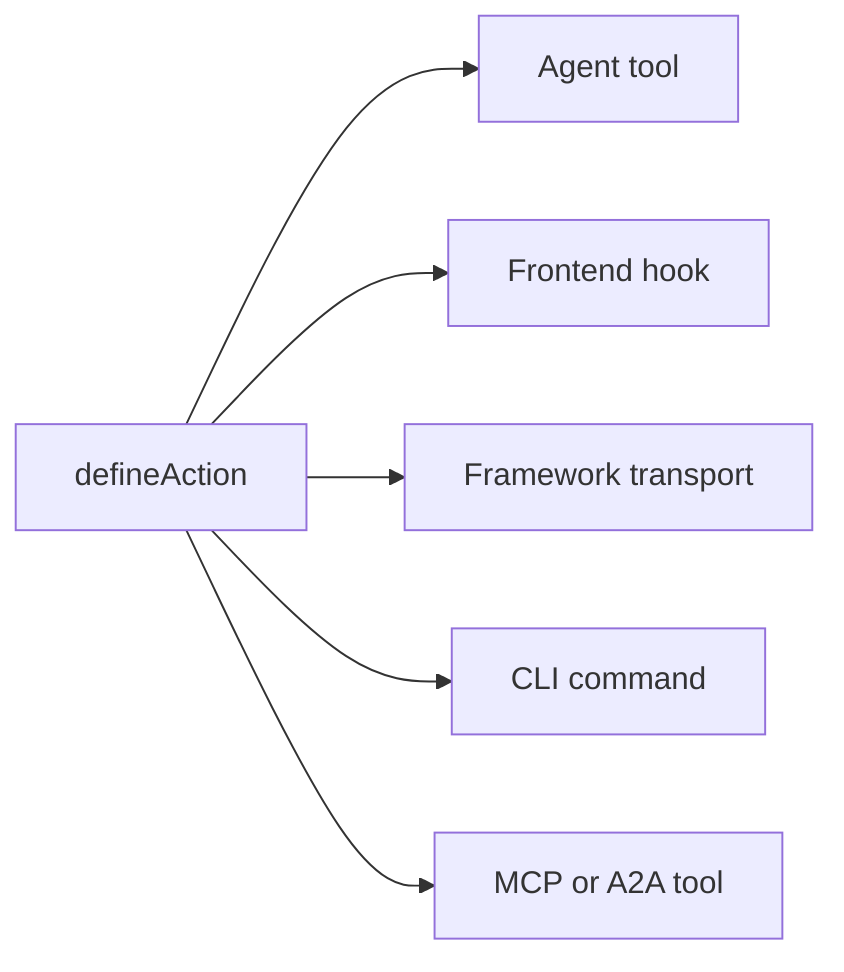

# मुख्य अवधारणाएं

अंदर से Agent-Native ऐप्स कैसे काम करते हैं: सिद्धांत और architecture। यह page वह contract है: वे तय नियम जिन्हें एक ऐप को Agent-Native गिने जाने के लिए follow करना होता है। इस तरह बनाने के vision और तर्क के लिए देखें [Agent-Native क्या है?](/docs/what-is-agent-native)।

## तीन लेयर्स {#three-layers}

Agent-Native तीन लेयर्स वाला एक framework है:

| लेयर                                     | यह क्या है                                                                                                                                                                                                                       |
| ---------------------------------------- | -------------------------------------------------------------------------------------------------------------------------------------------------------------------------------------------------------------------------------- |
| **Core: framework**                      | मूल runtime contract: actions, PostgreSQL/PGlite और Drizzle helpers, auth, application state, agent execution, access checks, routing, और live sync। हर ऐप सीधे Core का उपयोग कर सकता है।                                        |
| **Toolkit: वैकल्पिक reusable पीस**       | primitives, editors, sharing, collaboration, settings, और agent UX जैसे shared app-building UI और product systems। ऐप्स को जो पीस चाहिए उनका उपयोग, compose, या fork कर सकते हैं।                                                |
| **Templates: Core पर बने वैकल्पिक ऐप्स** | routes, schema, actions, instructions, और visual identity वाले पूर्ण, डोमेन-specific ऐप्स। First-party और custom templates आमतौर पर Toolkit का उपयोग करते हैं, और starting points के रूप में fork करके इस्तेमाल किए जा सकते हैं। |

Core नींव है। Toolkit और Templates वैकल्पिक हैं: एक template Toolkit का उपयोग कर सकता है, लेकिन Core पर ऐप बनाने के लिए Toolkit ज़रूरी नहीं है।

## आर्किटेक्चर {#the-architecture}

Runtime पर, हर Agent-Native ऐप तीन चीज़ें हैं जो साथ मिलकर काम करती हैं:

- **Agent:** स्वायत्त AI। यह data पढ़ता है, data लिखता है, actions चलाता है, और जो भी tools configured हैं उनका उपयोग करता है। जब इसके frame को जान-बूझकर workspace access और write tooling दी जाती है, तो यह ऐप के अपने source को भी modify कर सकता है। Skills और instructions के साथ customizable।
- **Application:** agent के इर्द-गिर्द product surface। यह chat के रूप में शुरू हो सकता है, native inline results जोड़ सकता है, एक छोटे control plane में बढ़ सकता है, या dashboards, flows, और visualizations वाला एक full React UI बन सकता है।
- **Computer:** database, browser, और configured tool runtimes जिनके ज़रिए agent काम करता है। Agents ऐप के अपने action और data surface के ज़रिए काम करते हैं; उसी surface को वैकल्पिक रूप से MCP पर expose किया जा सकता है, लेकिन external MCP servers एक add-on ही रहते हैं, foundation नहीं।

नीचे दिया diagram agent और application को साथ-साथ दिखाता है, दोनों के नीचे एक shared computer layer में जाने वाले two-way arrows के साथ। दोनों में से कोई भी data का owner नहीं है। इसके बजाय, वे same PostgreSQL/PGlite store को पढ़ते और लिखते हैं, इसलिए कोई भी side जो change करता है वह तुरंत दूसरे को दिखाई देता है, और बीच में कोई sync layer बनाने की ज़रूरत नहीं।

<Diagram id="doc-block-t1f7pj" title="Agent, application, और computer" summary="एक shared PostgreSQL/PGlite store पर मिलकर काम करने वाली तीन लेयर्स। agent और application दोनों एक ही data को पढ़ते और लिखते हैं।">

```html
<div class="diagram-arch">
  <div class="diagram-row">
    <div class="diagram-card">
      <span class="diagram-pill accent">Agent</span
      ><small class="diagram-muted"
        >data पढ़ता + लिखता है, actions चलाता है, configured tools का उपयोग करता
        है</small
      >
    </div>
    <div class="diagram-card">
      <span class="diagram-pill">Application</span
      ><small class="diagram-muted"
        >chat, inline results, control plane, या full React UI</small
      >
    </div>
  </div>
  <div class="diagram-arrow diagram-muted" aria-hidden="true">
    &darr;&nbsp;&uarr;
  </div>
  <div class="diagram-box" data-rough>
    Computer<br /><small class="diagram-muted"
      >SQL डेटाबेस · ब्राउज़र · कोड execution</small
    >
  </div>
</div>
```

```css
.diagram-arch {
  display: flex;
  flex-direction: column;
  align-items: center;
  gap: 10px;
}
.diagram-arch .diagram-row {
  display: flex;
  gap: 12px;
  flex-wrap: wrap;
  justify-content: center;
}
.diagram-arch .diagram-card {
  display: flex;
  flex-direction: column;
  gap: 6px;
  padding: 14px 16px;
  min-width: 220px;
}
.diagram-arch .diagram-arrow {
  font-size: 20px;
  line-height: 1;
}
.diagram-arch .diagram-box {
  text-align: center;
  padding: 12px 18px;
}
```

</Diagram>

वही agent-application-computer लूप है जो locally और production में चलता है। Automation-first ऐप्स इसे सीधे folder से `pnpm agent` के साथ चलाते हैं; UI ऐप्स embedded agent panel माउंट करते हैं और `pnpm dev` जोड़ते हैं। Cloud में, Builder.io उसी लूप को एक managed frame के रूप में host करता है: वह environment जो आपके ऐप के साथ agent को चलाता है। यह आपके लिए collaboration, visual editing, और infrastructure संभालता है।

## Agent बिल्डिंग ब्लॉक्स {#agent-building-blocks}

हर Agent-Native ऐप में समान agent बिल्डिंग ब्लॉक्स होते हैं, चाहे product surface chat-first हो, automation-first हो, या एक full UI हो। हर एक अपनी खुद की file में रहता है:

<FileTree
  id="doc-block-1ae57y4"
  title="मार्गदर्शन और व्यवहार"
  entries={[
    {
      path: "AGENTS.md",
      note: "हमेशा-चालू instructions: purpose, core rules, state keys, action index, skills index",
    },
    {
      path: ".agents/skills/<name>/SKILL.md",
      note: "reusable व्यवहार: workflow steps, policies, examples, references, और do/don't lists",
    },
    {
      path: "actions/<name>.ts",
      note: "executable क्षमता: agent, UI, CLI, HTTP, MCP, A2A, jobs, और webhooks को exposed typed operation",
    },
  ]}
/>

एक turn agent के साथ एक exchange है: यह अपना context पढ़ता है, तय करता है कि क्या करना है, और respond करता है। हर turn में loaded होने का मतलब है कि file हर बार उस context में फिर से enter होती है, न कि सिर्फ़ session शुरू होने पर एक बार।

| बिल्डिंग ब्लॉक   | File                             | इसके लिए उपयोग करें                                                                                                                             | कब Load होता है                                                             |
| ---------------- | -------------------------------- | ----------------------------------------------------------------------------------------------------------------------------------------------- | --------------------------------------------------------------------------- |
| **Instructions** | `AGENTS.md`                      | स्थिर मार्गदर्शन जिसे agent को हर task में साथ ले जाना चाहिए: ऐप क्या है, invariants, tone, indexes                                             | हर turn                                                                     |
| **Skills**       | `.agents/skills/<name>/SKILL.md` | Reusable व्यवहार: किसी workflow को कैसे follow करें, कोई policy कैसे apply करें, evidence कैसे inspect करें, या किसी output को कैसे verify करें | On demand, जब skill का description task से मेल खाए                          |
| **Actions**      | `actions/<name>.ts`              | असली operations: data पढ़ना या लिखना, APIs कॉल करना, messages भेजना, approvals चलाना, typed results produce करना                                | हर turn tools के रूप में listed; केवल तभी execute होते हैं जब call किए जाएं |

Skills और actions साथ मिलकर काम करते हैं। एक skill agent को यह सिखाती है कि किसी class के काम को कैसे किया जाए; एक action वह code path है जिसे वह उस काम को करते समय call कर सकता है। उदाहरण के लिए, एक `customer-research` skill agent को बता सकती है कि किन sources को inspect करना है और evidence को कैसे summarize करना है, जबकि `search-crm` और `create-brief` actions असली data fetch और write करते हैं।

पांच नियम architecture को govern करते हैं:

1. **Data PostgreSQL में रहता है:** सारा app state Drizzle ORM के ज़रिए database में रहता है।
2. **सारा AI agent के through जाता है:** कोई inline LLM calls नहीं; हर AI interaction agent chat bridge से होकर गुज़रता है।
3. **Agent operations के लिए Actions:** जटिल काम एक typed action के रूप में चलता है, inline code के रूप में नहीं।
4. **Live sync UI को sync में रखता है:** database में हुए changes SSE पर stream होते हैं, और polling universal fallback के रूप में काम करती है।
5. **Application state PostgreSQL में:** ephemeral UI state database में रहता है, जिसे agent और UI दोनों पढ़ सकते हैं।

## चार-क्षेत्र चेकलिस्ट {#four-area-checklist}

हर user-facing feature को सभी applicable areas update करने चाहिए। किसी applicable area को skip करना Agent-Native contract को तोड़ता है; किसी ऐसे automation पर screen थोपना जिसे किसी human को browse करने की ज़रूरत ही नहीं, वह भी एक smell है।

- **1. UI:** वह page, component, या dialog जिसके साथ user interact करता है।
- **2. Action:** उसी operation के लिए `actions/` में agent-callable action।
- **3. Skills:** `AGENTS.md` को update करें और/या pattern को document करने वाली एक skill बनाएं।
- **4. App-State:** Navigation state, view-screen data, और navigate commands।

केवल UI वाला feature agent के लिए invisible होता है। केवल actions वाला full UI feature user के लिए invisible होता है। बिना app-state वाला feature मतलब agent को यह नहीं पता कि user क्या कर रहा है। एक automation-first operation जायज़ तौर पर action + instructions से शुरू हो सकता है और बाद में chat, UI, या app-state जोड़ सकता है जब humans को उसे browse, approve, configure, या share करने की ज़रूरत हो।

## Agent-Native में क्या शामिल है {#what-you-get-for-free}

Framework अपनाना मुख्यतः इसलिए valuable है क्योंकि आपको जो चीज़ें बनानी बंद हो जाती हैं। जैसे ही आपका ऐप ऊपर दिए पांच नियमों को follow करता है, आपको ये मिल जाता है:

| Feature                           | आपको क्या मिलता है                                                                                                                                                                                                                                                                                                                                                                                |
| --------------------------------- | ------------------------------------------------------------------------------------------------------------------------------------------------------------------------------------------------------------------------------------------------------------------------------------------------------------------------------------------------------------------------------------------------- |
| एक action = हर surface            | `defineAction()` से define की गई हर action एक साथ एक agent tool, एक typesafe frontend hook (`useActionQuery` / `useActionMutation`), एक framework-owned HTTP transport, एक CLI command, external clients के लिए एक MCP tool, और अन्य Agent-Native ऐप्स के लिए एक A2A tool होती है। वैकल्पिक `link` और `mcpApp` metadata बिना किसी दूसरे implementation के deep links और MCP Apps UI जोड़ देता है। |
| प्रति user पूर्ण agent resources  | Skills, shared `LEARNINGS.md`, personal `memory/MEMORY.md`, `AGENTS.md`, custom sub-agents, scheduled jobs, और connected MCP servers। सब कुछ PostgreSQL-backed है, किसी dev-box की ज़रूरत नहीं। देखें [Agent Resources](/docs/agent-resources)।                                                                                                                                                   |
| Drop-in React components          | `<AgentPanel />` और `<AgentSidebar />` आपके ऐप में कहीं भी chat + resources render करते हैं। देखें [Drop-in Agent](/docs/drop-in-agent)।                                                                                                                                                                                                                                                          |
| BYO agent chat runtimes           | वही chat UI OpenAI Agents, OpenAI Responses, Claude Agent SDK, Vercel AI SDK, AG-UI, या आपके अपने normalized HTTP stream के ऊपर बैठ सकता है। देखें [मूल चैट UI](/docs/native-chat-ui#byo-agent-runtimes)।                                                                                                                                                                                         |
| Agent और UI के बीच Live sync      | Same-process writes तुरंत `/_agent-native/events` पर stream होते हैं; एक lightweight poll serverless, cron, और cross-process writes को convergent रखती है। Mutating actions automatically action-backed queries को invalidate कर देती हैं, इसलिए agent द्वारा बनाए गए records बिना manual refresh के दिखाई देते हैं। नीचे देखें [Live Sync](#polling-sync)।                                       |
| Auth, orgs, RBAC                  | orgs/members/roles के साथ Better Auth हर template में wired है। देखें [Authentication](/docs/authentication)। एक से ज़्यादा user के लिए, शुरुआत करें [Organizations, Teams & Permissions](/docs/organizations-teams-permissions) से।                                                                                                                                                              |
| Context awareness                 | `navigation` app-state key के ज़रिए agent को हमेशा पता होता है कि user क्या देख रहा है। देखें [संदर्भ जागरूकता](/docs/context-awareness)।                                                                                                                                                                                                                                                         |
| MCP client + server, दोनों दिशाएं | ऐप MCP servers (local, remote, hub-shared) को ingest करता है _और_ अपनी actions को एक MCP server के रूप में expose करता है। देखें [MCP Clients](/docs/mcp-clients) और [MCP Protocol](/docs/mcp-protocol)।                                                                                                                                                                                          |
| Inter-app delegation              | अलग-अलग ऐप्स में agents [A2A](/docs/a2a-protocol) पर बात करते हैं। Same-origin deploys JWT को skip कर देते हैं; cross-origin एक shared `A2A_SECRET` का उपयोग करता है।                                                                                                                                                                                                                             |
| Sub-agent teams                   | अपने खुद के thread और tools के साथ एक sub-agent spawn करें, जो chat में inline एक chip के रूप में दिखता है। देखें [Agent Teams](/docs/agent-teams)।                                                                                                                                                                                                                                               |
| Portability                       | स्थानीय PGlite और hosted Postgres के साथ PostgreSQL, तथा कोई भी Nitro-compatible host (Node, Workers, Netlify, Vercel, Deno, Lambda, Bun)।                                                                                                                                                                                                                                                        |

## PostgreSQL में Data {#data-in-sql}

सारा application state Drizzle ORM के ज़रिए PostgreSQL में रहता है। Schemas PostgreSQL और PGlite helpers का इस्तेमाल करते हैं; `DATABASE_URL` config और संचालन नियम [Database](/docs/server-database) में हैं।

Core SQL स्टोर auto-created हैं और हर template में उपलब्ध हैं:

- `application_state`: अस्थायी UI state (navigation, drafts, selections)
- `settings`: स्थायी key-value config
- `oauth_tokens`: OAuth क्रेडेंशियल्स
- `sessions`: auth sessions

नीचे हर row अपने fields दिखाने के लिए expand होती है:

<DataModel
  id="doc-block-4w0fu8"
  title="Core SQL स्टोर"
  summary={
    "हर template में auto-created। agent और UI दोनों इन्हें पढ़ते और लिखते हैं।"
  }
  entities={[
    {
      id: "application_state",
      name: "application_state",
      note: "अस्थायी UI state जिसे agent context के लिए पढ़ता है",
      fields: [
        {
          name: "key",
          type: "text",
          pk: true,
          note: "जैसे 'navigation'",
        },
        {
          name: "value",
          type: "json",
          note: "व्यू, चयन, ड्राफ्ट्स",
        },
      ],
    },
    {
      id: "settings",
      name: "settings",
      note: "स्थायी key-value config",
      fields: [
        {
          name: "key",
          type: "text",
          pk: true,
        },
        {
          name: "value",
          type: "json",
        },
      ],
    },
    {
      id: "oauth_tokens",
      name: "oauth_tokens",
      note: "OAuth क्रेडेंशियल्स",
      fields: [
        {
          name: "provider",
          type: "text",
          pk: true,
        },
        {
          name: "token",
          type: "text",
        },
      ],
    },
    {
      id: "sessions",
      name: "sessions",
      note: "Auth सेशन्स",
      fields: [
        {
          name: "id",
          type: "text",
          pk: true,
        },
        {
          name: "userId",
          type: "text",
        },
      ],
    },
  ]}
/>

अपना खुद का domain data जोड़ने के लिए, ऊपर दिए core stores द्वारा इस्तेमाल किए गए उन्हीं schema helpers के साथ एक table define करें:

```ts
// Drizzle schema for domain data
import { table, text, integer } from "@agent-native/core/db/schema";

export const forms = table("forms", {
  id: text("id").primaryKey(),
  title: text("title").notNull(),
  schema: text("schema").notNull(), // JSON
  ownerEmail: text("owner_email"),
  createdAt: integer("created_at").notNull(),
});
```

आप और agent दोनों उस data को terminal से inspect कर सकते हैं, बिना किसी अलग SQL client के:

```bash
# डेटाबेस की तुरंत जांच के लिए Core actions
pnpm action db-schema                                       # show all tables
pnpm action db-query --sql "SELECT * FROM forms"
```

`db-schema` हर table के columns और types प्रिंट करता है। `db-query` सीधे read-only SQL चलाता है, जो बिना कोई database client खोले किसी action के writes को check करने के लिए उपयोगी है।

<Callout tone="decision">

production agent chat plugin raw SQL tools को default रूप से read-only रखता है (`frameworkTools: { database: "read" }`), इसलिए agent app data को `db-schema` / `db-query` से inspect करते हैं और writes typed app actions से करते हैं। `database: "write"` (या `true`) केवल उन maintenance surfaces के लिए सेट करें जिन्हें scoped `db-exec` / `db-patch` भी चाहिए; सभी data access के लिए typed app actions ज़रूरी बनाने के लिए `database: "off"` / `false` सेट करें।

`frameworkTools` फ़्रेमवर्क के बाकी अपने टूल को भी इसी तरह नियंत्रित करता है: sharing, रिव्यू कमेंट, वर्शन इतिहास, feature flags, लोकलाइज़ेशन, ऑडिट, Context X-Ray, प्रोफ़ाइल, ऑटोमेशन, docs, resources, web, ऐप-दर-ऐप डेलिगेशन, चैट और ईमेल। पूरी सूची, `"minimal"` preset, और किसी समूह को बंद करने पर उसके HTTP रूट क्यों माउंट रहते हैं — देखें [Production Agent Tools](/docs/actions-agent-tools#production-agent-tools)।

</Callout>

## एजेंट चैट ब्रिज {#agent-chat-bridge}

UI कभी सीधे किसी LLM को call नहीं करता। जब कोई user "Generate chart" या "Write summary" पर click करता है, तो UI `postMessage` के ज़रिए agent को एक message भेजता है। Agent वह काम करता है। इसके पास पूरी conversation history, skills, instructions, और iterate करने की क्षमता होती है।

```ts
// Delegate AI work to the agent from a React component
import { sendToAgentChat } from "@agent-native/core/client/agent-chat";
sendToAgentChat({
  message: "Generate a chart showing signups by source",
  context: "Dashboard ID: main, date range: last 30 days",
  submit: true,
});
```

संक्षेप में:

- **AI non-deterministic है**: Feedback देने और iterate करने के लिए आपको conversation flow चाहिए, one-shot buttons नहीं।
- **Context मायने रखता है**: Agent के पास ऐप के instructions, skills, और history होती है। एक inline call के पास इनमें से कुछ भी नहीं होता।
- **Agent ज़्यादा कर सकता है**: यह actions चला सकता है, web browse कर सकता है, और कई steps को एक साथ chain कर सकता है।

**[External execution](/docs/a2a-protocol)**

क्योंकि सब कुछ agent और actions से होकर गुज़रता है, किसी भी ऐप को Slack, Telegram, scheduled jobs, scripts, या A2A के ज़रिए किसी दूसरे agent से चलाया जा सकता है।

## Actions सिस्टम {#actions-system}

जब agent को कुछ जटिल करना होता है, जैसे किसी API को call करना, data process करना, या database query करना, तो यह एक **action** चलाता है। Actions `actions/` में TypeScript files हैं जो एक default `defineAction()` export करती हैं:

```ts filename="actions/fetch-data.ts"
import { defineAction } from "@agent-native/core/action";
import { z } from "zod";

// One action powers every app surface: UI, agent, HTTP, MCP, A2A, and CLI.
export default defineAction({
  description: "Fetch data from a source API.",
  schema: z.object({
    source: z.string().describe("Data source key, e.g. 'signups'"),
  }),
  run: async ({ source }) => {
    const res = await fetch(`https://api.example.com/${source}`);
    return await res.json();
  },
});
```

यह action किसी source API से JSON fetch करता है और उसे return करता है। `defineAction()` फ़ंक्शन को उसके input (`source`) के लिए एक zod schema से wrap करता है, ताकि framework उस input को validate कर सके, एक JSON Schema generate कर सके जिसे agent call कर सके, और इसी एक definition से frontend hook के लिए types infer कर सके।

एक `defineAction()` call automatically पांच अलग-अलग consumers तक पहुंचती है। Diagram एक single action से होने वाला fan-out दिखाता है; नीचे दी list बताती है कि हर consumer को क्या मिलता है:



- **Agent tool:** agent इसे zod-derived JSON Schema के साथ देखता है और इसे call कर सकता है।
- **Frontend hook:** पूर्ण TypeScript inference के साथ `useActionMutation("fetch-data")`।
- **Framework transport:** client hooks के पीछे auto-mounted।
- **CLI:** scripting और agent dev loops के लिए `pnpm action fetch-data --source=signups`।
- **MCP tool / A2A tool:** जब MCP server या A2A enabled होता है, तो वही action वहां भी दिखाई देती है।

हर consumer उसी underlying function को call करता है, इसलिए लिखने और maintain करने के लिए बस एक ही implementation है। पूरे reference के लिए देखें [Actions](/docs/actions-overview)।

## Live Sync {#polling-sync}

जब agent data बदलता है, तो UI को उसे बिना manual refresh के reflect करना होता है। `useDbSync()` इसे automatic बनाता है। Same-process writes `/_agent-native/events` पर stream होते हैं; `/_agent-native/poll` cross-process और serverless fallback बना रहता है। जब agent database (application state, settings, या domain data) में लिखता है, तो एक version counter बढ़ता है और client relevant React Query caches को invalidate कर देता है।

SSE, WebSockets के बजाय common case को cover करता है, क्योंकि यह same-process writes को plain HTTP के ज़रिए browser तक तुरंत पहुंचने का रास्ता देता है, जबकि version-counter poll एक fallback के रूप में बना रहता है जो serverless और edge सहित हर deployment environment में काम करता है, जहां persistent sockets उपलब्ध नहीं हो सकते।

```ts
// Client: subscribe to agent/UI data changes once near the app shell
import { useDbSync } from "@agent-native/core/client/hooks";
useDbSync({ queryClient });
```

इसे एक बार, ऐप के root के पास call करें। यह पूरे ऐप को change events के लिए subscribe कर देता है, इसलिए `useActionQuery` या किसी source-versioned `useQuery` का उपयोग करने वाला कोई भी component जब वह जो data पढ़ता है वह बदलता है तो automatically refetch करता है।

Flow इस प्रकार है:

1. Agent एक ऐसी action चलाता है जो database में लिखती है
2. Server `"action"` या `"settings"` जैसे किसी source के साथ एक change event emit करता है
3. `useDbSync` इसे SSE या polling fallback पर receive करता है
4. `useActionQuery` hooks और source-versioned `useQuery` hooks refetch करते हैं
5. Components बिना page reload के नया data render करते हैं

Diagram उसी sequence को end to end trace करता है:

<Diagram id="doc-block-87e1c3" title="Live Sync फ़्लो" summary={"एक agent write बिना manual refresh के एक UI render बन जाता है। पहले SSE, फिर polling universal fallback के रूप में।"}>

```html
<div class="diagram-sync">
  <div class="diagram-node">
    Agent एक्शन<br /><small class="diagram-muted">DB में लिखता है</small>
  </div>
  <div class="diagram-arrow diagram-muted" aria-hidden="true">&rarr;</div>
  <div class="diagram-node">
    Change इवेंट<br /><small class="diagram-muted"
      >source: action / settings</small
    >
  </div>
  <div class="diagram-arrow diagram-muted" aria-hidden="true">&rarr;</div>
  <div class="diagram-panel center">
    <span class="diagram-pill accent">useDbSync</span
    ><small class="diagram-muted">SSE &middot; poll fallback</small>
  </div>
  <div class="diagram-arrow diagram-muted" aria-hidden="true">&rarr;</div>
  <div class="diagram-node">
    Query रीफ़ेच<br /><small class="diagram-muted"
      >render, बिना reload के</small
    >
  </div>
</div>
```

```css
.diagram-sync {
  display: flex;
  align-items: center;
  gap: 10px;
  flex-wrap: wrap;
}
.diagram-sync .diagram-arrow {
  font-size: 22px;
  line-height: 1;
}
.diagram-sync .center {
  display: flex;
  flex-direction: column;
  align-items: center;
  gap: 4px;
  padding: 10px 14px;
}
```

</Diagram>

यह सभी deployment environments में काम करता है, serverless और edge समेत, क्योंकि यह in-memory state या file system watchers के बजाय database का उपयोग करता है।

## संदर्भ जागरूकता {#context-awareness}

Agent को हमेशा पता होता है कि user क्या देख रहा है। हर route change पर UI application-state में एक `navigation` key लिखता है। Agent एक्शन लेने से पहले इसे `view-screen` action के ज़रिए पढ़ता है।

उदाहरण के लिए, जब आप कोई email thread खोलते हैं तो UI इस तरह की एक row upsert करता है:

```json
{ "key": "navigation", "value": { "view": "thread", "threadId": "th_abc123" } }
```

<Callout tone="info">

UI इसे route change पर लिखता है; agent कोई भी action लेने से पहले इसे (`view-screen` के ज़रिए) पढ़ता है, इसलिए इसे हमेशा पता रहता है कि आप किस thread, chart, या slide पर focused हैं।

</Callout>

पूरे pattern के लिए देखें [संदर्भ जागरूकता](/docs/context-awareness): navigation state, view-screen, navigate commands, और jitter prevention।

## एक Action, कई Surfaces {#protocols}

किसी domain operation को एक बार action के रूप में implement करें; framework इसे हर consumer के सामने expose करता है। वही `defineAction()` एक agent tool, एक typesafe UI hook, एक HTTP endpoint, एक CLI command, एक MCP tool, और एक A2A tool बन जाता है, साथ ही वैकल्पिक `link`, `mcpApp`, native-widget metadata, या Generative UI wrappers तभी जोड़े जाते हैं जब किसी surface को richer interaction चाहिए। Behavior को Skills और instructions cover करते हैं।

पूरे protocol/surface matrix (MCP server और OAuth, MCP Apps, A2A, deep links, native chat widgets, Generative UI, AgentChatRuntime connectors, Agent Web, और ACP और A2UI के लिए adapter horizon) के लिए, और एक product shape चुनने के लिए (chat, inline UI, full app pages, embedded sidecar, automation, या external-agent access), देखें [एजेंट Surfaces](/docs/agent-surfaces)।

## App कोड और कस्टमाइज़ेशन {#agent-modifies-code}

Framework embedded agent को ऐप के source code तक ambient access नहीं देता। एक deployed ऐप में, agent आमतौर पर actions, PostgreSQL-backed state, और configured integrations के ज़रिए काम करता है। यह components, routes, styles, और actions को edit कर सकता है जब इसके frame को जान-बूझकर workspace और write tooling दी गई हो। Templates पूर्ण ऐप्स हैं जिन्हें आप अपने खुद के repository और development workflow में किसी भी सूरत में fork और customize कर सकते हैं। बिना source बदले runtime customization के लिए [Extensions](/docs/extensions) का उपयोग करें।

## डिफ़ॉल्ट रूप से PostgreSQL {#hosting-agnostic}

दो architectural नियम ऐप्स को PGlite, hosted Postgres और अलग-अलग hosting targets में एक जैसा रखते हैं:

- **PostgreSQL.** `@agent-native/core/db/schema` से schemas लिखें और reads/writes के लिए Drizzle का उपयोग करें। Raw PostgreSQL SQL केवल additive migrations या one-off maintenance के लिए इस्तेमाल करें और इसे PGlite के साथ compatible रखें। [Database](/docs/server-database) देखें।
- **Hosting-agnostic.** Server Nitro पर चलता है और किसी भी deployment target के लिए compile होता है। Server routes या plugins में कभी भी Node-specific APIs (`fs`, `child_process`, `path`) का उपयोग न करें, और कभी भी persistent server process मान कर न चलें। Serverless और edge stateless होते हैं, इसलिए सारा state SQL में रखें। देखें [Deployment](/docs/deployment)।

## Agent Resources {#workspace}

हर user को **agent resources** का एक personal सेट मिलता है: instructions, skills, memory, custom sub-agents, scheduled jobs, और connected MCP servers, जो सब files के बजाय SQL में stored होते हैं। इससे per user एक container spin up किए बिना multi-tenant SaaS के अंदर Claude-Code-level customization viable बन जाती है। देखें [Agent Resources](/docs/agent-resources)।

## संबंधित बिल्डिंग ब्लॉक्स {#building-blocks}

ये उसी contract के ऊपर बैठते हैं और इनकी अपनी deep dives हैं:

- **[Dispatch](/docs/dispatch):** workspace control plane, जिसमें एक shared inbox, secrets vault, scheduled jobs, और एक orchestrator है जो A2A पर specialist ऐप्स को delegate करता है।
- **[Extensions](/docs/extensions):** sandboxed Alpine.js mini-apps जिन्हें agent runtime पर बनाता है, बिना किसी source changes या migrations के।
- **[A2A प्रोटोकॉल](/docs/a2a-protocol):** एक ही workspace में ऐप्स JSON-RPC पर एक-दूसरे को कैसे discover और call करते हैं।

## आगे क्या है {#deep-dives}

<Cards>

### [Agent-Native क्या है?](/docs/what-is-agent-native)

इन नियमों के पीछे का vision और philosophy।

### [संदर्भ जागरूकता](/docs/context-awareness)

Navigation state, view-screen, और navigate commands गहराई में।

### [सिंक इंटरनल्स](/docs/client-sync-internals)

Live sync के पीछे का change-version मैकेनिज्म, एक raw `useQuery` को सिंक करने के लिए।

### [Skills गाइड](/docs/skills-guide)

Framework skills, domain skills, और custom skills बनाना।

### [मूल चैट UI](/docs/native-chat-ui)

Action-declared tables, charts, और BYO runtime posture।

### [एजेंट Surfaces](/docs/agent-surfaces)

Chat, native inline UI, full app pages, embedded sidecar, automation, और external-agent paths।

### [A2A प्रोटोकॉल](/docs/a2a-protocol)

Agent-to-agent communication।

</Cards>
