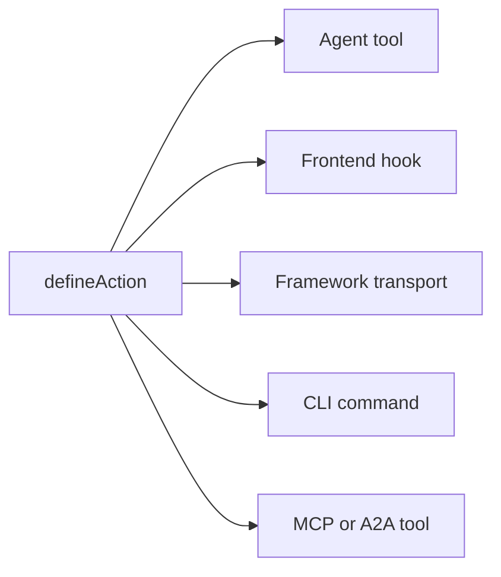

# 主要な概念

Agent-Native アプリが内部でどのように動作するか、その原則とアーキテクチャです。このページは契約です。アプリが Agent-Native と見なされるために従うべき固定ルールを定めています。このように構築する理由とビジョンについては、[Agent-Nativeとは？](/docs/what-is-agent-native) を参照してください。

## 3つのレイヤー {#three-layers}

Agent-Native は3つのレイヤーから成るフレームワークです。

| レイヤー                                             | 概要                                                                                                                                                                                                                              |
| ---------------------------------------------------- | --------------------------------------------------------------------------------------------------------------------------------------------------------------------------------------------------------------------------------- |
| **Core: フレームワーク**                             | 基盤となるランタイムの契約です。アクション、PostgreSQL/PGlite と Drizzle のヘルパー、認証、アプリケーション状態、エージェントの実行、アクセスチェック、ルーティング、ライブ同期を含みます。どのアプリも Core を直接使用できます。 |
| **Toolkit: 再利用可能なオプションの部品**            | プリミティブ、エディタ、共有、コラボレーション、設定、エージェント UX など、アプリ構築のための共有 UI とプロダクトシステムです。アプリは必要な部品を使用、組み合わせ、または fork できます。                                      |
| **Templates: Core 上に構築されたオプションのアプリ** | ルート、スキーマ、アクション、指示、ビジュアルアイデンティティを備えた、完全でドメイン特化型のアプリです。ファーストパーティおよびカスタムの Templates は一般的に Toolkit を使用し、fork して出発点として利用できます。           |

Core が基盤です。Toolkit と Templates はオプションです。template は Toolkit を使用できますが、Core の上にアプリを構築するために Toolkit が必須というわけではありません。

## アーキテクチャ {#the-architecture}

実行時には、すべての Agent-Native アプリは次の3つの要素が連携して動作します。

- **エージェント:** 自律的な AI です。データを読み取り、書き込みを行い、アクションを実行し、設定されたツールを何でも使用します。frame に意図的に workspace アクセスと書き込みツールが付与されている場合は、アプリ自身のソースコードを変更することもできます。スキルと指示でカスタマイズ可能です。
- **アプリケーション:** エージェントを取り巻くプロダクトサーフェスです。チャットとして始まり、ネイティブなインライン結果を追加し、小さなコントロールプレーンへ成長し、あるいはダッシュボード、フロー、ビジュアライゼーションを備えたフル React UI になることもあります。
- **コンピュータ:** エージェントが操作対象とするデータベース、ブラウザ、設定済みのツールランタイムです。エージェントはアプリ自身のアクションとデータのサーフェスを通じて動作します。同じサーフェスは任意で MCP 経由に公開できますが、外部の MCP サーバーはあくまでアドオンであり、基盤ではありません。

以下の図は、エージェントとアプリケーションを並べて示し、両方から共有された computer レイヤーへ双方向の矢印が伸びている様子を表しています。どちらもデータを所有しません。代わりに、両者は同じ SQL ストアを読み書きするため、どちら側で行った変更もすぐにもう一方から見えるようになり、間に構築すべき同期レイヤーはありません。

<Diagram id="doc-block-t1f7pj" title="エージェント、アプリケーション、コンピュータ" summary="3つのレイヤーが1つの共有 SQL ストア上で連携します。エージェントとアプリケーションはどちらも同じデータを読み書きします。">

```html
<div class="diagram-arch">
  <div class="diagram-row">
    <div class="diagram-card">
      <span class="diagram-pill accent">エージェント</span
      ><small class="diagram-muted"
        >データの読み書き、アクションの実行、設定済みツールの利用</small
      >
    </div>
    <div class="diagram-card">
      <span class="diagram-pill">アプリケーション</span
      ><small class="diagram-muted"
        >チャット、インライン結果、コントロールプレーン、またはフル React
        UI</small
      >
    </div>
  </div>
  <div class="diagram-arrow diagram-muted" aria-hidden="true">
    &darr;&nbsp;&uarr;
  </div>
  <div class="diagram-box" data-rough>
    コンピュータ<br /><small class="diagram-muted"
      >SQL データベース · ブラウザ · コード実行</small
    >
  </div>
</div>
```

```css
.diagram-arch {
  display: flex;
  flex-direction: column;
  align-items: center;
  gap: 10px;
}
.diagram-arch .diagram-row {
  display: flex;
  gap: 12px;
  flex-wrap: wrap;
  justify-content: center;
}
.diagram-arch .diagram-card {
  display: flex;
  flex-direction: column;
  gap: 6px;
  padding: 14px 16px;
  min-width: 220px;
}
.diagram-arch .diagram-arrow {
  font-size: 20px;
  line-height: 1;
}
.diagram-arch .diagram-box {
  text-align: center;
  padding: 12px 18px;
}
```

</Diagram>

同じ agent-application-computer ループが、ローカルと本番環境の両方で動作します。automation-first なアプリはフォルダから直接 `pnpm agent` で実行し、UI アプリは埋め込みエージェントパネルをマウントして `pnpm dev` を追加します。クラウドでは、Builder.io が同一のループをマネージド frame として提供します。これは、アプリの隣でエージェントを実行する環境です。コラボレーション、ビジュアル編集、インフラストラクチャを代わりに処理します。

## エージェントの構成要素 {#agent-building-blocks}

すべての Agent-Native アプリは、プロダクトサーフェスがチャットファースト、automation-first、フル UI のいずれであっても、同じエージェント構成要素を持っています。それぞれが独自のファイルに存在します。

<FileTree
  id="doc-block-1ae57y4"
  title="ガイダンスと振る舞い"
  entries={[
    {
      path: "AGENTS.md",
      note: "常時有効な指示: 目的、基本ルール、状態キー、アクションインデックス、スキルインデックス",
    },
    {
      path: ".agents/skills/<name>/SKILL.md",
      note: "再利用可能な振る舞い: ワークフローの手順、ポリシー、例、リファレンス、do/don't リスト",
    },
    {
      path: "actions/<name>.ts",
      note: "実行可能な能力: エージェント、UI、CLI、HTTP、MCP、A2A、jobs、webhooks に公開される型付き操作",
    },
  ]}
/>

ターンとは、エージェントとの1回のやり取りです。エージェントはコンテキストを読み取り、何をすべきか判断し、応答します。毎ターン読み込まれるとは、セッション開始時に一度だけではなく、そのファイルが毎回コンテキストに再度入ることを意味します。

| 構成要素       | ファイル                         | 用途                                                                                                         | 読み込まれるタイミング                                           |
| -------------- | -------------------------------- | ------------------------------------------------------------------------------------------------------------ | ---------------------------------------------------------------- |
| **指示**       | `AGENTS.md`                      | エージェントがすべてのタスクに持ち込むべき安定したガイダンス: アプリの概要、不変条件、トーン、インデックス   | 毎ターン                                                         |
| **スキル**     | `.agents/skills/<name>/SKILL.md` | 再利用可能な振る舞い: ワークフローに従う方法、ポリシーを適用する方法、証拠を検査する方法、出力を検証する方法 | スキルの説明がタスクと一致したときにオンデマンドで               |
| **アクション** | `actions/<name>.ts`              | 実際の操作: データの読み書き、API の呼び出し、メッセージの送信、承認の実行、型付き結果の生成                 | 毎ターンツールとして一覧表示され、呼び出されたときのみ実行される |

スキルとアクションは連携して動作します。スキルはエージェントにある種の作業のやり方を教え、アクションはその作業を行う際に呼び出せるコードパスです。たとえば、`customer-research` スキルはエージェントにどのソースを調べ、どのように証拠を要約するかを伝え、`search-crm` と `create-brief` アクションが実際のデータを取得・書き込みします。

アーキテクチャを支配する5つのルール:

1. **データは PostgreSQL に存在する:** すべてのアプリの状態は Drizzle ORM を介してデータベースに存在します。
2. **すべての AI はエージェントを経由する:** インライン LLM 呼び出しはありません。すべての AI とのやり取りはエージェントチャットブリッジを通過します。
3. **エージェントの操作にはアクションを使う:** 複雑な作業はインラインコードではなく、型付きアクションとして実行されます。
4. **ライブ同期が UI を同期させ続ける:** データベースの変更は SSE 経由でストリームされ、ポーリングがユニバーサルフォールバックになります。
5. **アプリケーション状態は PostgreSQL に:** 一時的な UI 状態はデータベースに存在し、エージェントと UI の両方から読み取れます。

## 4つの領域のチェックリスト {#four-area-checklist}

ユーザー向けのすべての機能は、該当するすべての領域を更新する必要があります。該当する領域をスキップすると Agent-Native の契約が破られます。人間が閲覧する必要のない automation に画面を強制するのも良くない兆候です。

- **1. UI:** ユーザーが操作するページ、コンポーネント、またはダイアログです。
- **2. アクション:** 同じ操作を行う `actions/` 内のエージェント呼び出し可能なアクションです。
- **3. スキル:** `AGENTS.md` を更新する、および/またはそのパターンを文書化するスキルを作成します。
- **4. アプリ状態:** ナビゲーション状態、view-screen データ、navigate コマンドです。

UI しか持たない機能はエージェントから見えません。アクションしか持たないフル UI 機能はユーザーから見えません。アプリ状態のない機能は、エージェントがユーザーの行動を認識できないことを意味します。automation-first な操作は、アクション + 指示から正当に開始し、人間が閲覧、承認、設定、共有する必要が出てきた時点でチャット、UI、アプリ状態を後から追加できます。

## Agent-Native に含まれるもの {#what-you-get-for-free}

このフレームワークを採用する価値は、主に何を構築しなくて済むようになるかにあります。アプリが上記の5つのルールに従った瞬間、次のものが手に入ります。

| 機能                                     | 得られるもの                                                                                                                                                                                                                                                                                                                                                                                                           |
| ---------------------------------------- | ---------------------------------------------------------------------------------------------------------------------------------------------------------------------------------------------------------------------------------------------------------------------------------------------------------------------------------------------------------------------------------------------------------------------- |
| 1つのアクション = あらゆるサーフェス     | `defineAction()` で定義されたすべてのアクションは、同時にエージェントツール、型安全なフロントエンドフック (`useActionQuery` / `useActionMutation`)、フレームワーク所有の HTTP トランスポート、CLI コマンド、外部クライアント向けの MCP ツール、他の Agent-Native アプリ向けの A2A ツールになります。オプションの `link` と `mcpApp` メタデータは、2つ目の実装を書くことなくディープリンクと MCP Apps UI を追加します。 |
| ユーザーごとの完全なエージェントリソース | スキル、共有される `LEARNINGS.md`、個人用の `memory/MEMORY.md`、`AGENTS.md`、カスタムサブエージェント、スケジュールされたジョブ、接続された MCP サーバーです。すべて SQL でバックアップされ、dev-box は不要です。[Agent Resources](/docs/agent-resources) を参照してください。                                                                                                                                         |
| ドロップイン React コンポーネント        | `<AgentPanel />` と `<AgentSidebar />` は、アプリ内の任意の場所にチャット + リソースをレンダリングします。[Drop-in Agent](/docs/drop-in-agent) を参照してください。                                                                                                                                                                                                                                                    |
| BYO エージェントチャットランタイム       | 同じチャット UI を OpenAI Agents、OpenAI Responses、Claude Agent SDK、Vercel AI SDK、AG-UI、または独自の正規化された HTTP ストリームの上に置くことができます。[ネイティブ チャット UI](/docs/native-chat-ui#byo-agent-runtimes) を参照してください。                                                                                                                                                                   |
| エージェントと UI 間のライブ同期         | 同一プロセスの書き込みは `/_agent-native/events` 経由で即座にストリームされます。軽量なポーリングが、サーバーレス、cron、クロスプロセスの書き込みを収束させ続けます。変更を行うアクションはアクションに基づくクエリを自動的に無効化するため、エージェントが作成したレコードは手動更新なしで表示されます。下記の [Live Sync](#polling-sync) を参照してください。                                                        |
| 認証、組織、RBAC                         | orgs/members/roles を備えた Better Auth がすべての template に組み込まれています。[Authentication](/docs/authentication) を参照してください。複数ユーザーの場合は、[Organizations, Teams & Permissions](/docs/organizations-teams-permissions) から始めてください。                                                                                                                                                    |
| コンテキスト認識                         | エージェントは `navigation` アプリ状態キーを通じて、ユーザーが何を見ているかを常に把握しています。[コンテキスト認識](/docs/context-awareness) を参照してください。                                                                                                                                                                                                                                                     |
| MCP クライアント + サーバー、両方向      | アプリは MCP サーバー (ローカル、リモート、ハブ共有) を取り込み、_かつ_ 自身のアクションを MCP サーバーとして公開します。[MCP Clients](/docs/mcp-clients) と [MCP Protocol](/docs/mcp-protocol) を参照してください。                                                                                                                                                                                                   |
| アプリ間の委任                           | 異なるアプリのエージェントは [A2A](/docs/a2a-protocol) 経由で通信します。同一オリジンのデプロイでは JWT がスキップされます。クロスオリジンでは共有の `A2A_SECRET` を使用します。                                                                                                                                                                                                                                       |
| サブエージェントチーム                   | 独自のスレッドとツールを持つサブエージェントを生成し、チャット内にインラインのチップとして表示します。[Agent Teams](/docs/agent-teams) を参照してください。                                                                                                                                                                                                                                                            |
| 移植性                                   | ローカル PGlite とホストされた Postgres を使う PostgreSQL、および Nitro 互換の任意のホスト (Node、Workers、Netlify、Vercel、Deno、Lambda、Bun)。                                                                                                                                                                                                                                                                       |

## PostgreSQL 内のデータ {#data-in-sql}

すべてのアプリケーション状態は Drizzle ORM を介して PostgreSQL に保存されます。スキーマは PostgreSQL と PGlite のヘルパーを使用します。`DATABASE_URL` の設定と運用ルールは [Database](/docs/server-database) にあります。

Core の SQL ストアは自動作成され、すべての template で利用できます。

- `application_state`: 一時的な UI 状態 (ナビゲーション、下書き、選択内容)
- `settings`: 永続的なキーバリュー設定
- `oauth_tokens`: OAuth 認証情報
- `sessions`: 認証セッション

以下の各行を展開すると、そのフィールドが表示されます。

<DataModel
  id="doc-block-4w0fu8"
  title="Core の SQL ストア"
  summary={
    "すべての template で自動作成されます。エージェントと UI はどちらもこれらを読み書きします。"
  }
  entities={[
    {
      id: "application_state",
      name: "application_state",
      note: "エージェントがコンテキストのために読み取る一時的な UI 状態",
      fields: [
        {
          name: "key",
          type: "text",
          pk: true,
          note: "例: 'navigation'",
        },
        {
          name: "value",
          type: "json",
          note: "ビュー、選択内容、下書き",
        },
      ],
    },
    {
      id: "settings",
      name: "settings",
      note: "永続的なキーバリュー設定",
      fields: [
        {
          name: "key",
          type: "text",
          pk: true,
        },
        {
          name: "value",
          type: "json",
        },
      ],
    },
    {
      id: "oauth_tokens",
      name: "oauth_tokens",
      note: "OAuth 認証情報",
      fields: [
        {
          name: "provider",
          type: "text",
          pk: true,
        },
        {
          name: "token",
          type: "text",
        },
      ],
    },
    {
      id: "sessions",
      name: "sessions",
      note: "認証セッション",
      fields: [
        {
          name: "id",
          type: "text",
          pk: true,
        },
        {
          name: "userId",
          type: "text",
        },
      ],
    },
  ]}
/>

独自のドメインデータを追加するには、上記の core ストアで使用されているのと同じスキーマヘルパーでテーブルを定義します。

```ts
// Drizzle schema for domain data
import { table, text, integer } from "@agent-native/core/db/schema";

export const forms = table("forms", {
  id: text("id").primaryKey(),
  title: text("title").notNull(),
  schema: text("schema").notNull(), // JSON
  ownerEmail: text("owner_email"),
  createdAt: integer("created_at").notNull(),
});
```

あなたとエージェントの両方が、別の SQL クライアントなしでターミナルからそのデータを検査できます。

```bash
# データベースを手早く確認するための Core actions
pnpm action db-schema                                       # show all tables
pnpm action db-query --sql "SELECT * FROM forms"
```

`db-schema` はすべてのテーブルのカラムと型を出力します。`db-query` は読み取り専用の SQL を直接実行するため、データベースクライアントを開かずにアクションの書き込みを確認するのに便利です。

<Callout tone="decision">

実稼働エージェントのチャット プラグインは raw SQL ツールをデフォルトで読み取り専用にします (`frameworkTools: { database: "read" }`)。エージェントは `db-schema` / `db-query` でアプリ所有データを検査し、書き込みは型付きアプリ actions 経由で行います。スコープ付きの `db-exec` / `db-patch` も公開する必要がある意図的なメンテナンス面だけで `database: "write"` (または `true`) を設定します。すべてのデータアクセスに型付きアプリ actions を要求するには `database: "off"` / `false` を設定します。

`frameworkTools` は、フレームワーク自身の残りのツールも同じように制御します。共有、レビューコメント、バージョン履歴、feature flags、ローカライズ、監査、Context X-Ray、プロフィール、自動化、docs、resources、web、アプリ間委譲、チャット、メールです。完全な一覧、`"minimal"` プリセット、グループを無効にしても HTTP ルートが残る理由は [Production Agent Tools](/docs/actions-agent-tools#production-agent-tools) を参照してください。

</Callout>

## エージェントチャットブリッジ {#agent-chat-bridge}

UI が LLM を直接呼び出すことはありません。ユーザーが「Generate chart」や「Write summary」をクリックすると、UI は `postMessage` 経由でエージェントにメッセージを送信します。作業を行うのはエージェントです。エージェントは完全な会話履歴、スキル、指示、そして繰り返し改善する能力を持っています。

```ts
// Delegate AI work to the agent from a React component
import { sendToAgentChat } from "@agent-native/core/client/agent-chat";
sendToAgentChat({
  message: "Generate a chart showing signups by source",
  context: "Dashboard ID: main, date range: last 30 days",
  submit: true,
});
```

要するに:

- **AI は非決定的です**: フィードバックを与えて繰り返し改善するための会話フローが必要であり、ワンショットのボタンでは足りません。
- **コンテキストが重要です**: エージェントはアプリの指示、スキル、履歴を持っています。インライン呼び出しにはそれらが一切ありません。
- **エージェントはより多くのことができます**: アクションを実行し、Web を閲覧し、複数のステップを連鎖させることができます。

**[外部実行](/docs/a2a-protocol)**

すべてがエージェントとアクションを経由するため、どのアプリも Slack、Telegram、スケジュールされたジョブ、スクリプト、あるいは A2A 経由の別のエージェントから操作できます。

## アクションシステム {#actions-system}

エージェントが API の呼び出し、データ処理、データベースへの問い合わせなど複雑なことを行う必要がある場合、**アクション** を実行します。アクションは `actions/` にある TypeScript ファイルで、デフォルトで `defineAction()` をエクスポートします。

```ts filename="actions/fetch-data.ts"
import { defineAction } from "@agent-native/core/action";
import { z } from "zod";

// One action powers every app surface: UI, agent, HTTP, MCP, A2A, and CLI.
export default defineAction({
  description: "Fetch data from a source API.",
  schema: z.object({
    source: z.string().describe("Data source key, e.g. 'signups'"),
  }),
  run: async ({ source }) => {
    const res = await fetch(`https://api.example.com/${source}`);
    return await res.json();
  },
});
```

このアクションはソース API から JSON を取得して返します。`defineAction()` は入力 (`source`) 用の zod スキーマで関数をラップするため、フレームワークはこの1つの定義だけから、その入力を検証し、エージェントが呼び出せる JSON Schema を生成し、フロントエンドフック用の型を推論できます。

1回の `defineAction()` 呼び出しは、自動的に5つの異なるコンシューマーに届きます。図は1つのアクションからのファンアウトを示し、以下のリストは各コンシューマーが得るものを説明します。



- **エージェントツール:** エージェントは zod から派生した JSON Schema を通じてこれを認識し、呼び出すことができます。
- **フロントエンドフック:** 完全な TypeScript 推論を伴う `useActionMutation("fetch-data")`。
- **フレームワークトランスポート:** クライアントフックの背後に自動マウントされます。
- **CLI:** スクリプト作成やエージェント開発ループのための `pnpm action fetch-data --source=signups`。
- **MCP ツール / A2A ツール:** MCP サーバーまたは A2A が有効な場合、同じアクションがそこにも表示されます。

どのコンシューマーも同じ基盤となる関数を呼び出すため、記述・保守する実装は1つだけです。完全なリファレンスは [Actions](/docs/actions-overview) を参照してください。

## ライブ同期 {#polling-sync}

エージェントがデータを変更したとき、UI は手動での更新なしにそれを反映する必要があります。`useDbSync()` がそれを自動化します。同一プロセスの書き込みは `/_agent-native/events` 経由でストリームされます。`/_agent-native/poll` は引き続きクロスプロセスおよびサーバーレス向けのフォールバックです。エージェントがデータベース (アプリケーション状態、設定、またはドメインデータ) に書き込むと、バージョンカウンターが増加し、クライアントは関連する React Query のキャッシュを無効化します。

WebSockets ではなく SSE が一般的なケースをカバーしているのは、通常の HTTP だけで同一プロセスの書き込みをブラウザへ即座に届けられるからです。一方でバージョンカウンターによるポーリングはフォールバックとして残り、永続的なソケットを利用できないことがあるサーバーレスやエッジを含む、あらゆるデプロイ環境で機能します。

```ts
// Client: subscribe to agent/UI data changes once near the app shell
import { useDbSync } from "@agent-native/core/client/hooks";
useDbSync({ queryClient });
```

これをアプリのルート付近で1回呼び出します。アプリ全体を変更イベントに購読させるため、`useActionQuery` やソースバージョン管理された `useQuery` を使用するどのコンポーネントも、読み取っているデータが変化すると自動的に再取得します。

フローは次のとおりです。

1. エージェントがデータベースに書き込むアクションを実行する
2. サーバーが `"action"` や `"settings"` のような source を持つ変更イベントを発行する
3. `useDbSync` が SSE またはポーリングフォールバック経由でそれを受信する
4. `useActionQuery` フックとソースバージョン管理された `useQuery` フックが再取得する
5. コンポーネントがページのリロードなしに新しいデータをレンダリングする

図は同じシーケンスを最初から最後まで示しています。

<Diagram id="doc-block-87e1c3" title="ライブ同期フロー" summary={"エージェントの書き込みが、手動更新なしの UI レンダリングになります。まず SSE、そしてユニバーサルフォールバックとしてのポーリングです。"}>

```html
<div class="diagram-sync">
  <div class="diagram-node">
    エージェントアクション<br /><small class="diagram-muted"
      >DB に書き込み</small
    >
  </div>
  <div class="diagram-arrow diagram-muted" aria-hidden="true">&rarr;</div>
  <div class="diagram-node">
    変更イベント<br /><small class="diagram-muted"
      >source: action / settings</small
    >
  </div>
  <div class="diagram-arrow diagram-muted" aria-hidden="true">&rarr;</div>
  <div class="diagram-panel center">
    <span class="diagram-pill accent">useDbSync</span
    ><small class="diagram-muted">SSE &middot; ポーリングフォールバック</small>
  </div>
  <div class="diagram-arrow diagram-muted" aria-hidden="true">&rarr;</div>
  <div class="diagram-node">
    クエリ再取得<br /><small class="diagram-muted"
      >レンダリング、リロードなし</small
    >
  </div>
</div>
```

```css
.diagram-sync {
  display: flex;
  align-items: center;
  gap: 10px;
  flex-wrap: wrap;
}
.diagram-sync .diagram-arrow {
  font-size: 22px;
  line-height: 1;
}
.diagram-sync .center {
  display: flex;
  flex-direction: column;
  align-items: center;
  gap: 4px;
  padding: 10px 14px;
}
```

</Diagram>

これは、インメモリの状態やファイルシステムウォッチャーの代わりにデータベースを使用するため、サーバーレスやエッジを含むあらゆるデプロイ環境で機能します。

## コンテキスト認識 {#context-awareness}

エージェントは、ユーザーが何を見ているかを常に把握しています。UI はルートが変わるたびに `navigation` キーを application-state に書き込みます。エージェントは行動する前に `view-screen` アクション経由でそれを読み取ります。

たとえば、メールスレッドを開くと、UI は次のような行を upsert します。

```json
{ "key": "navigation", "value": { "view": "thread", "threadId": "th_abc123" } }
```

<Callout tone="info">

UI はルート変更時にこれを書き込みます。エージェントは何らかのアクションを行う前に (`view-screen` 経由で) それを読み取るため、あなたがどのスレッド、チャート、スライドに注目しているかを常に把握しています。

</Callout>

ナビゲーション状態、view-screen、navigate コマンド、ジッター防止を含む完全なパターンについては、[コンテキスト認識](/docs/context-awareness) を参照してください。

## 1つのアクション、多くのサーフェス {#protocols}

ドメイン操作を1回だけアクションとして実装すれば、フレームワークがそれをすべてのコンシューマーに公開します。同じ `defineAction()` が、エージェントツール、型安全な UI フック、HTTP エンドポイント、CLI コマンド、MCP ツール、A2A ツールになります。オプションの `link`、`mcpApp`、ネイティブウィジェットメタデータ、あるいは Generative UI ラッパーは、サーフェスがよりリッチなインタラクションを必要とする場合にのみ追加されます。スキルと指示が振る舞いをカバーします。

完全なプロトコル/サーフェスのマトリックス (MCP サーバーと OAuth、MCP Apps、A2A、ディープリンク、ネイティブチャットウィジェット、Generative UI、AgentChatRuntime コネクタ、Agent Web、ACP と A2UI のアダプターホライズン) や、プロダクトの形 (チャット、インライン UI、フルアプリページ、埋め込みサイドカー、automation、外部エージェントアクセス) の選び方については、[エージェントサーフェス](/docs/agent-surfaces) を参照してください。

## アプリのコードとカスタマイズ {#agent-modifies-code}

フレームワークは、埋め込みエージェントにアプリのソースコードへのアンビエントなアクセスを付与しません。デプロイされたアプリでは、エージェントは通常アクション、SQL に保存された状態、設定済みのインテグレーションを通じて動作します。frame に workspace アクセスと書き込みツールが意図的に付与されている場合は、コンポーネント、ルート、スタイル、アクションを編集できます。Templates は、いずれの場合も自分自身のリポジトリと開発ワークフローで fork してカスタマイズできる完全なアプリです。ソースコードを変更せずにランタイムでカスタマイズするには、[Extensions](/docs/extensions) を使用してください。

## デフォルトは PostgreSQL {#hosting-agnostic}

2つのアーキテクチャ ルールにより、アプリは PGlite、ホストされた Postgres、さまざまなホスティング先で一貫して動作します。

- **PostgreSQL。** `@agent-native/core/db/schema` でスキーマを記述し、読み書きには Drizzle を使用します。raw PostgreSQL SQL は追加型マイグレーションまたは一時的なメンテナンスにのみ使用し、PGlite と互換性を保ってください。[Database](/docs/server-database) を参照してください。
- **Hosting-agnostic。** サーバーは Nitro 上で動作し、任意のデプロイターゲットにコンパイルされます。サーバーのルートやプラグインで Node 固有の API (`fs`、`child_process`、`path`) を使用しないでください。また、永続的なサーバープロセスを前提にしないでください。サーバーレスとエッジはステートレスなので、すべての状態を SQL に保持してください。[Deployment](/docs/deployment) を参照してください。

## エージェントリソース {#workspace}

すべてのユーザーは、個人用の **エージェントリソース** 一式 (指示、スキル、メモリ、カスタムサブエージェント、スケジュールされたジョブ、接続された MCP サーバー) を持ちます。これらはすべてファイルではなく SQL に保存されます。これにより、ユーザーごとにコンテナを起動することなく、マルチテナント SaaS 内で Claude-Code レベルのカスタマイズが実現可能になります。[Agent Resources](/docs/agent-resources) を参照してください。

## 関連する構成要素 {#building-blocks}

これらは同じ契約の上に成り立っており、それぞれ独自の詳細解説があります。

- **[Dispatch](/docs/dispatch):** 共有の受信トレイ、secrets vault、スケジュールされたジョブ、そして A2A 経由で専門アプリに委任するオーケストレーターを備えた workspace のコントロールプレーンです。
- **[Extensions](/docs/extensions):** エージェントが実行時に作成する、サンドボックス化された Alpine.js のミニアプリです。ソースの変更やマイグレーションは不要です。
- **[A2A プロトコル](/docs/a2a-protocol):** 同じ workspace 内のアプリが JSON-RPC 経由で互いを検出し、呼び出す仕組みです。

## 次のステップ {#deep-dives}

<Cards>

### [Agent-Nativeとは？](/docs/what-is-agent-native)

このルールの背景にあるビジョンと理念です。

### [コンテキスト認識](/docs/context-awareness)

ナビゲーション状態、view-screen、navigate コマンドについて詳しく解説します。

### [同期の内部](/docs/client-sync-internals)

ライブ同期を支えるチェンジバージョンの仕組みで、独自の `useQuery` を同期する方法です。

### [Skills ガイド](/docs/skills-guide)

フレームワークのスキル、ドメインスキル、カスタムスキルの作成方法です。

### [ネイティブ チャット UI](/docs/native-chat-ui)

アクションが宣言するテーブルやチャート、BYO ランタイムの方針です。

### [エージェントサーフェス](/docs/agent-surfaces)

チャット、ネイティブインライン UI、フルアプリページ、埋め込みサイドカー、automation、外部エージェントの経路です。

### [A2A プロトコル](/docs/a2a-protocol)

エージェント間通信です。

</Cards>
