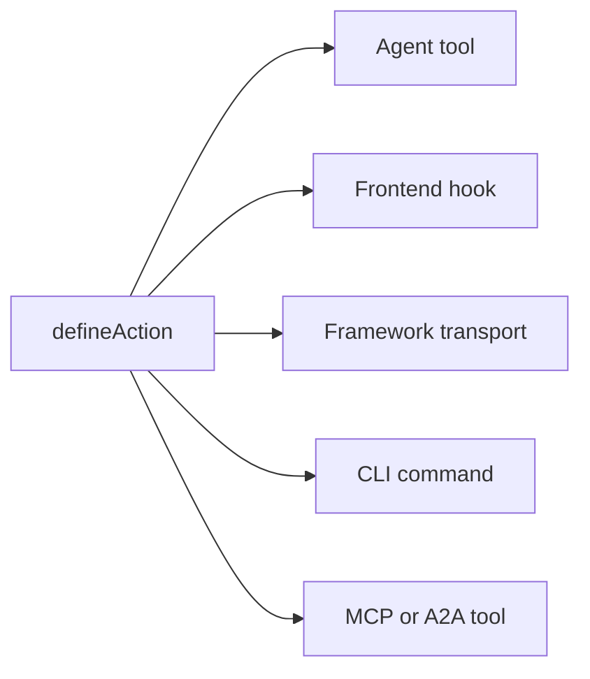

# 핵심 개념

Agent-Native 앱이 내부적으로 작동하는 방식: 원칙과 아키텍처입니다. 이 페이지는 계약입니다. 앱이 Agent-Native로 인정받기 위해 따라야 하는 고정된 규칙입니다. 이런 방식으로 만드는 비전과 근거는 [Agent-Native란?](/docs/what-is-agent-native)를 참조하세요.

## 세 개의 레이어 {#three-layers}

Agent-Native는 세 개의 레이어로 이루어진 프레임워크입니다:

| 레이어                                    | 설명                                                                                                                                                                                       |
| ----------------------------------------- | ------------------------------------------------------------------------------------------------------------------------------------------------------------------------------------------ |
| **Core: 프레임워크**                      | 기본 런타임 계약입니다: 액션, PostgreSQL/PGlite 및 Drizzle 헬퍼, 인증, 애플리케이션 상태, 에이전트 실행, 접근 검사, 라우팅, 라이브 동기화입니다. 모든 앱이 Core를 직접 사용할 수 있습니다. |
| **Toolkit: 선택적 재사용 가능 조각**      | 프리미티브, 에디터, 공유, 협업, 설정, 에이전트 UX 같은 공유되는 앱 빌딩 UI 및 제품 시스템입니다. 앱은 필요한 조각을 사용하거나, 조합하거나, fork할 수 있습니다.                            |
| **Templates: Core 위에 구축된 선택적 앱** | 라우트, 스키마, 액션, 지침, 시각적 아이덴티티를 갖춘 완전한 도메인 특화 앱입니다. 자사 및 커스텀 템플릿은 흔히 Toolkit을 사용하며, 시작점으로 fork해서 사용할 수 있습니다.                 |

Core는 기반입니다. Toolkit과 Templates는 선택 사항입니다: 템플릿은 Toolkit을 사용할 수 있지만, Core 위에 앱을 만드는 데 Toolkit이 필수는 아닙니다.

## 아키텍처 {#the-architecture}

런타임에서 모든 에이전트 기반 앱은 세 가지가 함께 작동하는 형태입니다:

- **에이전트:** 자율적으로 동작하는 AI입니다. 데이터를 읽고 쓰고, 액션을 실행하고, 구성된 도구를 사용합니다. 프레임이 의도적으로 작업 공간 접근 권한과 쓰기 도구를 부여받은 경우, 앱 자체의 소스 코드도 수정할 수 있습니다. skills와 지침으로 커스터마이즈할 수 있습니다.
- **애플리케이션:** 에이전트를 둘러싼 제품 표면입니다. 채팅으로 시작해 네이티브 인라인 결과를 추가하거나, 작은 제어 플레인으로 성장하거나, 대시보드·플로우·시각화를 갖춘 완전한 React UI가 될 수 있습니다.
- **컴퓨터:** 에이전트가 작업을 수행하는 대상인 데이터베이스, 브라우저, 구성된 도구 런타임입니다. 에이전트는 앱 자체의 액션 및 데이터 표면을 통해 작업하며, 이 동일한 표면은 선택적으로 MCP를 통해 노출될 수 있지만, 외부 MCP 서버는 어디까지나 부가 기능이지 기반이 아닙니다.

아래 다이어그램은 에이전트와 애플리케이션을 나란히 보여주며, 둘 다 그 아래에 있는 하나의 공유된 컴퓨터 레이어로 양방향 화살표를 뻗고 있습니다. 어느 쪽도 데이터를 소유하지 않습니다. 대신 양쪽 모두 동일한 SQL 저장소를 읽고 쓰므로, 한쪽에서 만든 변경 사항이 즉시 다른 쪽에서도 보이며, 그 사이에 별도의 동기화 레이어를 만들 필요가 없습니다.

<Diagram id="doc-block-t1f7pj" title="에이전트, 애플리케이션, 컴퓨터" summary="하나의 공유 SQL 저장소 위에서 함께 작동하는 세 개의 레이어입니다. 에이전트와 애플리케이션 모두 동일한 데이터를 읽고 씁니다.">

```html
<div class="diagram-arch">
  <div class="diagram-row">
    <div class="diagram-card">
      <span class="diagram-pill accent">에이전트</span
      ><small class="diagram-muted"
        >데이터를 읽고 쓰고, 액션을 실행하고, 구성된 도구를 사용</small
      >
    </div>
    <div class="diagram-card">
      <span class="diagram-pill">애플리케이션</span
      ><small class="diagram-muted"
        >채팅, 인라인 결과, 제어 플레인, 또는 완전한 React UI</small
      >
    </div>
  </div>
  <div class="diagram-arrow diagram-muted" aria-hidden="true">
    &darr;&nbsp;&uarr;
  </div>
  <div class="diagram-box" data-rough>
    컴퓨터<br /><small class="diagram-muted"
      >SQL 데이터베이스 · 브라우저 · 코드 실행</small
    >
  </div>
</div>
```

```css
.diagram-arch {
  display: flex;
  flex-direction: column;
  align-items: center;
  gap: 10px;
}
.diagram-arch .diagram-row {
  display: flex;
  gap: 12px;
  flex-wrap: wrap;
  justify-content: center;
}
.diagram-arch .diagram-card {
  display: flex;
  flex-direction: column;
  gap: 6px;
  padding: 14px 16px;
  min-width: 220px;
}
.diagram-arch .diagram-arrow {
  font-size: 20px;
  line-height: 1;
}
.diagram-arch .diagram-box {
  text-align: center;
  padding: 12px 18px;
}
```

</Diagram>

이 동일한 에이전트-애플리케이션-컴퓨터 루프가 로컬과 프로덕션 양쪽에서 실행되는 바로 그것입니다. 자동화 우선 앱은 폴더에서 바로 `pnpm agent`로 이를 실행합니다. UI 앱은 내장된 에이전트 패널을 마운트하고 `pnpm dev`를 추가합니다. 클라우드에서는 Builder.io가 동일한 루프를 관리형 프레임으로 호스팅합니다: 앱 옆에서 에이전트를 실행하는 환경입니다. 협업, 시각적 편집, 인프라를 대신 처리해 줍니다.

## 에이전트 빌딩 블록 {#agent-building-blocks}

모든 에이전트 기반 앱은 제품 표면이 채팅 우선이든, 자동화 우선이든, 완전한 UI든 관계없이
동일한 에이전트 빌딩 블록을 갖습니다. 각각은 자신만의 파일에 있습니다:

<FileTree
  id="doc-block-1ae57y4"
  title="지침과 동작"
  entries={[
    {
      path: "AGENTS.md",
      note: "항상 적용되는 지침: 목적, 핵심 규칙, 상태 키, 액션 색인, skills 색인",
    },
    {
      path: ".agents/skills/<name>/SKILL.md",
      note: "재사용 가능한 동작: 워크플로 단계, 정책, 예시, 참조, 해야 할 일/하지 말아야 할 일 목록",
    },
    {
      path: "actions/<name>.ts",
      note: "실행 가능한 기능: 타입이 지정된 오퍼레이션으로, 에이전트, UI, CLI, HTTP, MCP, A2A, 예약된 작업, 웹훅에 노출됩니다",
    },
  ]}
/>

턴(turn)은 에이전트와의 한 번의 상호작용입니다: 컨텍스트를 읽고, 무엇을 할지 결정하고, 응답합니다. "매 턴 로드됨"은 세션 시작 시 한 번만이 아니라 매번 해당 파일이 다시 컨텍스트에 들어온다는 뜻입니다.

| 빌딩 블록  | 파일                             | 용도                                                                                                              | 로드 시점                             |
| ---------- | -------------------------------- | ----------------------------------------------------------------------------------------------------------------- | ------------------------------------- |
| **지침**   | `AGENTS.md`                      | 에이전트가 모든 작업에 걸쳐 유지해야 하는 안정적인 안내: 앱이 무엇인지, 불변 조건, 어조, 색인                     | 매 턴                                 |
| **Skills** | `.agents/skills/<name>/SKILL.md` | 재사용 가능한 동작: 워크플로를 따르는 방법, 정책을 적용하는 방법, 증거를 검사하는 방법, 또는 출력을 검증하는 방법 | skill 설명이 작업과 일치할 때 요청 시 |
| **액션**   | `actions/<name>.ts`              | 실제 오퍼레이션: 데이터 읽기/쓰기, API 호출, 메시지 전송, 승인 실행, 타입이 지정된 결과 생성                      | 매 턴 도구로 나열됨; 호출될 때만 실행 |

Skills와 액션은 함께 작동합니다. skill은 에이전트에게 특정 부류의 작업을
수행하는 방법을 가르치고, 액션은 그 작업을 수행하는 동안 호출할 수 있는
코드 경로입니다. 예를 들어 `customer-research` skill은 에이전트에게 어떤
소스를 검사할지와 증거를 요약하는 방법을 알려주고, `search-crm` 및
`create-brief` 액션은 실제 데이터를 가져오고 씁니다.

다섯 가지 규칙이 이 아키텍처를 지배합니다:

1. **데이터는 PostgreSQL에 있습니다:** 모든 앱 상태는 Drizzle ORM을 통해 데이터베이스에 있습니다.
2. **모든 AI는 에이전트를 거칩니다:** 인라인 LLM 호출은 없습니다. 모든 AI 상호작용은 에이전트 채팅 브리지를 통해 흐릅니다.
3. **에이전트 오퍼레이션에는 액션을 사용합니다:** 복잡한 작업은 인라인 코드가 아니라 타입이 지정된 액션으로 실행됩니다.
4. **라이브 동기화가 UI를 동기화된 상태로 유지합니다:** 데이터베이스 변경 사항은 SSE로 스트리밍되며, 폴링이 범용 폴백 역할을 합니다.
5. **애플리케이션 상태는 PostgreSQL에 있습니다:** 임시 UI 상태는 데이터베이스에 있으며, 에이전트와 UI 모두 읽을 수 있습니다.

## 4개 영역 체크리스트 {#four-area-checklist}

사용자에게 노출되는 모든 기능은 해당하는 모든 영역을 업데이트해야 합니다. 해당되는 영역을 건너뛰면 에이전트 기반 계약이 깨집니다. 사람이 볼 필요가 없는 자동화에 화면을 억지로 붙이는 것도 좋지 않은 신호입니다.

- **1. UI:** 사용자가 상호작용하는 페이지, 컴포넌트, 또는 대화 상자입니다.
- **2. Action:** 동일한 오퍼레이션에 대해 `actions/`에 있는 에이전트 호출 가능한 액션입니다.
- **3. Skills:** `AGENTS.md`를 업데이트하고, 그리고/또는 해당 패턴을 문서화하는 skill을 만듭니다.
- **4. App-State:** 내비게이션 상태, view-screen 데이터, navigate 명령입니다.

UI만 있는 기능은 에이전트에게 보이지 않습니다. 액션만 있는 완전한 UI 기능은 사용자에게 보이지 않습니다. app-state가 없는 기능은 에이전트가 사용자가 무엇을 하고 있는지 알지 못한다는 뜻입니다. 자동화 우선 오퍼레이션은 액션 + 지침으로 시작하는 것이 정당하며, 사람이 이를 탐색하거나 승인하거나 구성하거나 공유해야 할 때 채팅, UI, 또는 app-state를 나중에 추가할 수 있습니다.

## Agent-Native가 기본으로 제공하는 것 {#what-you-get-for-free}

이 프레임워크를 채택하는 것이 가치 있는 주된 이유는 더 이상 직접 만들 필요가 없어지는 것들 때문입니다. 앱이 위의 다섯 가지 규칙을 따르는 순간, 다음을 자동으로 물려받습니다:

| 기능                            | 제공하는 것                                                                                                                                                                                                                                                                                                                                                       |
| ------------------------------- | ----------------------------------------------------------------------------------------------------------------------------------------------------------------------------------------------------------------------------------------------------------------------------------------------------------------------------------------------------------------- |
| 하나의 액션 = 모든 표면         | `defineAction()`으로 정의된 모든 액션은 동시에 에이전트 도구, 타입 안전한 프런트엔드 훅(`useActionQuery` / `useActionMutation`), 프레임워크가 소유하는 HTTP 전송, CLI 명령, 외부 클라이언트를 위한 MCP 도구, 그리고 다른 Agent-Native 앱을 위한 A2A 도구가 됩니다. 선택적인 `link` 및 `mcpApp` 메타데이터는 두 번째 구현 없이 딥 링크와 MCP Apps UI를 추가합니다. |
| 사용자별 완전한 에이전트 리소스 | Skills, 공유 `LEARNINGS.md`, 개인 `memory/MEMORY.md`, `AGENTS.md`, 사용자 정의 하위 에이전트, 예약된 작업, 연결된 MCP 서버입니다. 모두 SQL 기반이며 dev-box가 필요 없습니다. [Agent Resources](/docs/agent-resources)를 참조하세요.                                                                                                                               |
| 드롭인 React 컴포넌트           | `<AgentPanel />`와 `<AgentSidebar />`는 앱 어디에서나 채팅 + 리소스를 렌더링합니다. [Drop-in Agent](/docs/drop-in-agent)를 참조하세요.                                                                                                                                                                                                                            |
| BYO 에이전트 채팅 런타임        | 동일한 채팅 UI가 OpenAI Agents, OpenAI Responses, Claude Agent SDK, Vercel AI SDK, AG-UI, 또는 자체 정규화된 HTTP 스트림 위에서 동작할 수 있습니다. [기본 채팅 UI](/docs/native-chat-ui#byo-agent-runtimes)를 참조하세요.                                                                                                                                         |
| 에이전트와 UI 간 라이브 동기화  | 동일 프로세스 쓰기는 `/_agent-native/events`를 통해 즉시 스트리밍됩니다. 가벼운 폴링이 서버리스, cron, 크로스 프로세스 쓰기를 수렴 상태로 유지합니다. 변형(mutating) 액션은 액션 기반 쿼리를 자동으로 무효화하므로, 에이전트가 생성한 레코드가 수동 새로고침 없이 나타납니다. 아래 [Live Sync](#polling-sync)를 참조하세요.                                       |
| Auth, orgs, RBAC                | orgs/members/roles를 갖춘 Better Auth가 모든 템플릿에 연결되어 있습니다. [Authentication](/docs/authentication)을 참조하세요. 사용자가 두 명 이상이라면 [Organizations, Teams & Permissions](/docs/organizations-teams-permissions)부터 시작하세요.                                                                                                               |
| 컨텍스트 인식                   | 에이전트는 `navigation` app-state 키를 통해 사용자가 무엇을 보고 있는지 항상 알고 있습니다. [상황 인식](/docs/context-awareness)를 참조하세요.                                                                                                                                                                                                                    |
| MCP 클라이언트 + 서버, 양방향   | 앱은 MCP 서버(로컬, 원격, 허브 공유)를 수집하는 동시에 _자체_ 액션을 MCP 서버로 노출합니다. [MCP Clients](/docs/mcp-clients)와 [MCP Protocol](/docs/mcp-protocol)을 참조하세요.                                                                                                                                                                                   |
| 앱 간 위임                      | 서로 다른 앱의 에이전트가 [A2A](/docs/a2a-protocol)를 통해 대화합니다. 동일 출처 배포는 JWT를 건너뛰고, 교차 출처는 공유 `A2A_SECRET`를 사용합니다.                                                                                                                                                                                                               |
| 하위 에이전트 팀                | 자체 스레드와 도구를 가진 하위 에이전트를 생성하며, 채팅에 인라인 칩으로 표시됩니다. [Agent Teams](/docs/agent-teams)를 참조하세요.                                                                                                                                                                                                                               |
| 이식성                          | 로컬 PGlite 및 호스팅 Postgres를 사용하는 PostgreSQL과 Nitro 호환 호스트(Node, Workers, Netlify, Vercel, Deno, Lambda, Bun).                                                                                                                                                                                                                                      |

## PostgreSQL의 데이터 {#data-in-sql}

모든 애플리케이션 상태는 Drizzle ORM을 통해 PostgreSQL에 있습니다. 스키마는 PostgreSQL 및 PGlite 도우미를 사용하며, `DATABASE_URL` 구성과 운영 규칙은 [Database](/docs/server-database)에 있습니다.

핵심 SQL 스토어는 자동으로 생성되며 모든 템플릿에서 사용할 수 있습니다:

- `application_state`: 임시 UI 상태(내비게이션, 초안, 선택 항목)
- `settings`: 영구적인 키-값 구성
- `oauth_tokens`: OAuth 자격 증명
- `sessions`: 인증 세션

아래 각 행은 확장하면 필드를 보여줍니다:

<DataModel
  id="doc-block-4w0fu8"
  title="핵심 SQL 스토어"
  summary={
    "모든 템플릿에서 자동으로 생성됩니다. 에이전트와 UI 모두 이를 읽고 씁니다."
  }
  entities={[
    {
      id: "application_state",
      name: "application_state",
      note: "에이전트가 컨텍스트를 위해 읽는 임시 UI 상태",
      fields: [
        {
          name: "key",
          type: "text",
          pk: true,
          note: "예: 'navigation'",
        },
        {
          name: "value",
          type: "json",
          note: "보기, 선택, 초안",
        },
      ],
    },
    {
      id: "settings",
      name: "settings",
      note: "영구적인 키-값 구성",
      fields: [
        {
          name: "key",
          type: "text",
          pk: true,
        },
        {
          name: "value",
          type: "json",
        },
      ],
    },
    {
      id: "oauth_tokens",
      name: "oauth_tokens",
      note: "OAuth 자격 증명",
      fields: [
        {
          name: "provider",
          type: "text",
          pk: true,
        },
        {
          name: "token",
          type: "text",
        },
      ],
    },
    {
      id: "sessions",
      name: "sessions",
      note: "인증 세션",
      fields: [
        {
          name: "id",
          type: "text",
          pk: true,
        },
        {
          name: "userId",
          type: "text",
        },
      ],
    },
  ]}
/>

자신만의 도메인 데이터를 추가하려면, 위의 핵심 스토어에서 사용된 것과 동일한 스키마 헬퍼로 테이블을 정의하세요:

```ts
// Drizzle schema for domain data
import { table, text, integer } from "@agent-native/core/db/schema";

export const forms = table("forms", {
  id: text("id").primaryKey(),
  title: text("title").notNull(),
  schema: text("schema").notNull(), // JSON
  ownerEmail: text("owner_email"),
  createdAt: integer("created_at").notNull(),
});
```

당신과 에이전트 모두 별도의 SQL 클라이언트 없이 터미널에서 해당 데이터를 검사할 수 있습니다:

```bash
# 빠른 데이터베이스 점검을 위한 Core actions
pnpm action db-schema                                       # show all tables
pnpm action db-query --sql "SELECT * FROM forms"
```

`db-schema`는 모든 테이블의 컬럼과 타입을 출력합니다. `db-query`는 읽기 전용 SQL을 직접 실행하며, 데이터베이스 클라이언트를 열지 않고도 액션이 쓴 내용을 확인할 때 유용합니다.

<Callout tone="decision">

프로덕션 에이전트 채팅 플러그인은 raw SQL 도구를 기본적으로 읽기 전용으로 둡니다(`frameworkTools: { database: "read" }`). 에이전트는 `db-schema` / `db-query`로 앱 소유 데이터를 검사하고, 쓰기는 typed app actions를 통해 수행합니다. 스코프가 적용된 `db-exec` / `db-patch`도 노출해야 하는 의도적인 유지 관리 화면에서만 `database: "write"`(또는 `true`)를 설정합니다. 모든 데이터 접근에 typed app actions를 요구하려면 `database: "off"` / `false`를 설정합니다.

</Callout>

`frameworkTools`는 프레임워크 자체의 나머지 도구도 같은 방식으로 관리합니다: 공유, 리뷰 코멘트, 버전 이력, feature flags, 로컬라이제이션, 감사, Context X-Ray, 프로필, 자동화, docs, resources, web, 앱 간 위임, 채팅, 이메일. 전체 목록과 `"minimal"` 프리셋, 그룹을 꺼도 HTTP 라우트가 유지되는 이유는 [Production Agent Tools](/docs/actions-agent-tools#production-agent-tools)를 참고하세요.

## 에이전트 채팅 브리지 {#agent-chat-bridge}

UI는 절대 LLM을 직접 호출하지 않습니다. 사용자가 "Generate chart" 또는 "Write summary"를 클릭하면, UI는 `postMessage`를 통해 에이전트에게 메시지를 보냅니다. 작업은 에이전트가 수행합니다. 에이전트는 전체 대화 기록, skills, 지침, 그리고 반복 작업을 수행할 수 있는 능력을 갖추고 있습니다.

```ts
// Delegate AI work to the agent from a React component
import { sendToAgentChat } from "@agent-native/core/client/agent-chat";
sendToAgentChat({
  message: "Generate a chart showing signups by source",
  context: "Dashboard ID: main, date range: last 30 days",
  submit: true,
});
```

요약하면:

- **AI는 비결정적입니다**: 피드백을 주고 반복하려면 일회성 버튼이 아니라 대화 흐름이 필요합니다.
- **컨텍스트가 중요합니다**: 에이전트는 앱의 지침, skills, 기록을 가지고 있습니다. 인라인 호출에는 이런 것이 전혀 없습니다.
- **에이전트는 더 많은 것을 할 수 있습니다**: 액션을 실행하고, 웹을 탐색하고, 여러 단계를 연결할 수 있습니다.

**[외부 실행](/docs/a2a-protocol)**

모든 것이 에이전트와 액션을 거치기 때문에, 어떤 앱이든 Slack, Telegram, 예약된 작업, 스크립트, 또는 A2A를 통한 다른 에이전트로 구동될 수 있습니다.

## 액션 시스템 {#actions-system}

에이전트가 API 호출, 데이터 처리, 데이터베이스 쿼리처럼 복잡한 작업을 수행해야 할 때, **액션**을 실행합니다. 액션은 `actions/`에 있는 TypeScript 파일로, 기본으로 `defineAction()`을 내보냅니다:

```ts filename="actions/fetch-data.ts"
import { defineAction } from "@agent-native/core/action";
import { z } from "zod";

// One action powers every app surface: UI, agent, HTTP, MCP, A2A, and CLI.
export default defineAction({
  description: "Fetch data from a source API.",
  schema: z.object({
    source: z.string().describe("Data source key, e.g. 'signups'"),
  }),
  run: async ({ source }) => {
    const res = await fetch(`https://api.example.com/${source}`);
    return await res.json();
  },
});
```

이 액션은 소스 API에서 JSON을 가져와 반환합니다. `defineAction()`은 입력값(`source`)에 대한 zod 스키마로 함수를 감싸므로, 프레임워크는 이 하나의 정의만으로 입력을 검증하고, 에이전트가 호출할 수 있는 JSON Schema를 생성하고, 프런트엔드 훅을 위한 타입을 추론할 수 있습니다.

하나의 `defineAction()` 호출은 자동으로 다섯 개의 서로 다른 소비자에게 도달합니다. 다이어그램은 하나의 액션에서 뻗어나가는 팬아웃을 보여주며, 아래 목록은 각 소비자가 무엇을 얻는지 설명합니다:



- **에이전트 도구:** 에이전트는 zod에서 파생된 JSON Schema로 이를 보고 호출할 수 있습니다.
- **프런트엔드 훅:** 전체 TypeScript 추론이 포함된 `useActionMutation("fetch-data")`입니다.
- **프레임워크 전송:** 클라이언트 훅 뒤에 자동으로 마운트됩니다.
- **CLI:** 스크립팅과 에이전트 개발 루프를 위한 `pnpm action fetch-data --source=signups`입니다.
- **MCP 도구 / A2A 도구:** MCP 서버 또는 A2A가 활성화되면 동일한 액션이 그곳에도 나타납니다.

모든 소비자는 동일한 기반 함수를 호출하므로, 작성하고 유지 관리해야 할 구현은 단 하나뿐입니다. 전체 레퍼런스는 [Actions](/docs/actions-overview)를 참조하세요.

## 라이브 동기화 {#polling-sync}

에이전트가 데이터를 변경하면, UI는 수동 새로고침 없이 이를 반영해야 합니다. `useDbSync()`가 이를 자동으로 처리합니다. 동일 프로세스 쓰기는 `/_agent-native/events`를 통해 스트리밍되며, `/_agent-native/poll`은 크로스 프로세스 및 서버리스 폴백으로 남아 있습니다. 에이전트가 데이터베이스(애플리케이션 상태, 설정, 또는 도메인 데이터)에 쓰면, 버전 카운터가 증가하고 클라이언트는 관련된 React Query 캐시를 무효화합니다.

SSE를 WebSockets 대신 일반적인 경우에 사용하는 이유는, 동일 프로세스 쓰기가 평범한 HTTP만으로 브라우저까지 즉시 도달하는 경로를 제공하는 동시에, 서버리스와 엣지처럼 지속적인 소켓을 사용할 수 없는 배포 환경을 포함한 모든 환경에서 작동하는 폴백으로 버전 카운터 폴링이 남아 있기 때문입니다.

```ts
// Client: subscribe to agent/UI data changes once near the app shell
import { useDbSync } from "@agent-native/core/client/hooks";
useDbSync({ queryClient });
```

앱의 루트 근처에서 이를 한 번 호출하세요. 이는 앱 전체를 변경 이벤트에 구독시키므로, `useActionQuery`나 소스 버전이 지정된 `useQuery`를 사용하는 모든 컴포넌트는 자신이 읽는 데이터가 바뀌면 자동으로 다시 가져옵니다.

흐름은 다음과 같습니다:

1. 에이전트가 데이터베이스에 쓰는 액션을 실행합니다
2. 서버가 `"action"` 또는 `"settings"`와 같은 소스를 가진 변경 이벤트를 내보냅니다
3. `useDbSync`가 SSE 또는 폴링 폴백을 통해 이를 수신합니다
4. `useActionQuery` 훅과 소스 버전이 지정된 `useQuery` 훅이 다시 가져옵니다
5. 컴포넌트가 페이지 새로고침 없이 새 데이터를 렌더링합니다

다이어그램은 동일한 흐름을 처음부터 끝까지 추적합니다:

<Diagram id="doc-block-87e1c3" title="라이브 동기화 흐름" summary={"에이전트의 쓰기가 수동 새로고침 없이 UI 렌더링으로 이어집니다. SSE가 우선이며, 폴링은 범용 폴백입니다."}>

```html
<div class="diagram-sync">
  <div class="diagram-node">
    에이전트 액션<br /><small class="diagram-muted">DB에 씀</small>
  </div>
  <div class="diagram-arrow diagram-muted" aria-hidden="true">&rarr;</div>
  <div class="diagram-node">
    변경 이벤트<br /><small class="diagram-muted"
      >source: action / settings</small
    >
  </div>
  <div class="diagram-arrow diagram-muted" aria-hidden="true">&rarr;</div>
  <div class="diagram-panel center">
    <span class="diagram-pill accent">useDbSync</span
    ><small class="diagram-muted">SSE &middot; 폴링 폴백</small>
  </div>
  <div class="diagram-arrow diagram-muted" aria-hidden="true">&rarr;</div>
  <div class="diagram-node">
    쿼리 다시 가져오기<br /><small class="diagram-muted"
      >렌더링, 새로고침 없음</small
    >
  </div>
</div>
```

```css
.diagram-sync {
  display: flex;
  align-items: center;
  gap: 10px;
  flex-wrap: wrap;
}
.diagram-sync .diagram-arrow {
  font-size: 22px;
  line-height: 1;
}
.diagram-sync .center {
  display: flex;
  flex-direction: column;
  align-items: center;
  gap: 4px;
  padding: 10px 14px;
}
```

</Diagram>

이는 메모리 내 상태나 파일 시스템 감시자가 아닌 데이터베이스를 사용하기 때문에 서버리스 및 엣지를 포함한 모든 배포 환경에서 작동합니다.

## 컨텍스트 인식 {#context-awareness}

에이전트는 사용자가 무엇을 보고 있는지 항상 알고 있습니다. UI는 라우트가 바뀔 때마다 `navigation` 키를 애플리케이션 상태에 기록합니다. 에이전트는 행동하기 전에 `view-screen` 액션을 통해 이를 읽습니다.

예를 들어, 이메일 스레드를 열면 UI는 다음과 같은 행을 upsert합니다:

```json
{ "key": "navigation", "value": { "view": "thread", "threadId": "th_abc123" } }
```

<Callout tone="info">

UI는 라우트가 바뀔 때 이를 기록합니다. 에이전트는 어떤 행동을 하기 전에(`view-screen`을 통해) 이를 읽으므로, 당신이 어떤 스레드, 차트, 슬라이드에 집중하고 있는지 항상 알고 있습니다.

</Callout>

전체 패턴(내비게이션 상태, view-screen, navigate 명령, 지터 방지)은 [상황 인식](/docs/context-awareness)를 참조하세요.

## 하나의 액션, 여러 표면 {#protocols}

도메인 오퍼레이션을 액션으로 한 번 구현하면, 프레임워크가 이를 모든 소비자에게 노출합니다. 동일한 `defineAction()`이 에이전트 도구, 타입 안전한 UI 훅, HTTP 엔드포인트, CLI 명령, MCP 도구, A2A 도구가 되며, 표면이 더 풍부한 상호작용을 필요로 할 때만 선택적으로 `link`, `mcpApp`, 네이티브 위젯 메타데이터, 또는 Generative UI 래퍼가 추가됩니다. Skills와 지침은 동작을 다룹니다.

전체 프로토콜/표면 매트릭스(MCP 서버 및 OAuth, MCP Apps, A2A, 딥 링크, 네이티브 채팅 위젯, Generative UI, AgentChatRuntime 커넥터, Agent Web, 그리고 ACP와 A2UI를 위한 어댑터 지평선)와, 제품 형태 선택(채팅, 인라인 UI, 전체 앱 페이지, 임베디드 사이드카, 자동화, 또는 외부 에이전트 접근) 방법에 대해서는 [에이전트 서피스](/docs/agent-surfaces)를 참조하세요.

## 앱 코드와 사용자 지정 {#agent-modifies-code}

프레임워크는 내장된 에이전트에게 앱의 소스 코드에 대한 상시(ambient) 접근 권한을
부여하지 않습니다. 배포된 앱에서 에이전트는 보통 액션, SQL 기반 상태, 구성된 통합을
통해 작업합니다. 프레임이 의도적으로 작업 공간과 쓰기 도구를 부여받은 경우에는
컴포넌트, 라우트, 스타일, 액션을 편집할 수 있습니다. Templates는 완전한 앱으로,
어느 경우든 자신의 저장소와 개발 워크플로에서 fork하여 커스터마이즈할 수 있습니다.
소스 코드 변경 없이 런타임에 커스터마이즈하려면 [Extensions](/docs/extensions)를
사용하세요.

## 기본값은 PostgreSQL {#hosting-agnostic}

두 가지 아키텍처 규칙은 로컬 PGlite, 호스팅 Postgres 및 다양한 호스팅 대상에서 앱을 일관되게 유지합니다:

- **PostgreSQL.** `@agent-native/core/db/schema`로 스키마를 작성하고 읽기/쓰기는 Drizzle을 사용하세요. 원시 PostgreSQL SQL은 추가 마이그레이션이나 일회성 유지 관리에만 사용하고 PGlite와 호환되게 유지하세요. [Database](/docs/server-database)를 참조하세요.
- **호스팅에 구애받지 않음.** 서버는 Nitro에서 실행되며 어떤 배포 대상으로도 컴파일됩니다. 서버 라우트나 플러그인에서 Node 전용 API(`fs`, `child_process`, `path`)를 절대 사용하지 말고, 영구적인 서버 프로세스를 가정하지 마세요. 서버리스와 엣지는 상태를 저장하지 않으므로, 모든 상태를 SQL에 유지하세요. [Deployment](/docs/deployment)를 참조하세요.

## 에이전트 리소스 {#workspace}

모든 사용자는 개인 **에이전트 리소스** 세트를 갖습니다: 지침, skills, 메모리, 사용자 정의 하위 에이전트, 예약된 작업, 연결된 MCP 서버로, 모두 파일이 아니라 SQL에 저장됩니다. 이는 사용자별 컨테이너를 띄우지 않고도 다중 테넌트 SaaS 내에서 Claude Code 수준의 커스터마이징을 가능하게 만듭니다. [Agent Resources](/docs/agent-resources)를 참조하세요.

## 관련 빌딩 블록 {#building-blocks}

이들은 동일한 계약 위에 있으며, 각각 자체적인 심층 문서를 갖고 있습니다:

- **[Dispatch](/docs/dispatch):** 공유 받은 편지함, 비밀 금고, 예약된 작업, 그리고 A2A를 통해 전문 앱에 위임하는 오케스트레이터를 갖춘 작업 공간 제어 플레인입니다.
- **[Extensions](/docs/extensions):** 에이전트가 런타임에 만드는 샌드박스화된 Alpine.js 미니 앱으로, 소스 변경이나 마이그레이션이 없습니다.
- **[A2A 프로토콜](/docs/a2a-protocol):** 동일한 작업 공간에 있는 앱들이 JSON-RPC를 통해 서로를 검색하고 호출하는 방법입니다.

## 다음 단계 {#deep-dives}

<Cards>

### [Agent-Native란 무엇인가?](/docs/what-is-agent-native)

이 규칙들 뒤에 있는 비전과 철학입니다.

### [상황 인식](/docs/context-awareness)

내비게이션 상태, view-screen, navigate 명령을 깊이 다룹니다.

### [동기화 내부](/docs/client-sync-internals)

라이브 동기화 뒤에 있는 change-version 메커니즘으로, 직접 만든 `useQuery`를 동기화하는 방법을 다룹니다.

### [Skills 가이드](/docs/skills-guide)

프레임워크 skills, 도메인 skills, 커스텀 skills 만들기를 다룹니다.

### [기본 채팅 UI](/docs/native-chat-ui)

액션이 선언하는 테이블, 차트, BYO 런타임 태세를 다룹니다.

### [에이전트 서피스](/docs/agent-surfaces)

채팅, 네이티브 인라인 UI, 전체 앱 페이지, 임베디드 사이드카, 자동화, 외부 에이전트 경로를 다룹니다.

### [A2A 프로토콜](/docs/a2a-protocol)

에이전트 간 통신입니다.

</Cards>
