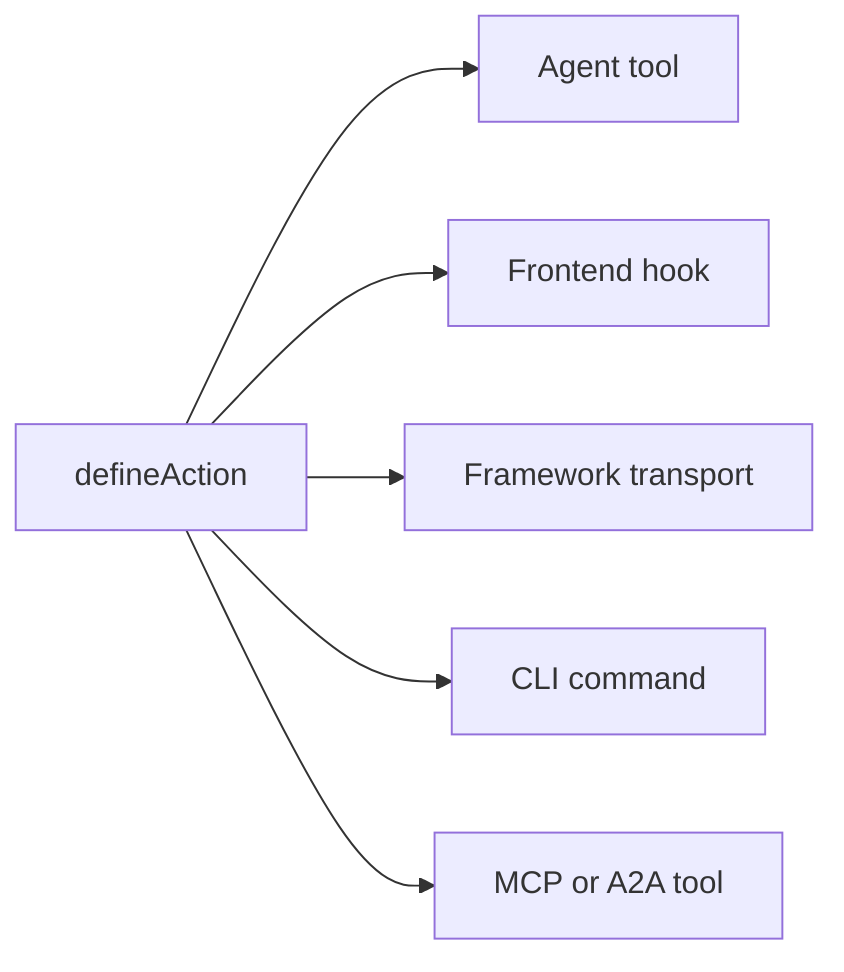

# Conceitos-chave

Como os aplicativos Agent-Native funcionam por baixo dos panos: os princípios e a arquitetura. Esta página é o contrato: as regras fixas que um aplicativo precisa seguir para contar como Agent-Native. Para a visão e os argumentos para construir dessa forma, consulte [O que é Agent-Native?](/docs/what-is-agent-native).

## As três camadas {#three-layers}

Agent-Native é um framework com três camadas:

| Camada                                                        | O que é                                                                                                                                                                                                                                               |
| ------------------------------------------------------------- | ----------------------------------------------------------------------------------------------------------------------------------------------------------------------------------------------------------------------------------------------------- |
| **Core: o framework**                                         | O contrato fundamental de runtime: ações, auxiliares de PostgreSQL/PGlite e Drizzle, autenticação, estado da aplicação, execução do agente, verificações de acesso, roteamento e sincronização ao vivo. Todo aplicativo pode usar o Core diretamente. |
| **Toolkit: peças reutilizáveis opcionais**                    | UI compartilhada para construção de apps e sistemas de produto, como primitivos, editores, compartilhamento, colaboração, configurações e UX do agente. Os aplicativos podem usar, compor ou fazer fork das peças de que precisam.                    |
| **Templates: aplicativos opcionais construídos sobre o Core** | Aplicativos completos e específicos de domínio, com rotas, schema, ações, instruções e identidade visual. Templates próprios e personalizados costumam usar o Toolkit, e podem ser forkados e usados como ponto de partida.                           |

O Core é a base. Toolkit e Templates são opcionais: um template pode usar o Toolkit, mas o Toolkit não é obrigatório para construir um aplicativo sobre o Core.

## A arquitetura {#the-architecture}

Em tempo de execução, todo aplicativo Agent-Native é composto por três elementos que trabalham juntos:

- **Agente:** A IA autônoma. Ela lê dados, grava dados, executa ações e usa as ferramentas configuradas. Quando seu frame recebe intencionalmente acesso ao workspace e ferramentas de escrita, ela também pode modificar o código-fonte do próprio aplicativo. Personalizável com skills e instruções.
- **Aplicação:** A superfície do produto ao redor do agente. Pode começar como chat, adicionar resultados inline nativos, crescer até um pequeno plano de controle, ou se tornar um UI React completo, com painéis, fluxos e visualizações.
- **Computador:** O banco de dados, o navegador e os runtimes de ferramentas configurados pelos quais o agente age. Os agentes trabalham pela superfície de ações e dados do próprio aplicativo; essa mesma superfície pode, opcionalmente, ser exposta via MCP, mas servidores MCP externos continuam sendo um complemento, não a base.

O diagrama abaixo mostra o agente e a aplicação lado a lado, ambos com setas bidirecionais para uma camada de computador compartilhada abaixo. Nenhum dos dois é dono dos dados. Em vez disso, ambos leem e gravam no mesmo armazenamento SQL, de modo que uma alteração feita por qualquer um dos lados fica visível ao outro imediatamente, sem nenhuma camada de sincronização para construir no meio do caminho.

<Diagram id="doc-block-t1f7pj" title="Agente, aplicação e computador" summary="Três camadas trabalhando juntas sobre um armazenamento SQL compartilhado. O agente e a aplicação leem e gravam os mesmos dados.">

```html
<div class="diagram-arch">
  <div class="diagram-row">
    <div class="diagram-card">
      <span class="diagram-pill accent">Agente</span
      ><small class="diagram-muted"
        >lê + grava dados, executa ações, usa ferramentas configuradas</small
      >
    </div>
    <div class="diagram-card">
      <span class="diagram-pill">Aplicação</span
      ><small class="diagram-muted"
        >chat, resultados inline, plano de controle ou UI React completo</small
      >
    </div>
  </div>
  <div class="diagram-arrow diagram-muted" aria-hidden="true">
    &darr;&nbsp;&uarr;
  </div>
  <div class="diagram-box" data-rough>
    Computador<br /><small class="diagram-muted"
      >banco de dados SQL · navegador · execução de código</small
    >
  </div>
</div>
```

```css
.diagram-arch {
  display: flex;
  flex-direction: column;
  align-items: center;
  gap: 10px;
}
.diagram-arch .diagram-row {
  display: flex;
  gap: 12px;
  flex-wrap: wrap;
  justify-content: center;
}
.diagram-arch .diagram-card {
  display: flex;
  flex-direction: column;
  gap: 6px;
  padding: 14px 16px;
  min-width: 220px;
}
.diagram-arch .diagram-arrow {
  font-size: 20px;
  line-height: 1;
}
.diagram-arch .diagram-box {
  text-align: center;
  padding: 12px 18px;
}
```

</Diagram>

Esse mesmo loop agente-aplicação-computador é o que roda localmente e em produção. Aplicativos automation-first o executam diretamente da pasta com `pnpm agent`; aplicativos UI montam o painel de agente incorporado e adicionam `pnpm dev`. Na nuvem, o Builder.io hospeda o mesmo loop como um frame gerenciado: o ambiente que executa o agente ao lado do seu aplicativo. Ele cuida da colaboração, da edição visual e da infraestrutura para você.

## Blocos de construção do agente {#agent-building-blocks}

Todo aplicativo Agent-Native tem os mesmos blocos de construção de agente,
independentemente de a superfície do produto ser chat-first, automation-first
ou um UI completo. Cada um vive em seu próprio arquivo:

<FileTree
  id="doc-block-1ae57y4"
  title="Orientação e comportamento"
  entries={[
    {
      path: "AGENTS.md",
      note: "instruções sempre ativas: propósito, regras centrais, chaves de estado, índice de ações, índice de skills",
    },
    {
      path: ".agents/skills/<name>/SKILL.md",
      note: "comportamento reutilizável: etapas de workflow, políticas, exemplos, referências e listas do que fazer/não fazer",
    },
    {
      path: "actions/<name>.ts",
      note: "capacidade executável: operação tipada exposta ao agente, UI, CLI, HTTP, MCP, A2A, jobs e webhooks",
    },
  ]}
/>

Um turno é uma troca com o agente: ele lê seu contexto, decide o que fazer e responde. Carregado a cada turno significa que o arquivo volta a entrar nesse contexto a cada vez, não apenas uma vez no início da sessão.

| Bloco de construção | Arquivo                          | Use para                                                                                                                 | Carregado quando                                                          |
| ------------------- | -------------------------------- | ------------------------------------------------------------------------------------------------------------------------ | ------------------------------------------------------------------------- |
| **Instruções**      | `AGENTS.md`                      | Orientação estável que o agente deve levar para cada tarefa: o que é o aplicativo, invariantes, tom, índices             | Cada turno                                                                |
| **Skills**          | `.agents/skills/<name>/SKILL.md` | Comportamento reutilizável: como seguir um workflow, aplicar uma política, inspecionar evidências ou verificar uma saída | Sob demanda, quando a descrição do skill corresponde à tarefa             |
| **Ações**           | `actions/<name>.ts`              | Operações reais: ler ou gravar dados, chamar APIs, enviar mensagens, executar aprovações, produzir resultados tipados    | Listadas como ferramentas a cada turno; executadas apenas quando chamadas |

Skills e ações trabalham juntas. Um skill ensina o agente a fazer uma classe de
trabalho; uma ação é o caminho de código que ele pode chamar enquanto realiza esse trabalho. Por exemplo,
um skill `customer-research` pode dizer ao agente quais fontes inspecionar e
como resumir evidências, enquanto as ações `search-crm` e `create-brief` buscam
e gravam os dados reais.

Cinco regras regem a arquitetura:

1. **Os dados residem em PostgreSQL:** todo o estado do aplicativo reside no banco de dados via Drizzle ORM.
2. **Toda IA passa pelo agente:** nenhuma chamada de LLM inline; toda interação de IA flui pela ponte de chat do agente.
3. **Ações para operações do agente:** trabalho complexo roda como uma ação tipada, não como código inline.
4. **A sincronização ao vivo mantém a UI sincronizada:** as alterações do banco de dados são transmitidas via SSE, com polling como substituto universal.
5. **Estado da aplicação em PostgreSQL:** o estado efêmero da UI reside no banco de dados, legível tanto pelo agente quanto pela UI.

## A lista de verificação de quatro áreas {#four-area-checklist}

Todo recurso voltado ao usuário deve atualizar todas as áreas aplicáveis. Ignorar uma área aplicável quebra o contrato Agent-Native; forçar uma tela em uma automação que nenhum humano precisa navegar também é um indício de problema.

- **1. UI:** Página, componente ou diálogo com o qual o usuário interage.
- **2. Ação:** Ação chamável pelo agente em `actions/` para a mesma operação.
- **3. Skills:** Atualize `AGENTS.md` e/ou crie um skill documentando o padrão.
- **4. App-State:** Estado de navegação, dados de view-screen e comandos de navigate.

Um recurso apenas com UI é invisível para o agente. Um recurso de UI completo apenas com ações é invisível para o usuário. Um recurso sem app-state significa que o agente fica cego para o que o usuário está fazendo. Uma operação automation-first pode legitimamente começar apenas com ação + instruções e adicionar chat, UI ou app-state depois, quando humanos precisarem navegar, aprovar, configurar ou compartilhá-la.

## O que o Agent-Native inclui {#what-you-get-for-free}

Adotar o framework é valioso principalmente pelo que você deixa de precisar construir. No momento em que seu aplicativo segue as cinco regras acima, você herda:

| Recurso                                   | O que você ganha                                                                                                                                                                                                                                                                                                                                                                                                                              |
| ----------------------------------------- | --------------------------------------------------------------------------------------------------------------------------------------------------------------------------------------------------------------------------------------------------------------------------------------------------------------------------------------------------------------------------------------------------------------------------------------------- |
| Uma ação = todas as superfícies           | Toda ação definida com `defineAction()` é simultaneamente uma ferramenta de agente, um hook de frontend typesafe (`useActionQuery` / `useActionMutation`), um transporte HTTP de propriedade do framework, um comando CLI, uma ferramenta MCP para clientes externos e uma ferramenta A2A para outros aplicativos Agent-Native. Os metadados opcionais `link` e `mcpApp` adicionam deep links e UI de MCP Apps sem uma segunda implementação. |
| Recursos de agente completos por usuário  | Skills, `LEARNINGS.md` compartilhado, `memory/MEMORY.md` pessoal, `AGENTS.md`, subagentes personalizados, jobs agendados e servidores MCP conectados. Tudo com suporte de SQL, sem necessidade de uma caixa de desenvolvimento. Consulte [Agent Resources](/docs/agent-resources).                                                                                                                                                            |
| Componentes React prontos para usar       | `<AgentPanel />` e `<AgentSidebar />` renderizam chat + recursos em qualquer lugar do seu aplicativo. Consulte [Drop-in Agent](/docs/drop-in-agent).                                                                                                                                                                                                                                                                                          |
| Runtimes de chat de agente BYO            | A mesma UI de chat pode ser colocada sobre OpenAI Agents, OpenAI Responses, Claude Agent SDK, Vercel AI SDK, AG-UI ou seu próprio stream HTTP normalizado. Consulte [Bate-papo nativo UI](/docs/native-chat-ui#byo-agent-runtimes).                                                                                                                                                                                                           |
| Sincronização ao vivo entre agente e UI   | Gravações do mesmo processo são transmitidas imediatamente via `/_agent-native/events`; um polling leve mantém as gravações serverless, de cron e entre processos convergentes. Ações que fazem mutação invalidam automaticamente as queries baseadas em ação, de modo que registros criados pelo agente aparecem sem uma atualização manual. Veja [Live Sync](#polling-sync) abaixo.                                                         |
| Auth, orgs, RBAC                          | Better Auth com orgs/membros/funções já vem conectado em todo template. Consulte [Authentication](/docs/authentication). Para mais de um usuário, comece por [Organizations, Teams & Permissions](/docs/organizations-teams-permissions).                                                                                                                                                                                                     |
| Reconhecimento de contexto                | O agente sempre sabe o que o usuário está vendo por meio da chave de app-state `navigation`. Consulte [Consciência do Contexto](/docs/context-awareness).                                                                                                                                                                                                                                                                                     |
| Cliente + servidor MCP, nas duas direções | O aplicativo ingere servidores MCP (locais, remotos, compartilhados via hub) _e_ expõe suas próprias ações como um servidor MCP. Consulte [MCP Clients](/docs/mcp-clients) e [MCP Protocol](/docs/mcp-protocol).                                                                                                                                                                                                                              |
| Delegação entre aplicativos               | Agentes em aplicativos diferentes se comunicam via [A2A](/docs/a2a-protocol). Implantações de mesma origem dispensam JWT; origens cruzadas usam um `A2A_SECRET` compartilhado.                                                                                                                                                                                                                                                                |
| Equipes de subagentes                     | Crie um subagente com sua própria thread e ferramentas, exibido como um chip inline no chat. Consulte [Agent Teams](/docs/agent-teams).                                                                                                                                                                                                                                                                                                       |
| Portabilidade                             | PostgreSQL com PGlite local e Postgres hospedado, além de qualquer host compatível com Nitro (Node, Workers, Netlify, Vercel, Deno, Lambda, Bun).                                                                                                                                                                                                                                                                                             |

## Dados em PostgreSQL {#data-in-sql}

Todo o estado da aplicação reside no PostgreSQL via Drizzle ORM. Os schemas usam os auxiliares de PostgreSQL e PGlite; a configuração de `DATABASE_URL` e as regras operacionais estão em [Database](/docs/server-database).

As stores SQL do Core são criadas automaticamente e estão disponíveis em todo template:

- `application_state`: estado efêmero da UI (navegação, rascunhos, seleções)
- `settings`: configuração persistente de chave-valor
- `oauth_tokens`: credenciais OAuth
- `sessions`: sessões de autenticação

Cada linha abaixo se expande para mostrar seus campos:

<DataModel
  id="doc-block-4w0fu8"
  title="Stores SQL do Core"
  summary={
    "Criadas automaticamente em todo template. O agente e a UI leem e gravam nelas."
  }
  entities={[
    {
      id: "application_state",
      name: "application_state",
      note: "Estado efêmero da UI que o agente lê para obter contexto",
      fields: [
        {
          name: "key",
          type: "text",
          pk: true,
          note: "por exemplo, 'navigation'",
        },
        {
          name: "value",
          type: "json",
          note: "view, seleção, rascunhos",
        },
      ],
    },
    {
      id: "settings",
      name: "settings",
      note: "Configuração persistente de chave-valor",
      fields: [
        {
          name: "key",
          type: "text",
          pk: true,
        },
        {
          name: "value",
          type: "json",
        },
      ],
    },
    {
      id: "oauth_tokens",
      name: "oauth_tokens",
      note: "Credenciais OAuth",
      fields: [
        {
          name: "provider",
          type: "text",
          pk: true,
        },
        {
          name: "token",
          type: "text",
        },
      ],
    },
    {
      id: "sessions",
      name: "sessions",
      note: "Sessões de autenticação",
      fields: [
        {
          name: "id",
          type: "text",
          pk: true,
        },
        {
          name: "userId",
          type: "text",
        },
      ],
    },
  ]}
/>

Para adicionar seus próprios dados de domínio, defina uma tabela com os mesmos helpers de schema usados pelas stores do core acima:

```ts
// Drizzle schema for domain data
import { table, text, integer } from "@agent-native/core/db/schema";

export const forms = table("forms", {
  id: text("id").primaryKey(),
  title: text("title").notNull(),
  schema: text("schema").notNull(), // JSON
  ownerEmail: text("owner_email"),
  createdAt: integer("created_at").notNull(),
});
```

Tanto você quanto o agente podem inspecionar esses dados pelo terminal, sem um cliente SQL separado:

```bash
# Actions do Core para inspeção rápida do banco de dados
pnpm action db-schema                                       # show all tables
pnpm action db-query --sql "SELECT * FROM forms"
```

`db-schema` imprime as colunas e os tipos de cada tabela. `db-query` executa SQL somente leitura diretamente, o que é útil para verificar as gravações de uma ação sem abrir um cliente de banco de dados.

<Callout tone="decision">

O plug-in de bate-papo do agente de produção deixa as ferramentas SQL brutas em modo somente leitura por padrão (`frameworkTools: { database: "read" }`). Os agentes inspecionam dados do app com `db-schema` / `db-query` e escrevem por meio de actions tipadas do app. Defina `database: "write"` (ou `true`) apenas para superfícies de manutenção intencionais que também devam expor `db-exec` / `db-patch` com escopo; use `database: "off"` / `false` para exigir actions tipadas para todo acesso a dados.

`frameworkTools` governa da mesma forma as demais ferramentas próprias do framework: sharing, comentários de revisão, histórico de versões, feature flags, localização, auditoria, Context X-Ray, perfil, automações, docs, resources, web, delegação entre apps, chat e email. Veja [Production Agent Tools](/docs/actions-agent-tools#production-agent-tools) para a lista completa, o preset `"minimal"` e por que desativar um grupo mantém suas rotas HTTP montadas.

</Callout>

## Ponte de chat do agente {#agent-chat-bridge}

A UI nunca chama um LLM diretamente. Quando um usuário clica em "Gerar gráfico" ou "Escrever resumo", a UI envia uma mensagem ao agente via `postMessage`. O agente faz o trabalho. Ele tem histórico completo da conversa, skills, instruções e a capacidade de iterar.

```ts
// Delegate AI work to the agent from a React component
import { sendToAgentChat } from "@agent-native/core/client/agent-chat";
sendToAgentChat({
  message: "Generate a chart showing signups by source",
  context: "Dashboard ID: main, date range: last 30 days",
  submit: true,
});
```

Em resumo:

- **A IA não é determinística**: você precisa de um fluxo de conversa para dar feedback e iterar, não de botões de disparo único.
- **O contexto importa**: o agente tem as instruções, os skills e o histórico do aplicativo. Uma chamada inline não tem nada disso.
- **O agente pode fazer mais**: ele pode executar ações, navegar na web e encadear várias etapas.

**[Execução externa](/docs/a2a-protocol)**

Como tudo passa pelo agente e pelas ações, qualquer aplicativo pode ser controlado a partir do Slack, do Telegram, de jobs agendados, de scripts ou de outro agente via A2A.

## Sistema de ações {#actions-system}

Quando o agente precisa fazer algo complexo, como chamar uma API, processar dados ou consultar o banco de dados, ele executa uma **ação**. Ações são arquivos TypeScript em `actions/` que exportam um `defineAction()` como padrão:

```ts filename="actions/fetch-data.ts"
import { defineAction } from "@agent-native/core/action";
import { z } from "zod";

// One action powers every app surface: UI, agent, HTTP, MCP, A2A, and CLI.
export default defineAction({
  description: "Fetch data from a source API.",
  schema: z.object({
    source: z.string().describe("Data source key, e.g. 'signups'"),
  }),
  run: async ({ source }) => {
    const res = await fetch(`https://api.example.com/${source}`);
    return await res.json();
  },
});
```

Essa ação busca JSON de uma API de origem e o retorna. `defineAction()` encapsula a função com um schema zod para sua entrada (`source`), de modo que o framework pode validar essa entrada, gerar um JSON Schema que o agente pode chamar e inferir tipos para o hook de frontend, tudo a partir dessa única definição.

Uma única chamada a `defineAction()` alcança automaticamente cinco consumidores diferentes. O diagrama mostra o fan-out a partir de uma única ação; a lista abaixo explica o que cada consumidor recebe:



- **Ferramenta de agente:** o agente a vê com o JSON Schema derivado do zod e pode chamá-la.
- **Hook de frontend:** `useActionMutation("fetch-data")` com inferência completa de TypeScript.
- **Transporte do framework:** montado automaticamente por trás dos hooks de cliente.
- **CLI:** `pnpm action fetch-data --source=signups` para scripts e loops de desenvolvimento do agente.
- **Ferramenta MCP / ferramenta A2A:** quando o servidor MCP ou o A2A está habilitado, a mesma ação também aparece lá.

Todo consumidor chama a mesma função subjacente, então há apenas uma implementação para escrever e manter. Consulte [Actions](/docs/actions-overview) para a referência completa.

## Sincronização ao vivo {#polling-sync}

Quando o agente altera dados, a UI precisa refletir isso sem uma atualização manual. `useDbSync()` é o que torna isso automático. Gravações do mesmo processo são transmitidas via `/_agent-native/events`; `/_agent-native/poll` continua sendo o substituto para entre processos e serverless. Quando o agente grava no banco de dados (estado da aplicação, configurações ou dados de domínio), um contador de versão é incrementado e o cliente invalida os caches relevantes do React Query.

O SSE cobre o caso comum em vez de WebSockets porque oferece às gravações do mesmo processo um caminho imediato até o navegador usando HTTP simples, enquanto o polling por contador de versão permanece como um substituto que funciona em qualquer ambiente de implantação, incluindo serverless e edge, onde sockets persistentes podem não estar disponíveis.

```ts
// Client: subscribe to agent/UI data changes once near the app shell
import { useDbSync } from "@agent-native/core/client/hooks";
useDbSync({ queryClient });
```

Chame isso uma vez, perto da raiz do aplicativo. Isso inscreve o aplicativo inteiro nos eventos de alteração, de modo que qualquer componente usando `useActionQuery` ou um `useQuery` com versão de origem refaça a busca automaticamente quando os dados que ele lê mudarem.

O fluxo é:

1. O agente executa uma ação que grava no banco de dados
2. O servidor emite um evento de alteração com uma origem como `"action"` ou `"settings"`
3. `useDbSync` o recebe via SSE ou pelo fallback de polling
4. Os hooks `useActionQuery` e os hooks `useQuery` com versão de origem refazem a busca
5. Os componentes renderizam os novos dados sem recarregar a página

O diagrama percorre essa mesma sequência do início ao fim:

<Diagram id="doc-block-87e1c3" title="Fluxo de sincronização ao vivo" summary={"Uma gravação do agente se torna uma renderização de UI sem atualização manual. SSE primeiro, com polling como substituto universal."}>

```html
<div class="diagram-sync">
  <div class="diagram-node">
    Ação do agente<br /><small class="diagram-muted">grava no BD</small>
  </div>
  <div class="diagram-arrow diagram-muted" aria-hidden="true">&rarr;</div>
  <div class="diagram-node">
    Evento de alteração<br /><small class="diagram-muted"
      >source: action / settings</small
    >
  </div>
  <div class="diagram-arrow diagram-muted" aria-hidden="true">&rarr;</div>
  <div class="diagram-panel center">
    <span class="diagram-pill accent">useDbSync</span
    ><small class="diagram-muted">SSE &middot; fallback de polling</small>
  </div>
  <div class="diagram-arrow diagram-muted" aria-hidden="true">&rarr;</div>
  <div class="diagram-node">
    Nova busca da query<br /><small class="diagram-muted"
      >renderiza, sem recarregar</small
    >
  </div>
</div>
```

```css
.diagram-sync {
  display: flex;
  align-items: center;
  gap: 10px;
  flex-wrap: wrap;
}
.diagram-sync .diagram-arrow {
  font-size: 22px;
  line-height: 1;
}
.diagram-sync .center {
  display: flex;
  flex-direction: column;
  align-items: center;
  gap: 4px;
  padding: 10px 14px;
}
```

</Diagram>

Isso funciona em todos os ambientes de implantação, incluindo serverless e edge, porque usa o banco de dados em vez de estado em memória ou observadores do sistema de arquivos.

## Reconhecimento de contexto {#context-awareness}

O agente sempre sabe o que o usuário está vendo. A UI grava uma chave `navigation` no application-state a cada mudança de rota. O agente a lê via a ação `view-screen` antes de agir.

Por exemplo, quando você abre uma thread de e-mail, a UI faz upsert de uma linha como:

```json
{ "key": "navigation", "value": { "view": "thread", "threadId": "th_abc123" } }
```

<Callout tone="info">

A UI grava isso a cada mudança de rota; o agente a lê (via `view-screen`) antes de realizar qualquer ação, de modo que ele sempre sabe em qual thread, gráfico ou slide você está focado.

</Callout>

Consulte [Consciência do Contexto](/docs/context-awareness) para o padrão completo: estado de navegação, view-screen, comandos de navigate e prevenção de jitter.

## Uma ação, muitas superfícies {#protocols}

Implemente uma operação de domínio uma vez como uma ação; o framework a expõe a todo consumidor. O mesmo `defineAction()` se torna uma ferramenta de agente, um hook de UI typesafe, um endpoint HTTP, um comando CLI, uma ferramenta MCP e uma ferramenta A2A, com `link`, `mcpApp`, metadados de widget nativo ou wrappers de Generative UI opcionais adicionados apenas quando uma superfície precisa de uma interação mais rica. Skills e instruções cobrem o comportamento.

Para a matriz completa de protocolos/superfícies (servidor MCP e OAuth, MCP Apps, A2A, deep links, widgets de chat nativos, Generative UI, conectores AgentChatRuntime, Agent Web e o horizonte de adaptadores para ACP e A2UI), e para escolher um formato de produto (chat, UI inline, páginas completas de aplicativo, sidecar incorporado, automação ou acesso de agente externo), consulte [Superfícies do Agente](/docs/agent-surfaces).

## Código do aplicativo e personalização {#agent-modifies-code}

O framework não concede ao agente incorporado acesso ambiente ao código-fonte de um aplicativo. Em um aplicativo implantado, o agente normalmente trabalha por meio de ações, estado com suporte de SQL e integrações configuradas. Ele pode editar componentes, rotas, estilos e ações quando seu frame recebe intencionalmente workspace e ferramentas de escrita. Templates são aplicativos completos que você pode fazer fork e personalizar no seu próprio repositório e fluxo de desenvolvimento, de qualquer forma. Para personalização em tempo de execução sem alterações no código-fonte, use [Extensions](/docs/extensions).

## PostgreSQL por padrão {#hosting-agnostic}

Duas regras arquiteturais mantêm os aplicativos consistentes entre PGlite, Postgres hospedado e os diferentes hosts:

- **PostgreSQL.** Escreva schemas com `@agent-native/core/db/schema` e use Drizzle para leituras e gravações. Use SQL PostgreSQL bruto apenas para migrações aditivas ou manutenção pontual, mantendo-o compatível com PGlite. Consulte [Database](/docs/server-database).
- **Agnóstico de hosting.** O servidor roda sobre Nitro e compila para qualquer destino de implantação. Nunca use APIs específicas do Node (`fs`, `child_process`, `path`) em rotas ou plugins do servidor, e nunca assuma um processo de servidor persistente. Serverless e edge são stateless, então mantenha todo o estado em SQL. Consulte [Deployment](/docs/deployment).

## Recursos do Agente {#workspace}

Cada usuário recebe um conjunto pessoal de **recursos de agente**: instruções, skills, memória, subagentes personalizados, jobs agendados e servidores MCP conectados, tudo armazenado em SQL em vez de arquivos. Isso torna viável uma personalização no nível do Claude Code dentro de um SaaS multi-tenant, sem precisar subir um container por usuário. Consulte [Agent Resources](/docs/agent-resources).

## Blocos de construção relacionados {#building-blocks}

Eles se apoiam no mesmo contrato e têm seus próprios aprofundamentos:

- **[Dispatch](/docs/dispatch):** o plano de controle do workspace, com uma caixa de entrada compartilhada, um cofre de segredos, jobs agendados e um orquestrador que delega para aplicativos especializados via A2A.
- **[Extensions](/docs/extensions):** mini-apps Alpine.js em sandbox que o agente cria em tempo de execução, sem alterações no código-fonte ou migrações.
- **[Protocolo A2A](/docs/a2a-protocol):** como aplicativos no mesmo workspace se descobrem e se chamam via JSON-RPC.

## O que vem a seguir {#deep-dives}

<Cards>

### [O Que É Agent-Native?](/docs/what-is-agent-native)

A visão e a filosofia por trás destas regras.

### [Consciência do Contexto](/docs/context-awareness)

Estado de navegação, view-screen e comandos de navigate em profundidade.

### [Sincronização interna](/docs/client-sync-internals)

O mecanismo de versão de mudança por trás da sincronização em tempo real, para sincronizar um `useQuery` bruto.

### [Guia Skills](/docs/skills-guide)

Skills do framework, skills de domínio e criação de skills personalizados.

### [Bate-papo nativo UI](/docs/native-chat-ui)

Tabelas e gráficos declarados por ação, e postura de runtime BYO.

### [Superfícies do Agente](/docs/agent-surfaces)

Chat, UI inline nativa, páginas completas de aplicativo, sidecar incorporado, automação e caminhos de agente externo.

### [Protocolo A2A](/docs/a2a-protocol)

Comunicação entre agentes.

</Cards>
