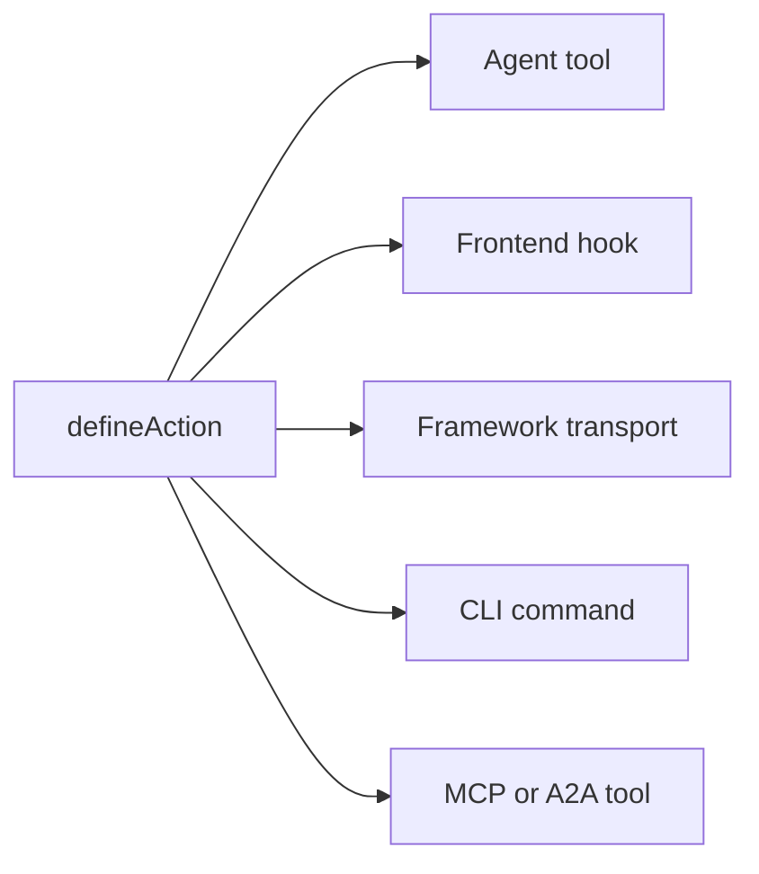

# 关键概念

Agent-Native 应用在幕后如何运作：原则与架构。此页是契约：一个应用要被视为 Agent-Native，必须遵循的固定规则。关于这种构建方式背后的愿景与理由，请参阅[什么是 Agent-Native？](/docs/what-is-agent-native)。

## 三个层次 {#three-layers}

Agent-Native 是一个具有三层架构的框架：

| 层级                                    | 内容                                                                                                                                                  |
| --------------------------------------- | ----------------------------------------------------------------------------------------------------------------------------------------------------- |
| **Core：框架**                          | 基础运行时契约：actions、PostgreSQL/PGlite 和 Drizzle 辅助函数、身份验证、应用状态、代理执行、访问检查、路由和实时同步。每个应用都可以直接使用 Core。 |
| **Toolkit：可选的可复用组件**           | 共享的应用构建 UI 和产品系统，例如基础组件、编辑器、共享、协作、设置和代理 UX。应用可以使用、组合或 fork 所需的组件。                                 |
| **Templates：基于 Core 构建的可选应用** | 完整的、特定领域的应用，具有路由、schema、actions、指令和视觉标识。第一方和自定义模板通常使用 Toolkit，也可以被 fork 并用作起点。                     |

Core 是基础。Toolkit 和 Templates 都是可选的：模板可以使用 Toolkit，但基于 Core 构建应用并不需要 Toolkit。

## 架构 {#the-architecture}

在运行时，每个代理本机应用都是三样东西协同工作：

- **代理：** 自主 AI。它读取数据、写入数据、运行 actions，并使用任何已配置的工具。当它的框架被有意授予工作区访问权限和写入工具时，它也可以修改应用自身的源代码。可通过 skills 和指令进行定制。
- **应用：** 围绕代理的产品表面。它可能从聊天开始，加入原生内联结果，成长为一个小型控制平面，或者成为带有仪表板、流程和可视化的完整 React UI。
- **计算机：** 数据库、浏览器，以及代理借以行动的已配置工具运行时。代理通过应用自身的 action 和数据表面工作；同一个表面也可以选择性地通过 MCP 暴露，但外部 MCP 服务器仍是一个附加项，不是基础。

下面的图表展示了代理和应用并排放置，二者都通过双向箭头连接到下方同一个共享的计算机层。二者都不拥有数据的所有权。相反，它们读写同一个 SQL 存储，因此任何一方所做的更改都会立即对另一方可见，中间无需构建同步层。

<Diagram id="doc-block-t1f7pj" title="代理、应用和计算机" summary="三层在一个共享的 SQL 存储上协同工作。代理和应用都读写相同的数据。">

```html
<div class="diagram-arch">
  <div class="diagram-row">
    <div class="diagram-card">
      <span class="diagram-pill accent">Agent</span
      ><small class="diagram-muted"
        >读取 + 写入数据，运行 actions，使用已配置的工具</small
      >
    </div>
    <div class="diagram-card">
      <span class="diagram-pill">Application</span
      ><small class="diagram-muted"
        >聊天、内联结果、控制平面或完整 React UI</small
      >
    </div>
  </div>
  <div class="diagram-arrow diagram-muted" aria-hidden="true">
    &darr;&nbsp;&uarr;
  </div>
  <div class="diagram-box" data-rough>
    Computer<br /><small class="diagram-muted"
      >SQL 数据库 · 浏览器 · 代码执行</small
    >
  </div>
</div>
```

```css
.diagram-arch {
  display: flex;
  flex-direction: column;
  align-items: center;
  gap: 10px;
}
.diagram-arch .diagram-row {
  display: flex;
  gap: 12px;
  flex-wrap: wrap;
  justify-content: center;
}
.diagram-arch .diagram-card {
  display: flex;
  flex-direction: column;
  gap: 6px;
  padding: 14px 16px;
  min-width: 220px;
}
.diagram-arch .diagram-arrow {
  font-size: 20px;
  line-height: 1;
}
.diagram-arch .diagram-box {
  text-align: center;
  padding: 12px 18px;
}
```

</Diagram>

这个相同的代理-应用-计算机循环，在本地和生产环境中运行的是同一套。自动化优先的应用直接从文件夹用 `pnpm agent` 运行它；UI 应用挂载嵌入式代理面板并加上 `pnpm dev`。在云端，Builder.io 将同一个循环托管为一个受管理的框架：在你的应用旁边运行代理的环境。它为你处理协作、可视化编辑和基础设施。

## 代理构建块 {#agent-building-blocks}

每个代理本机应用都拥有相同的代理构建块，无论其产品
表面是聊天优先、自动化优先，还是完整的 UI。每一个构建块
都存放在自己的文件中：

<FileTree
  id="doc-block-1ae57y4"
  title="指导与行为"
  entries={[
    {
      path: "AGENTS.md",
      note: "始终生效的指令：目的、核心规则、状态键、action 索引、skills 索引",
    },
    {
      path: ".agents/skills/<name>/SKILL.md",
      note: "可复用行为：工作流步骤、策略、示例、参考资料，以及应做/不应做清单",
    },
    {
      path: "actions/<name>.ts",
      note: "可执行能力：向代理、UI、CLI、HTTP、MCP、A2A、jobs 和 webhooks 暴露的类型化操作",
    },
  ]}
/>

一个 turn（回合）是与代理的一次交流：它读取自己的上下文、决定要做什么，然后作出响应。"每个回合都加载"意味着该文件每次都会重新进入上下文，而不仅仅是在会话开始时加载一次。

| 构建块      | 文件                             | 用途                                                                   | 加载时机                                 |
| ----------- | -------------------------------- | ---------------------------------------------------------------------- | ---------------------------------------- |
| **指令**    | `AGENTS.md`                      | 代理应带入每项任务的稳定指导：应用是什么、不变量、语气、索引           | 每个回合                                 |
| **Skills**  | `.agents/skills/<name>/SKILL.md` | 可复用行为：如何遵循一个工作流、应用一项策略、检查证据，或验证一个输出 | 当 skill 描述与任务匹配时按需加载        |
| **Actions** | `actions/<name>.ts`              | 真实操作：读取或写入数据、调用 API、发送消息、运行审批、生成类型化结果 | 每个回合都作为工具列出；仅在被调用时执行 |

Skills 和 actions 一起工作。一个 skill 教会代理如何完成一类
工作；一个 action 则是代理在完成这类工作时可以调用的代码路径。例如，
一个 `customer-research` skill 可能会告诉代理该检查哪些来源、
如何总结证据，而 `search-crm` 和 `create-brief` 这两个 actions
负责获取和写入实际数据。

五条规则支配着这一架构：

1. **数据存在于 PostgreSQL 中：** 所有应用状态都通过 Drizzle ORM 存在于数据库中。
2. **所有 AI 都通过代理进行：** 没有内联 LLM 调用；每一次 AI 交互都通过代理聊天桥进行。
3. **Actions 用于代理操作：** 复杂的工作以类型化的 action 运行，而不是内联代码。
4. **实时同步让 UI 保持同步：** 数据库更改通过 SSE 流式传输，轮询作为通用回退方案。
5. **应用状态存储在 PostgreSQL 中：** 临时 UI 状态存在于数据库中，代理和 UI 都可读取。

## 四个区域清单 {#four-area-checklist}

每个面向用户的功能都应该更新所有适用的区域。跳过一个适用的区域会破坏代理本机契约；给一个没有人类需要浏览的自动化强加一个屏幕，同样是一种代码异味。

- **1. UI：** 用户与之交互的页面、组件或对话框。
- **2. Action：** `actions/` 中用于同一操作的、可供代理调用的 action。
- **3. Skills：** 更新 `AGENTS.md`，和/或创建一个记录该模式的 skill。
- **4. App-State：** 导航状态、view-screen 数据和 navigate 命令。

只有 UI 的功能对代理来说是不可见的。一个完整 UI 功能如果只有 actions，对用户来说是不可见的。没有 app-state 的功能意味着代理对用户正在做的事情视而不见。一个自动化优先的操作完全可以合理地从 action + 指令开始，等到人类需要浏览、批准、配置或分享它时，再添加聊天、UI 或 app-state。

## Agent-Native 包含哪些内容 {#what-you-get-for-free}

采用这个框架之所以有价值，主要在于你不再需要自己构建的那些东西。只要你的应用遵循上述五条规则，你就会继承：

| 功能                      | 你获得了什么                                                                                                                                                                                                                                                                                                                               |
| ------------------------- | ------------------------------------------------------------------------------------------------------------------------------------------------------------------------------------------------------------------------------------------------------------------------------------------------------------------------------------------ |
| 一个 action = 每个表面    | 使用 `defineAction()` 定义的每个 action 同时是一个代理工具、一个类型安全的前端 hook（`useActionQuery` / `useActionMutation`）、一个框架自有的 HTTP 传输、一个 CLI 命令、一个供外部客户端使用的 MCP 工具，以及一个供其他 Agent-Native 应用使用的 A2A 工具。可选的 `link` 和 `mcpApp` 元数据无需第二次实现，即可添加深层链接和 MCP Apps UI。 |
| 每个用户的完整代理资源    | Skills、共享的 `LEARNINGS.md`、个人的 `memory/MEMORY.md`、`AGENTS.md`、自定义子代理、计划任务，以及已连接的 MCP 服务器。全部由 SQL 支撑，无需开发机。参见 [Agent Resources](/docs/agent-resources)。                                                                                                                                       |
| 开箱即用的 React 组件     | `<AgentPanel />` 和 `<AgentSidebar />` 可以在你应用的任意位置渲染聊天 + 资源。参见 [Drop-in Agent](/docs/drop-in-agent)。                                                                                                                                                                                                                  |
| BYO 代理聊天运行时        | 同一个聊天 UI 可以架在 OpenAI Agents、OpenAI Responses、Claude Agent SDK、Vercel AI SDK、AG-UI，或者你自己的规范化 HTTP 流之上。参见 [原生聊天 UI](/docs/native-chat-ui#byo-agent-runtimes)。                                                                                                                                              |
| 代理和 UI 之间的实时同步  | 同进程写入会立即通过 `/_agent-native/events` 流式传输；轻量级轮询让无服务器、cron 和跨进程写入保持收敛。变更类 actions 会自动使 action 支持的查询失效，因此代理创建的记录无需手动刷新即可出现。参见下方的 [Live Sync](#polling-sync)。                                                                                                     |
| Auth、orgs、RBAC          | 每个模板都内置了带有 orgs/members/roles 的 Better Auth。参见 [Authentication](/docs/authentication)。如果不止一个用户，请从 [Organizations, Teams & Permissions](/docs/organizations-teams-permissions) 开始。                                                                                                                             |
| 上下文感知                | 代理始终通过 `navigation` app-state 键知道用户正在查看什么。参见 [情境意识](/docs/context-awareness)。                                                                                                                                                                                                                                     |
| MCP 客户端 + 服务器，双向 | 该应用摄取 MCP 服务器（本地、远程、hub 共享的），*同时*也将自己的 actions 暴露为一个 MCP 服务器。参见 [MCP Clients](/docs/mcp-clients) 和 [MCP Protocol](/docs/mcp-protocol)。                                                                                                                                                             |
| 跨应用委托                | 不同应用中的代理通过 [A2A](/docs/a2a-protocol) 通信。同源部署跳过 JWT；跨域部署使用共享的 `A2A_SECRET`。                                                                                                                                                                                                                                   |
| 子代理团队                | 生成一个拥有自己线程和工具的子代理，以聊天内联芯片的形式呈现。参见 [Agent Teams](/docs/agent-teams)。                                                                                                                                                                                                                                      |
| 可移植性                  | 使用本地 PGlite 和托管 Postgres 的 PostgreSQL，以及任何 Nitro 兼容主机（Node、Workers、Netlify、Vercel、Deno、Lambda、Bun）。                                                                                                                                                                                                              |

## PostgreSQL 中的数据 {#data-in-sql}

所有应用状态都通过 Drizzle ORM 存储在 PostgreSQL 中。Schema 使用 PostgreSQL 和 PGlite 助手；`DATABASE_URL` 配置和运行规则见 [Database](/docs/server-database)。

Core 的 SQL 存储会自动创建，并在每个模板中可用：

- `application_state`：临时 UI 状态（导航、草稿、选择）
- `settings`：持久化的键值配置
- `oauth_tokens`：OAuth 凭据
- `sessions`：身份验证会话

下面每一行都可以展开查看其字段：

<DataModel
  id="doc-block-4w0fu8"
  title="Core 的 SQL 存储"
  summary={"在每个模板中自动创建。代理和 UI 都会读写这些数据。"}
  entities={[
    {
      id: "application_state",
      name: "application_state",
      note: "代理读取以获取上下文的临时 UI 状态",
      fields: [
        {
          name: "key",
          type: "text",
          pk: true,
          note: "例如 'navigation'",
        },
        {
          name: "value",
          type: "json",
          note: "视图、选择、草稿",
        },
      ],
    },
    {
      id: "settings",
      name: "settings",
      note: "持久化的键值配置",
      fields: [
        {
          name: "key",
          type: "text",
          pk: true,
        },
        {
          name: "value",
          type: "json",
        },
      ],
    },
    {
      id: "oauth_tokens",
      name: "oauth_tokens",
      note: "OAuth 凭据",
      fields: [
        {
          name: "provider",
          type: "text",
          pk: true,
        },
        {
          name: "token",
          type: "text",
        },
      ],
    },
    {
      id: "sessions",
      name: "sessions",
      note: "身份验证会话",
      fields: [
        {
          name: "id",
          type: "text",
          pk: true,
        },
        {
          name: "userId",
          type: "text",
        },
      ],
    },
  ]}
/>

要添加你自己的领域数据，请使用与上面核心存储相同的 schema 辅助函数定义一张表：

```ts
// Drizzle schema for domain data
import { table, text, integer } from "@agent-native/core/db/schema";

export const forms = table("forms", {
  id: text("id").primaryKey(),
  title: text("title").notNull(),
  schema: text("schema").notNull(), // JSON
  ownerEmail: text("owner_email"),
  createdAt: integer("created_at").notNull(),
});
```

你和代理都可以直接从终端检查这些数据，无需单独的 SQL 客户端：

```bash
# 用于快速检查数据库的 Core actions
pnpm action db-schema                                       # show all tables
pnpm action db-query --sql "SELECT * FROM forms"
```

`db-schema` 会打印每张表的列和类型。`db-query` 直接运行只读 SQL，便于在不打开数据库客户端的情况下检查某个 action 的写入结果。

<Callout tone="decision">

生产代理聊天插件默认将原始 SQL 工具设为只读（`frameworkTools: { database: "read" }`），因此代理使用 `db-schema` / `db-query` 检查应用拥有的数据，并通过类型化应用 actions 执行写入。只有在刻意的维护界面也需要公开带范围限制的 `db-exec` / `db-patch` 时，才设置 `database: "write"`（或 `true`）；设置 `database: "off"` / `false` 可要求所有数据访问都通过类型化应用 actions。

`frameworkTools` 以同样的方式管理框架自带的其余工具：分享、审阅评论、版本历史、feature flags、本地化、审计、Context X-Ray、个人资料、自动化、docs、resources、web、跨应用委派、聊天和邮件。完整列表、`"minimal"` 预设，以及为什么关闭分组仍保留其 HTTP 路由，请参见 [Production Agent Tools](/docs/actions-agent-tools#production-agent-tools)。

</Callout>

## 代理聊天桥 {#agent-chat-bridge}

UI 从不直接调用 LLM。当用户点击"生成图表"或"撰写摘要"时，UI 会通过 `postMessage` 向代理发送一条消息。真正的工作由代理完成。它拥有完整的对话历史、skills、指令，以及迭代的能力。

```ts
// Delegate AI work to the agent from a React component
import { sendToAgentChat } from "@agent-native/core/client/agent-chat";
sendToAgentChat({
  message: "Generate a chart showing signups by source",
  context: "Dashboard ID: main, date range: last 30 days",
  submit: true,
});
```

简而言之：

- **AI 是非确定性的**：你需要对话流程来提供反馈和迭代，而不是一次性的按钮。
- **上下文很重要**：代理拥有应用的指令、skills 和历史记录。内联调用则完全没有这些。
- **代理能做更多事**：它可以运行 actions、浏览网页，并把多个步骤串联在一起。

**[外部执行](/docs/a2a-protocol)**

因为一切都通过代理和 actions 进行，任何应用都可以由 Slack、Telegram、计划任务、脚本，或者通过 A2A 由另一个代理来驱动。

## Actions 系统 {#actions-system}

当代理需要做一些复杂的事情时，比如调用 API、处理数据或查询数据库，它会运行一个 **action**。Actions 是 `actions/` 目录下的 TypeScript 文件，默认导出一个 `defineAction()`：

```ts filename="actions/fetch-data.ts"
import { defineAction } from "@agent-native/core/action";
import { z } from "zod";

// One action powers every app surface: UI, agent, HTTP, MCP, A2A, and CLI.
export default defineAction({
  description: "Fetch data from a source API.",
  schema: z.object({
    source: z.string().describe("Data source key, e.g. 'signups'"),
  }),
  run: async ({ source }) => {
    const res = await fetch(`https://api.example.com/${source}`);
    return await res.json();
  },
});
```

这个 action 从一个来源 API 获取 JSON 并返回它。`defineAction()` 用一个 zod schema 包裹这个函数的输入（`source`），因此框架可以校验该输入、生成一个供代理调用的 JSON Schema，并从这一个定义中为前端 hook 推断类型。

一次 `defineAction()` 调用会自动触达五个不同的消费者。图表展示了从单个 action 扇出的过程；下面的列表解释了每个消费者各自获得了什么：



- **代理工具：** 代理通过 zod 派生的 JSON Schema 看到它，并可以调用它。
- **前端 hook：** `useActionMutation("fetch-data")`，具有完整的 TypeScript 推断。
- **框架传输：** 自动挂载在客户端 hooks 之后。
- **CLI：** `pnpm action fetch-data --source=signups`，用于脚本编写和代理开发循环。
- **MCP 工具 / A2A 工具：** 当 MCP 服务器或 A2A 启用时，同一个 action 也会出现在那里。

每一个消费者调用的都是同一个底层函数，因此只需要编写和维护一份实现。完整参考请见 [Actions](/docs/actions-overview)。

## 实时同步 {#polling-sync}

当代理更改数据时，UI 需要在无需手动刷新的情况下反映这一变化。`useDbSync()` 让这一切自动发生。同进程写入通过 `/_agent-native/events` 流式传输；`/_agent-native/poll` 仍然是跨进程和无服务器场景的回退方案。当代理写入数据库（应用状态、设置或领域数据）时，一个版本计数器会递增，客户端会使相关的 React Query 缓存失效。

SSE 覆盖了常见场景而不是使用 WebSockets，因为它能以普通 HTTP 的方式让同进程写入立即到达浏览器；而版本计数器轮询则作为回退方案，在包括无服务器和边缘在内的所有部署环境中都能正常工作，这些环境可能无法使用持久化的 socket 连接。

```ts
// Client: subscribe to agent/UI data changes once near the app shell
import { useDbSync } from "@agent-native/core/client/hooks";
useDbSync({ queryClient });
```

在应用的根部附近调用一次即可。它会让整个应用订阅变更事件，因此任何使用 `useActionQuery` 或带来源版本的 `useQuery` 的组件，在其读取的数据发生变化时都会自动重新获取。

流程如下：

1. 代理运行一个写入数据库的 action
2. 服务器发出一个带有来源（例如 `"action"` 或 `"settings"`）的变更事件
3. `useDbSync` 通过 SSE 或轮询回退接收该事件
4. `useActionQuery` hooks 和带来源版本的 `useQuery` hooks 重新获取数据
5. 组件渲染新数据，无需重新加载页面

下面的图表端到端地追踪了这一相同的顺序：

<Diagram id="doc-block-87e1c3" title="实时同步流程" summary={"一次代理写入变成一次 UI 渲染，无需手动刷新。SSE 优先，轮询作为通用回退方案。"}>

```html
<div class="diagram-sync">
  <div class="diagram-node">
    Agent 操作<br /><small class="diagram-muted">写入数据库</small>
  </div>
  <div class="diagram-arrow diagram-muted" aria-hidden="true">&rarr;</div>
  <div class="diagram-node">
    变更事件<br /><small class="diagram-muted">source: action / settings</small>
  </div>
  <div class="diagram-arrow diagram-muted" aria-hidden="true">&rarr;</div>
  <div class="diagram-panel center">
    <span class="diagram-pill accent">useDbSync</span
    ><small class="diagram-muted">SSE &middot; 轮询回退</small>
  </div>
  <div class="diagram-arrow diagram-muted" aria-hidden="true">&rarr;</div>
  <div class="diagram-node">
    查询重新获取<br /><small class="diagram-muted">渲染，无需重新加载</small>
  </div>
</div>
```

```css
.diagram-sync {
  display: flex;
  align-items: center;
  gap: 10px;
  flex-wrap: wrap;
}
.diagram-sync .diagram-arrow {
  font-size: 22px;
  line-height: 1;
}
.diagram-sync .center {
  display: flex;
  flex-direction: column;
  align-items: center;
  gap: 4px;
  padding: 10px 14px;
}
```

</Diagram>

这在所有部署环境中都有效，包括无服务器和边缘环境，因为它依赖的是数据库，而不是内存状态或文件系统监视器。

## 上下文感知 {#context-awareness}

代理始终知道用户正在查看什么。UI 会在每次路由变化时向 application-state 写入一个 `navigation` 键。代理在采取行动之前，会通过 `view-screen` 这个 action 读取它。

例如，当你打开一个邮件线程时，UI 会 upsert（更新插入）一行像这样的数据：

```json
{ "key": "navigation", "value": { "view": "thread", "threadId": "th_abc123" } }
```

<Callout tone="info">

UI 会在路由变化时写入这条数据；代理在采取任何行动之前会（通过 `view-screen`）读取它，因此它始终知道你正专注于哪个线程、图表或幻灯片。

</Callout>

完整模式请见 [情境意识](/docs/context-awareness)：导航状态、view-screen、navigate 命令，以及防抖动机制。

## 一个 action，多个表面 {#protocols}

把一个领域操作实现为一个 action，只需一次；框架会将它暴露给每一个消费者。同一个 `defineAction()` 会变成一个代理工具、一个类型安全的 UI hook、一个 HTTP 端点、一个 CLI 命令、一个 MCP 工具和一个 A2A 工具，只有当某个表面需要更丰富的交互时，才会额外添加可选的 `link`、`mcpApp`、原生小部件元数据，或 Generative UI 包装器。Skills 和指令负责覆盖行为部分。

完整的协议/表面矩阵（MCP 服务器与 OAuth、MCP Apps、A2A、深层链接、原生聊天小部件、Generative UI、AgentChatRuntime 连接器、Agent Web，以及面向 ACP 和 A2UI 的适配器展望），以及如何选择产品形态（聊天、内联 UI、完整应用页面、嵌入式 sidecar、自动化，或外部代理访问），请见 [Agent 界面](/docs/agent-surfaces)。

## 应用代码与定制 {#agent-modifies-code}

框架不会赋予嵌入式代理对应用源代码的环境访问权限。在一个已部署的应用中，代理通常通过 actions、SQL 支撑的状态和已配置的集成来工作。当它的框架被有意授予工作区和写入工具时，它可以编辑组件、路由、样式和 actions。无论哪种情况，Templates 都是完整的应用，你可以在自己的代码仓库和开发流程中 fork 并定制它们。如果需要在不修改源代码的情况下进行运行时定制，请使用 [Extensions](/docs/extensions)。

## 默认使用 PostgreSQL {#hosting-agnostic}

两条架构规则让应用在 PGlite、托管 Postgres 和各种主机上保持一致：

- **PostgreSQL。** 使用 `@agent-native/core/db/schema` 编写 schema，并使用 Drizzle 进行读写。原始 PostgreSQL SQL 仅用于增量迁移或一次性维护，并保持与 PGlite 兼容。参见 [Database](/docs/server-database)。
- **主机无关。** 服务器运行在 Nitro 之上，可以编译到任意部署目标。切勿在服务器路由或插件中使用 Node 特有的 API（`fs`、`child_process`、`path`），也不要假设存在一个持久化的服务器进程。无服务器和边缘环境都是无状态的，因此要把所有状态保存在 SQL 中。参见 [Deployment](/docs/deployment)。

## 代理资源 {#workspace}

每个用户都会获得一套个人的**代理资源**：指令、skills、记忆、自定义子代理、计划任务，以及已连接的 MCP 服务器，全部存储在 SQL 中，而不是文件中。这使得 Claude-Code 级别的定制，在多租户 SaaS 中也变得可行，而无需为每个用户启动一个容器。参见 [Agent Resources](/docs/agent-resources)。

## 相关构建块 {#building-blocks}

以下内容建立在同一份契约之上，各自都有更深入的介绍：

- **[Dispatch](/docs/dispatch)：** 工作区控制平面，具有共享收件箱、secrets vault、计划任务，以及一个通过 A2A 将工作委托给专项应用的编排器。
- **[Extensions](/docs/extensions)：** 代理在运行时创建的沙盒化 Alpine.js 迷你应用，无需修改源代码或迁移。
- **[A2A协议](/docs/a2a-protocol)：** 同一工作区内的应用如何通过 JSON-RPC 相互发现并调用。

## 下一步 {#deep-dives}

<Cards>

### [什么是 Agent-Native？](/docs/what-is-agent-native)

这些规则背后的愿景和理念。

### [情境意识](/docs/context-awareness)

深入介绍导航状态、view-screen 和 navigate 命令。

### [同步内部机制](/docs/client-sync-internals)

实时同步背后的变更版本机制，用于同步自定义的 `useQuery`。

### [Skills指南](/docs/skills-guide)

框架 skills、领域 skills，以及创建自定义 skills。

### [原生聊天 UI](/docs/native-chat-ui)

由 action 声明的表格、图表，以及 BYO 运行时定位。

### [Agent 界面](/docs/agent-surfaces)

聊天、原生内联 UI、完整应用页面、嵌入式 sidecar、自动化，以及外部代理路径。

### [A2A协议](/docs/a2a-protocol)

代理间通信。

</Cards>
