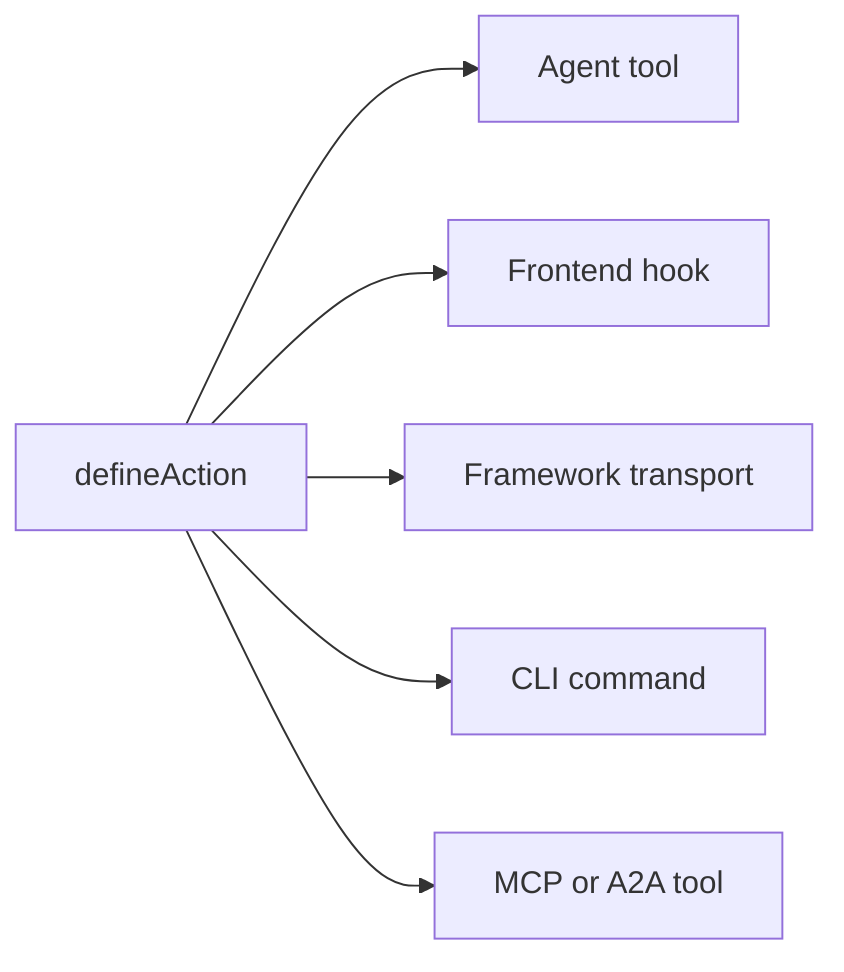

# 關鍵概念

Agent-Native 應用程式如何在幕後運作：原則與架構。此頁面就是合約：應用程式若要被視為 Agent-Native，就必須遵守這些固定規則。若想了解以此方式建置的願景與理由，請參閱 [什麼是 Agent-Native？](/docs/what-is-agent-native)。

## 三個層次 {#three-layers}

Agent-Native 是一個具有三個層次的框架：

| 層次                                        | 是什麼                                                                                                                                                   |
| ------------------------------------------- | -------------------------------------------------------------------------------------------------------------------------------------------------------- |
| **Core：框架**                              | 基礎的執行階段合約：動作、PostgreSQL/PGlite 與 Drizzle 輔助工具、驗證、應用程式狀態、代理執行、存取檢查、路由與即時同步。每個應用程式都能直接使用 Core。 |
| **Toolkit：可選的可重複使用元件**           | 共用的應用程式建置 UI 與產品系統，例如基礎元件、編輯器、共用、協作、設定和代理 UX。應用程式可以採用、組合或 fork 所需的元件。                            |
| **Templates：以 Core 為基礎的可選應用程式** | 具有路由、結構描述、動作、指令和視覺識別的完整領域專屬應用程式。官方與自訂範本通常會使用 Toolkit，也可以被 fork 並作為起點使用。                         |

Core 是基礎。Toolkit 與 Templates 都是可選的：範本可以使用 Toolkit，但要在 Core 上建置應用程式並不需要 Toolkit。

## 架構 {#the-architecture}

在執行階段，每個 Agent-Native 應用程式都是三個協同運作的部分：

- **代理：** 自主運作的 AI。它讀取資料、寫入資料、執行動作，並使用任何已設定的工具。當其 frame 被刻意授予工作區存取權和寫入工具時，它也能修改應用程式自身的原始碼。可透過 skills 和指令進行客製化。
- **應用程式：** 圍繞代理的產品表面。它可能一開始只是聊天，之後加入原生行內結果、成長為小型控制平面，或成為具有儀表板、流程和視覺化的完整 React UI。
- **電腦：** 代理據以行動的資料庫、瀏覽器和已設定的工具執行環境。代理透過應用程式自身的動作與資料介面來工作；同一個介面可以選擇性地透過 MCP 公開，但外部 MCP 伺服器仍只是附加元件，不是基礎。

下圖顯示代理和應用程式並排在一起，兩者都有雙向箭頭指向下方同一個共用的電腦層。沒有任何一方擁有資料。相反地，它們讀取並寫入同一個 SQL 儲存，因此任一方所做的變更都會立即讓另一方看到，中間不需要建置任何同步層。

<Diagram id="doc-block-t1f7pj" title="代理、應用程式和電腦" summary="三個層次在同一個共用的 SQL 儲存上協同運作。代理和應用程式都會讀取並寫入相同的資料。">

```html
<div class="diagram-arch">
  <div class="diagram-row">
    <div class="diagram-card">
      <span class="diagram-pill accent">代理</span
      ><small class="diagram-muted"
        >讀取並寫入資料、執行動作、使用已設定的工具</small
      >
    </div>
    <div class="diagram-card">
      <span class="diagram-pill">應用程式</span
      ><small class="diagram-muted"
        >聊天、行內結果、控制平面，或完整的 React UI</small
      >
    </div>
  </div>
  <div class="diagram-arrow diagram-muted" aria-hidden="true">
    &darr;&nbsp;&uarr;
  </div>
  <div class="diagram-box" data-rough>
    電腦<br /><small class="diagram-muted"
      >SQL 資料庫 · 瀏覽器 · 程式碼執行</small
    >
  </div>
</div>
```

```css
.diagram-arch {
  display: flex;
  flex-direction: column;
  align-items: center;
  gap: 10px;
}
.diagram-arch .diagram-row {
  display: flex;
  gap: 12px;
  flex-wrap: wrap;
  justify-content: center;
}
.diagram-arch .diagram-card {
  display: flex;
  flex-direction: column;
  gap: 6px;
  padding: 14px 16px;
  min-width: 220px;
}
.diagram-arch .diagram-arrow {
  font-size: 20px;
  line-height: 1;
}
.diagram-arch .diagram-box {
  text-align: center;
  padding: 12px 18px;
}
```

</Diagram>

這個相同的代理-應用程式-電腦迴圈，會同時在本機和正式環境中運作。以自動化為優先的應用程式，可以直接用 `pnpm agent` 在資料夾中執行它；UI 應用程式則會掛載嵌入式代理面板，並加上 `pnpm dev`。在雲端中，Builder.io 會將這個相同的迴圈，以受管理的 frame 形式代管：也就是在你的應用程式旁邊執行代理的環境。它會為你處理協作、視覺化編輯和基礎設施。

## 代理建置區塊 {#agent-building-blocks}

每個 Agent-Native 應用程式都有相同的代理建置區塊，無論
產品表面是以聊天為優先、以自動化為優先，還是完整的 UI。每一個都
存在於自己的檔案中：

<FileTree
  id="doc-block-1ae57y4"
  title="指導與行為"
  entries={[
    {
      path: "AGENTS.md",
      note: "常駐指令：用途、核心規則、狀態鍵、動作索引、skills 索引",
    },
    {
      path: ".agents/skills/<name>/SKILL.md",
      note: "可重複使用的行為：工作流程步驟、政策、範例、參考資料，以及該做和不該做的清單",
    },
    {
      path: "actions/<name>.ts",
      note: "可執行的能力：向代理、UI、CLI、HTTP、MCP、A2A、jobs 和 webhooks 公開的型別化操作",
    },
  ]}
/>

一個回合是與代理的一次交流：它讀取脈絡、決定要做什麼，然後回應。「每回合載入」表示該檔案每次都會重新進入脈絡，而不僅僅是在工作階段開始時載入一次。

| 建置區塊    | 檔案                             | 用途                                                                   | 載入時機                               |
| ----------- | -------------------------------- | ---------------------------------------------------------------------- | -------------------------------------- |
| **說明**    | `AGENTS.md`                      | 代理在每項任務中都應攜帶的穩定指導：應用程式是什麼、不變量、語氣、索引 | 每個回合                               |
| **Skills**  | `.agents/skills/<name>/SKILL.md` | 可重複使用的行為：如何遵循工作流程、套用政策、檢查證據或驗證輸出       | 當 skill 描述與任務相符時按需載入      |
| **Actions** | `actions/<name>.ts`              | 實際操作：讀取或寫入資料、呼叫 API、傳送訊息、執行核准、產生型別化結果 | 每個回合都列為工具；僅在被呼叫時才執行 |

Skills 和 actions 協同運作。一項 skill 教導代理如何做
一類工作；一個 action 是它在執行該工作時可以呼叫的程式碼路徑。舉例來說，
`customer-research` skill 可能會告訴代理該檢查哪些來源，
以及如何摘要證據，而 `search-crm` 和 `create-brief` 這些 actions
則負責擷取並寫入實際資料。

五項規則規範了這個架構：

1. **資料存在於 PostgreSQL 中：** 所有應用程式狀態都透過 Drizzle ORM 存放在資料庫中。
2. **所有 AI 都透過代理：** 沒有行內 LLM 呼叫；每一次 AI 互動都流經代理聊天橋接。
3. **動作用於代理操作：** 複雜的工作以型別化動作執行，而非行內程式碼。
4. **即時同步讓 UI 保持同步：** 資料庫變更會透過 SSE 串流，並以輪詢作為通用回退。
5. **應用程式狀態存於 PostgreSQL：** 短暫的 UI 狀態存放在資料庫中，代理和 UI 都可以讀取。

## 四個領域檢查清單 {#four-area-checklist}

每個面向使用者的功能都應該更新所有適用的領域。跳過某個適用的領域會破壞 Agent-Native 合約；把畫面硬塞進不需要人類瀏覽的自動化流程中，同樣是一種代碼異味。

- **1. UI：** 使用者互動的頁面、元件或對話框。
- **2. Action：** `actions/` 中對應同一操作、可供代理呼叫的 action。
- **3. Skills：** 更新 `AGENTS.md`，並/或建立記錄該模式的 skill。
- **4. App-State：** 導覽狀態、view-screen 資料，以及 navigate 指令。

只有 UI 的功能對代理來說是不可見的。只有 actions 的完整 UI 功能對使用者來說是不可見的。沒有 app-state 的功能代表代理對使用者正在做什麼一無所知。以自動化優先的操作可以合理地先從 action + 指令開始，等到之後人類需要瀏覽、核准、設定或分享它時，再加入聊天、UI 或 app-state。

## Agent-Native 包含哪些內容 {#what-you-get-for-free}

採用這個框架的價值，主要來自於你不再需要建置的東西。只要你的應用程式遵循上述五項規則，你就會繼承：

| 功能                          | 它帶給你什麼                                                                                                                                                                                                                                                                                                                                              |
| ----------------------------- | --------------------------------------------------------------------------------------------------------------------------------------------------------------------------------------------------------------------------------------------------------------------------------------------------------------------------------------------------------- |
| 一個 action = 每個表面        | 每個以 `defineAction()` 定義的 action，同時是一個代理工具、一個型別安全的前端 hook（`useActionQuery` / `useActionMutation`）、一個框架自有的 HTTP 傳輸、一個 CLI 指令、一個供外部用戶端使用的 MCP 工具，以及一個供其他 Agent-Native 應用程式使用的 A2A 工具。可選的 `link` 和 `mcpApp` 中繼資料，可在不需要第二次實作的情況下新增深層連結和 MCP Apps UI。 |
| 每位使用者的完整代理資源      | Skills、共用的 `LEARNINGS.md`、個人的 `memory/MEMORY.md`、`AGENTS.md`、自訂子代理、排程工作，以及已連接的 MCP 伺服器。全部由 SQL 支援，不需要開發用機器。請參閱 [Agent Resources](/docs/agent-resources)。                                                                                                                                                |
| 隨插即用的 React 元件         | `<AgentPanel />` 和 `<AgentSidebar />` 可以在應用程式中的任何位置渲染聊天 + 資源。請參閱 [Drop-in Agent](/docs/drop-in-agent)。                                                                                                                                                                                                                           |
| 自帶代理聊天執行環境（BYO）   | 相同的聊天 UI 可以架在 OpenAI Agents、OpenAI Responses、Claude Agent SDK、Vercel AI SDK、AG-UI，或你自己的標準化 HTTP 串流之上。請參閱 [原生聊天 UI](/docs/native-chat-ui#byo-agent-runtimes)。                                                                                                                                                           |
| 代理與 UI 之間的即時同步      | 同行程的寫入會立即透過 `/_agent-native/events` 串流；輕量級輪詢則讓無伺服器、cron 和跨行程的寫入保持一致。會變更資料的 actions 會自動讓以 action 為基礎的查詢失效，因此代理建立的紀錄無需手動重新整理即可出現。請參閱下方的 [Live Sync](#polling-sync)。                                                                                                  |
| 驗證、組織、RBAC              | 每個範本都已內建具有 orgs/members/roles 的 Better Auth。請參閱 [Authentication](/docs/authentication)。若使用者不只一位，請從 [Organizations, Teams & Permissions](/docs/organizations-teams-permissions) 開始。                                                                                                                                          |
| 情境感知                      | 代理透過 `navigation` 這個 app-state 鍵，隨時知道使用者正在看什麼。請參閱 [情境意識](/docs/context-awareness)。                                                                                                                                                                                                                                           |
| MCP 用戶端 + 伺服器，雙向皆可 | 應用程式可以擷取 MCP 伺服器（本機、遠端、hub 共用），*同時*也能將自己的 actions 公開為 MCP 伺服器。請參閱 [MCP Clients](/docs/mcp-clients) 和 [MCP Protocol](/docs/mcp-protocol)。                                                                                                                                                                        |
| 跨應用程式委派                | 不同應用程式中的代理透過 [A2A](/docs/a2a-protocol) 通訊。同源部署會跳過 JWT；跨源部署則使用共用的 `A2A_SECRET`。                                                                                                                                                                                                                                          |
| 子代理團隊                    | 產生一個擁有自己對話串和工具的子代理，並以聊天中行內的標籤形式呈現。請參閱 [Agent Teams](/docs/agent-teams)。                                                                                                                                                                                                                                             |
| 可移植性                      | 使用本機 PGlite 和託管 Postgres 的 PostgreSQL，以及任何 Nitro 相容主機（Node、Workers、Netlify、Vercel、Deno、Lambda、Bun）。                                                                                                                                                                                                                             |

## PostgreSQL 中的資料 {#data-in-sql}

所有應用程式狀態都透過 Drizzle ORM 儲存在 PostgreSQL 中。結構描述使用 PostgreSQL 和 PGlite 幫手；`DATABASE_URL` 設定與運作規則記載於 [Database](/docs/server-database)。

Core 的 SQL 儲存區會自動建立，並在每個範本中都可使用：

- `application_state`：短暫的 UI 狀態（導覽、草稿、選取項目）
- `settings`：持久性的鍵值設定
- `oauth_tokens`：OAuth 憑證
- `sessions`：驗證工作階段

以下每一列都可展開以顯示其欄位：

<DataModel
  id="doc-block-4w0fu8"
  title="Core 的 SQL 儲存區"
  summary={"在每個範本中自動建立。代理和 UI 都會讀取並寫入這些資料。"}
  entities={[
    {
      id: "application_state",
      name: "application_state",
      note: "代理讀取以取得脈絡的短暫 UI 狀態",
      fields: [
        {
          name: "key",
          type: "text",
          pk: true,
          note: "例如 'navigation'",
        },
        {
          name: "value",
          type: "json",
          note: "檢視、選取項目、草稿",
        },
      ],
    },
    {
      id: "settings",
      name: "settings",
      note: "持久性的鍵值設定",
      fields: [
        {
          name: "key",
          type: "text",
          pk: true,
        },
        {
          name: "value",
          type: "json",
        },
      ],
    },
    {
      id: "oauth_tokens",
      name: "oauth_tokens",
      note: "OAuth 憑證",
      fields: [
        {
          name: "provider",
          type: "text",
          pk: true,
        },
        {
          name: "token",
          type: "text",
        },
      ],
    },
    {
      id: "sessions",
      name: "sessions",
      note: "驗證工作階段",
      fields: [
        {
          name: "id",
          type: "text",
          pk: true,
        },
        {
          name: "userId",
          type: "text",
        },
      ],
    },
  ]}
/>

若要新增你自己的領域資料，請使用與上述核心儲存區相同的結構描述輔助工具來定義資料表：

```ts
// Drizzle schema for domain data
import { table, text, integer } from "@agent-native/core/db/schema";

export const forms = table("forms", {
  id: text("id").primaryKey(),
  title: text("title").notNull(),
  schema: text("schema").notNull(), // JSON
  ownerEmail: text("owner_email"),
  createdAt: integer("created_at").notNull(),
});
```

你和代理都可以直接從終端機檢查該資料，不需要額外的 SQL 用戶端：

```bash
# 用於快速檢查資料庫的 Core actions
pnpm action db-schema                                       # show all tables
pnpm action db-query --sql "SELECT * FROM forms"
```

`db-schema` 會印出每個資料表的欄位與型別。`db-query` 會直接執行唯讀 SQL，這對於在不開啟資料庫用戶端的情況下檢查某個 action 的寫入結果很有用。

<Callout tone="decision">

正式環境代理聊天外掛預設將原始 SQL 工具設為唯讀（`frameworkTools: { database: "read" }`），因此代理使用 `db-schema` / `db-query` 檢查應用程式擁有的資料，並透過型別化應用程式 actions 執行寫入。只有在刻意的維護介面也需要公開具範圍限制的 `db-exec` / `db-patch` 時，才設定 `database: "write"`（或 `true`）；設定 `database: "off"` / `false` 可要求所有資料存取都透過型別化應用程式 actions。

`frameworkTools` 以同樣的方式管理框架自帶的其餘工具：分享、審閱留言、版本歷史、feature flags、本地化、稽核、Context X-Ray、個人資料、自動化、docs、resources、web、跨應用委派、聊天與郵件。完整清單、`"minimal"` 預設，以及為什麼關閉分組仍保留其 HTTP 路由，請參見 [Production Agent Tools](/docs/actions-agent-tools#production-agent-tools)。

</Callout>

## 代理聊天橋接 {#agent-chat-bridge}

UI 從不直接呼叫 LLM。當使用者點擊「Generate chart」或「Write summary」時，UI 會透過 `postMessage` 向代理傳送一則訊息。代理負責完成工作，它擁有完整的對話歷史、skills、指令，以及反覆迭代的能力。

```ts
// Delegate AI work to the agent from a React component
import { sendToAgentChat } from "@agent-native/core/client/agent-chat";
sendToAgentChat({
  message: "Generate a chart showing signups by source",
  context: "Dashboard ID: main, date range: last 30 days",
  submit: true,
});
```

簡而言之：

- **AI 是非確定性的**：你需要對話流程來提供意見回饋並反覆迭代，而不是一次性的按鈕。
- **脈絡很重要**：代理擁有應用程式的指令、skills 和歷史紀錄。行內呼叫則完全沒有這些。
- **代理能做更多事**：它可以執行 actions、瀏覽網頁，並將多個步驟串連在一起。

**[外部執行](/docs/a2a-protocol)**

因為一切都會經過代理和 actions，任何應用程式都可以由 Slack、Telegram、排程工作、腳本，或透過 A2A 的另一個代理來驅動。

## Actions 系統 {#actions-system}

當代理需要做一些複雜的事，例如呼叫 API、處理資料或查詢資料庫時，它會執行一個**動作**。Actions 是 `actions/` 中匯出預設 `defineAction()` 的 TypeScript 檔案：

```ts filename="actions/fetch-data.ts"
import { defineAction } from "@agent-native/core/action";
import { z } from "zod";

// One action powers every app surface: UI, agent, HTTP, MCP, A2A, and CLI.
export default defineAction({
  description: "Fetch data from a source API.",
  schema: z.object({
    source: z.string().describe("Data source key, e.g. 'signups'"),
  }),
  run: async ({ source }) => {
    const res = await fetch(`https://api.example.com/${source}`);
    return await res.json();
  },
});
```

這個 action 會從來源 API 擷取 JSON 並回傳它。`defineAction()` 會用一個 zod schema 包裝這個函式來驗證其輸入（`source`），因此框架可以驗證該輸入、產生代理可以呼叫的 JSON Schema，並為前端 hook 推斷型別，這一切都來自這單一個定義。

一次 `defineAction()` 呼叫會自動觸及五種不同的消費者。下圖顯示了單一 action 的扇出；下方的清單則說明每個消費者各自獲得什麼：



- **代理工具：** 代理會透過 zod 衍生的 JSON Schema 看到它，並可以呼叫它。
- **前端 hook：** `useActionMutation("fetch-data")`，具有完整的 TypeScript 推斷。
- **框架傳輸：** 自動掛載於用戶端 hooks 之後。
- **CLI：** `pnpm action fetch-data --source=signups`，用於腳本撰寫和代理開發迴圈。
- **MCP 工具 / A2A 工具：** 當啟用 MCP 伺服器或 A2A 時，同一個 action 也會出現在那裡。

每個消費者都呼叫相同的底層函式，因此只需要撰寫和維護一份實作。完整參考資料請見 [Actions](/docs/actions-overview)。

## 即時同步 {#polling-sync}

當代理變更資料時，UI 需要在不手動重新整理的情況下反映出來。`useDbSync()` 就是讓這件事自動發生的機制。同行程的寫入會透過 `/_agent-native/events` 串流；`/_agent-native/poll` 仍然是跨行程和無伺服器情境下的回退方案。當代理寫入資料庫（應用程式狀態、設定或領域資料）時，版本計數器會遞增，用戶端也會讓相關的 React Query 快取失效。

SSE 之所以能涵蓋一般情境而不必使用 WebSockets，是因為它能讓同行程的寫入透過單純的 HTTP 立即傳遞到瀏覽器；而版本計數器輪詢則作為回退方案，在包括無伺服器和邊緣環境在內、可能無法使用持久連線 socket 的每一種部署環境中都能運作。

```ts
// Client: subscribe to agent/UI data changes once near the app shell
import { useDbSync } from "@agent-native/core/client/hooks";
useDbSync({ queryClient });
```

在應用程式的根部附近呼叫一次即可。它會讓整個應用程式訂閱變更事件，因此任何使用 `useActionQuery` 或具有來源版本的 `useQuery` 的元件，都會在其讀取的資料變更時自動重新取得。

流程如下：

1. 代理執行一個會寫入資料庫的 action
2. 伺服器會發出一個變更事件，附帶像 `"action"` 或 `"settings"` 這樣的來源
3. `useDbSync` 透過 SSE 或輪詢回退接收該事件
4. `useActionQuery` hooks 和具有來源版本的 `useQuery` hooks 重新取得資料
5. 元件在不重新載入頁面的情況下渲染新資料

下圖從頭到尾追蹤了相同的順序：

<Diagram id="doc-block-87e1c3" title="即時同步流程" summary={"代理的寫入會變成 UI 渲染，無需手動重新整理。SSE 優先，輪詢作為通用回退。"}>

```html
<div class="diagram-sync">
  <div class="diagram-node">
    代理動作<br /><small class="diagram-muted">寫入資料庫</small>
  </div>
  <div class="diagram-arrow diagram-muted" aria-hidden="true">&rarr;</div>
  <div class="diagram-node">
    變更事件<br /><small class="diagram-muted">來源：action / settings</small>
  </div>
  <div class="diagram-arrow diagram-muted" aria-hidden="true">&rarr;</div>
  <div class="diagram-panel center">
    <span class="diagram-pill accent">useDbSync</span
    ><small class="diagram-muted">SSE &middot; 輪詢回退</small>
  </div>
  <div class="diagram-arrow diagram-muted" aria-hidden="true">&rarr;</div>
  <div class="diagram-node">
    查詢重新取得<br /><small class="diagram-muted">渲染，無需重新載入</small>
  </div>
</div>
```

```css
.diagram-sync {
  display: flex;
  align-items: center;
  gap: 10px;
  flex-wrap: wrap;
}
.diagram-sync .diagram-arrow {
  font-size: 22px;
  line-height: 1;
}
.diagram-sync .center {
  display: flex;
  flex-direction: column;
  align-items: center;
  gap: 4px;
  padding: 10px 14px;
}
```

</Diagram>

這在所有部署環境中都能運作，包括無伺服器和邊緣環境，因為它使用資料庫，而不是記憶體內狀態或檔案系統監看器。

## 情境感知 {#context-awareness}

代理隨時都知道使用者正在看什麼。UI 會在每次路由變更時，將一個 `navigation` 鍵寫入 application-state。代理會在採取行動之前，透過 `view-screen` action 讀取它。

舉例來說，當你開啟一個電子郵件對話串時，UI 會 upsert 一列像這樣的資料：

```json
{ "key": "navigation", "value": { "view": "thread", "threadId": "th_abc123" } }
```

<Callout tone="info">

UI 會在路由變更時寫入這筆資料；代理會在採取任何行動之前（透過 `view-screen`）讀取它，因此它隨時都知道你正專注於哪個對話串、圖表或投影片。

</Callout>

完整模式請參閱 [情境意識](/docs/context-awareness)：導覽狀態、view-screen、navigate 指令，以及抖動防止機制。

## 一個 action，多個表面 {#protocols}

將一個領域操作實作為一個 action，只需要一次；框架會將它公開給每一個消費者。同一個 `defineAction()` 會成為代理工具、型別安全的 UI hook、HTTP 端點、CLI 指令、MCP 工具和 A2A 工具，只有在某個表面需要更豐富的互動時，才會加上可選的 `link`、`mcpApp`、原生小工具中繼資料或 Generative UI 包裝器。Skills 和指令則涵蓋行為。

完整的協定/表面矩陣（MCP 伺服器與 OAuth、MCP Apps、A2A、深層連結、原生聊天小工具、Generative UI、AgentChatRuntime 連接器、Agent Web，以及 ACP 和 A2UI 的轉接器展望），以及如何選擇產品形態（聊天、行內 UI、完整應用程式頁面、嵌入式 sidecar、自動化，或外部代理存取），請參閱 [Agent 介面](/docs/agent-surfaces)。

## 應用程式程式碼與客製化 {#agent-modifies-code}

框架不會賦予嵌入式代理對應用程式原始碼的環境級存取權限。在已部署的
應用程式中，代理通常透過 actions、SQL 支援的狀態和已設定的整合來運作。只有當其
frame 被刻意授予工作區和寫入工具時，它才能編輯元件、路由、
樣式和 actions。Templates 是完整的應用程式，無論如何你都可以在自己的儲存庫
和開發流程中 fork 並客製化它們。若要在不變更原始碼的情況下進行執行階段
客製化，請使用 [Extensions](/docs/extensions)。

## 預設使用 PostgreSQL {#hosting-agnostic}

兩項架構規則讓應用程式在 PGlite、託管 Postgres 和各種主機上保持一致：

- **PostgreSQL。** 使用 `@agent-native/core/db/schema` 撰寫結構描述，並使用 Drizzle 進行讀寫。原始 PostgreSQL SQL 僅用於附加式遷移或一次性維護，並保持與 PGlite 相容。請參閱 [Database](/docs/server-database)。
- **與主機無關。** 伺服器執行於 Nitro 之上，並可編譯為任何部署目標。切勿在伺服器路由或外掛程式中使用 Node 特有的 API（`fs`、`child_process`、`path`），也切勿假設有一個持續存在的伺服器行程。無伺服器和邊緣環境都是無狀態的，因此請將所有狀態保留在 SQL 中。請參閱 [Deployment](/docs/deployment)。

## 代理資源 {#workspace}

每位使用者都會獲得一組個人的**代理資源**：指令、skills、記憶、自訂子代理、排程工作，以及已連接的 MCP 伺服器，全部都儲存在 SQL 中而不是檔案裡。這讓 Claude-Code 等級的客製化，得以在多租戶 SaaS 中實現，而不需要為每位使用者啟動一個容器。請參閱 [Agent Resources](/docs/agent-resources)。

## 相關建置區塊 {#building-blocks}

以下這些都建立在同一份合約之上，並且各有自己的深入探討：

- **[Dispatch](/docs/dispatch)：** 工作區控制平面，具備共用收件匣、機密保管庫、排程工作，以及一個透過 A2A 委派給專門應用程式的協調器。
- **[Extensions](/docs/extensions)：** 代理在執行階段建立的沙盒化 Alpine.js 迷你應用程式，不需要變更原始碼或執行遷移。
- **[A2A 協議](/docs/a2a-protocol)：** 同一個工作區中的應用程式如何透過 JSON-RPC 互相發現並呼叫彼此。

## 接下來呢 {#deep-dives}

<Cards>

### [什麼是 Agent-Native？](/docs/what-is-agent-native)

這些規則背後的願景與理念。

### [情境意識](/docs/context-awareness)

深入探討導覽狀態、view-screen 和 navigate 指令。

### [同步內部機制](/docs/client-sync-internals)

即時同步背後的變更版本機制，用於同步自訂的 `useQuery`。

### [Skills指南](/docs/skills-guide)

框架 skills、領域 skills，以及建立自訂 skills。

### [原生聊天 UI](/docs/native-chat-ui)

以 action 宣告的表格、圖表，以及自帶執行環境（BYO）的姿態。

### [Agent 介面](/docs/agent-surfaces)

聊天、原生行內 UI、完整應用程式頁面、嵌入式 sidecar、自動化，以及外部代理路徑。

### [A2A 協議](/docs/a2a-protocol)

代理與代理之間的通訊。

</Cards>
